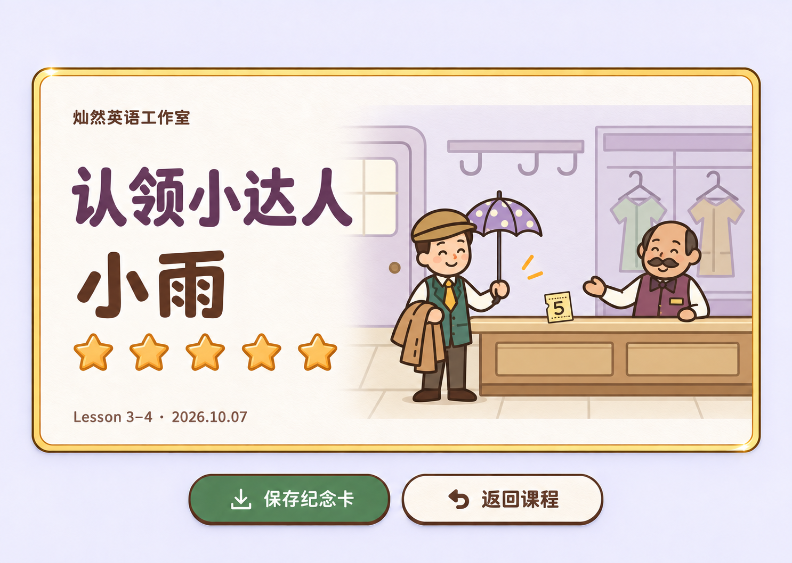
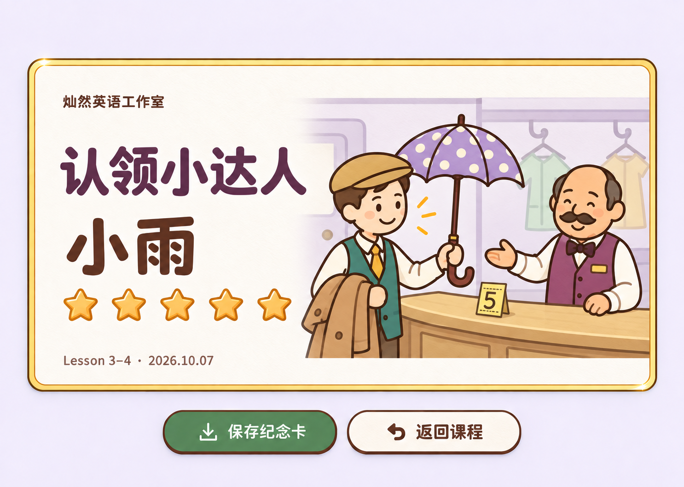
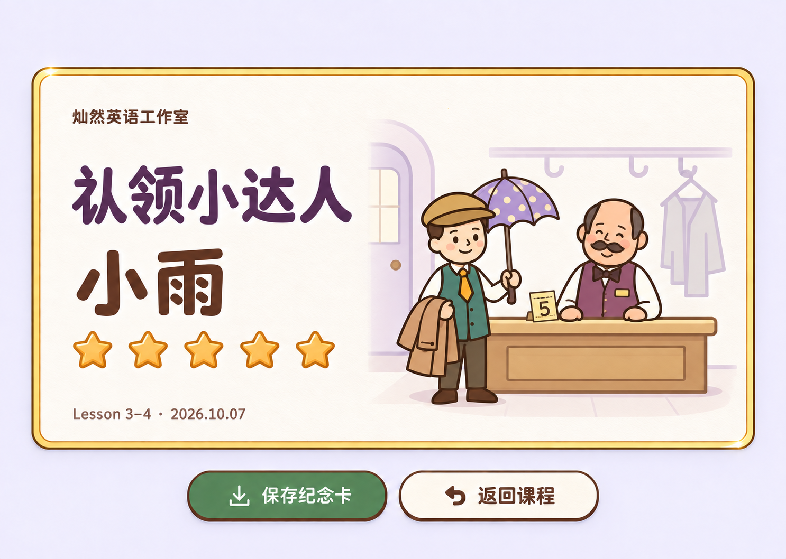

# Lesson 3–4 证书设计

版本 v0.9，时间 2026-10-07 13:27，选择记录更新于 13:29。工作分支 `codex/award-version`。用户已选定本轮显示的第二张“柜台近景”；未修改课程或奖励功能，未提交、推送、发布。

后续 Lesson 3–4 证书以[第二张设计稿](visuals/2026-10-07-1327-v0.9/counter.png)为视觉依据。原始生成文件为 `exec-665d6e58-1e68-4f4c-8d2e-484a5dee9f71.png`，对应本轮实际显示顺序的第 2 张；其余两张保留为候选历史。已确认的计星与首次满星日期规则不变。

## 沿用与变化

此前已细化的是 Lesson 1–2 的横版故事纪念卡。Lesson 3–4 沿用同一版式、暖纸压印质感、姓名位置、五颗星及底部操作，只更换本课称号、人物、场景和主题色。

| 内容 | 本课设计 |
| --- | --- |
| 工作室 | 灿然英语工作室 |
| 称号 | 认领小达人，沿用本课现有称号 |
| 学生姓名 | 图中“小雨”为示例；实现时读取当前学生记录 |
| 主色 | 暖白纸面、棕色描边，浅紫环境与深紫标题呼应衣帽间 |
| 客人 | 便帽、绿色马甲、领带，较瘦的轮廓；不复用 Lesson 1–2 的眼镜男士 |
| 工作人员 | 较宽轮廓、胡须、紫色马甲、蝴蝶结，站在木柜台后 |
| 故事物品 | 客人领回紫色圆点雨伞与外套，柜台上保留 5 号寄存牌 |
| 卡片操作 | 卡片下方并列“保存纪念卡”“返回课程”，沿用已有主次层级 |

不添加“你完成了……”或替代口号。两个人物、伞、外套、柜台共同交代故事，不能只在 Lesson 1–2 卡片上替换标题和图标。

紫色圆点伞沿用课程最终确认后的那一把。红色纯色伞、黄色条纹伞是中途被否认的物品，不进入完成卡主画面。颜色与花纹是既有舞台设计，不宣称教材指定这些特征。

## 三张构图（第二张已选）

以下编号按照本轮生成图片在会话中的实际显示顺序。三张都展示五星状态，以便在相同条件下比较插图构图。

| 编号 | 构图 | 比较重点 |
| --- | --- | --- |
| 1 | 柜台认领完成 | 全身客人与柜台工作人员，房间信息完整，保留明确的故事关系 |
| 2 | 柜台近景（已选） | 放大人物、紫伞与寄存牌，缩小展示时物品更醒目 |
| 3 | 衣帽间纪念合影 | 人物靠拢，背景更轻、纸面留白更多，突出纪念卡感 |

## 星星与日期

执行已确认的[五答题区计星与首次满星日期规则 v0.8](2026-10-07-1309-v0.8-五答题区计星与首次满星日期规则.md)，本轮不改评分方式：

- 每单元恰好五个答题区，每区一颗星。整轮每题首次提交全部正确才获得该区星星；本轮答错后订正仍可继续学习，但不补发本轮星星。
- 已有 1–4 星时，用棕边和对应数量的实心星，其余为轮廓星；没有满星日期。0 星时五颗均为空心，同样不显示日期。
- 获得第五颗星时，整圈边框变金色，并记录首次满星日期。刷新、重做或保存图片不改这个日期。
- 图中的 `2026.10.07` 只是五星示例数据。姓名、星数、日期必须由真实页面动态排版，不能把这张整屏生成图直接作为通用证书背景。

当前 award 工作树中的 Lesson 3–4 已有五个答题区，设计映射如下；这不表示现有代码已经采用新计星规则。

| 区域 ID | 答题区 |
| --- | --- |
| `listen` | 单词寻宝 |
| `roles` | 故事小侦探 |
| `manners` | 认领柜台 |
| `reply` | 你我的接力 |
| `exam` | 认领小挑战 |

图鉴、小剧场、小锦囊属于教学部分，不额外计星。综合练习包含在五区之内。已有星星的保留、旧版奖励留存及尚待实现的存储约束继续以 v0.8 为准，不通过本轮插图另增规则。

## 依据与验收范围

实际核对了本工作树的[课程内容](../../unit3-4/content.js)、[场景状态](../../unit3-4/scene.js)、[现有证书称号](../../unit3-4/unit.js)，以及[雨伞叙事文档](../butcher-version/2026-09-25-1607-v2.2-Lesson3-4雨伞叙事与验收.md)。

Imagegen 每次都附带两张已查看的参考：Lesson 1–2 已选[五星卡](visuals/2026-10-07-1128-v0.7/card-five-stars.png)，以及 butcher 工作树原有的[第 11 句认领完成截图](visuals/2026-10-07-1327-v0.9/reference-course-scene.png)。后者只作为既有人物与道具参考，不宣称是本轮网页验收。没有修改另一工作树。

三张使用内置 imagegen 独立生成，尺寸均为 1486 × 1058。已目视核对五颗实心星、连续金边、课号、示例日期、无完成说明、人物身份与紫色圆点伞。原始输出、提示词、参考来源及 SHA-256 见[素材清单](visuals/2026-10-07-1327-v0.9/manifest.json)。

本轮仅验证静态设计与文档、素材链接。真实姓名长度适配、1–4 星页面、计星和首次满星日期、手机布局、保存导出与账号同步均尚未实施或验收；静态图片上的按钮不代表功能已经可用。
