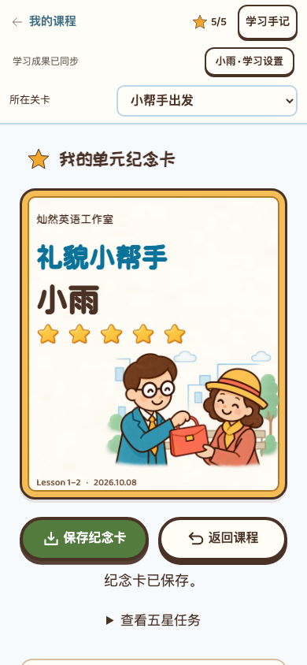

# 新版纪念卡迁移与验收 v0.13

本地目标：`codex/debug-reward-version`；基线为 `codex/butcher-version` 的 `da4273e`。来源为 `codex/award-version` 工作树中未提交的纪念卡实现，不修改来源工作树。

## 迁入什么

Lesson 1–2 已确认的手提包交还近景、暖纸卡面、五个星位与满星金边；姓名来自登录学生；缩小页面卡片，保存图片仍为1640×880。保留正版素材、字体许可、已确认设计及历史方案。

接入五区整轮零错、首次五星日期固定、离线待同步、服务器奖励记录、换设备与学生隔离、重开练习保留奖励。保存失败可重试；匿名和教师预览不能导出。旧版本奖励记录单独保留，收藏室界面未实现。

## 怎样保留新分支内容

不直接覆盖来源旧的22题配音课程。保留目标现行25道无配音题、点击作答、八题综合挑战、人物场景和简洁交互；原找物2题与拼句2题合为问句小工坊4题。最终五区为4／4／5／4／8题。

保留最新账号安全、横幅首页、缓存加载与其余课程。新奖励校验兼容默认单选、原文定位、配对、逐空填答及词块；旧已完成记录可作为学习进度继续，但不能自动发新版星星。

## 实际验收

验收全部通过真实浏览器操作进行；答案来自既有独立题稿，未注入获星结果。测试只使用临时虚构账号，不访问线上学生数据。

| 检查范围 | 实际结果 |
| --- | --- |
| 纪念卡、五星、旧25题记录迁移、工坊、词卡 | 最终定向运行14项通过；含四种宽度、匿名禁导出、A4练习纸、卡片版本独立、提示单独记录和原题保留。 |
| 共用交互、无配音完整流程、旧版升级、错误重试、导航 | 58项均已有通过结果；首轮56项通过，2项历史页面夹具的问题修正后单独复验通过。Lesson 1–2 与25–26全流程、20个无配音单元阅读界面及其他课程错误重试均覆盖；不等同于所有课程完整通关验收。 |
| 登录账号与保存 | `/lesson/` 最终4项通过：登录姓名、离线待同步、跨设备五星、固定首次日期、重开与学生隔离、320／390／768／1280宽度、17字长姓名、真实1640×880 PNG、保存失败重试、零星续学、账号隔离与现有设置回归。 |
| 网站根目录 | 新版纪念卡账号完整流程1项通过；未对线上服务执行发布。 |
| 文档与迁移边界 | 变更Markdown链接已核对；原奖励工作树关键源文件摘要未改变，目标保留现行25题与无配音模式。 |

首轮确实暴露并解决了默认单选题缺省类型的计星兼容问题，避免正确完成却不发星；另先复现再修复“零星但已有学习进度，首页仍显示开始学习”。旧版测试的工坊入口、纪念卡名称及完整页面依赖同步更新，没有降低现行题数或获星条件。

证据保存在 [本轮页面记录](evidence/2026-10-08-debug-reward-migration/)。该目录包含首次失败和复验日志，不能把单次旧失败日志当作最终结果；最终定向页面检查见 `reward-final-page.log`，账号检查见 `reward-account-regression.log`。

桌面与手机截图已目视检查，姓名、金边、星星和角色完整；实物打印与真实手机仍待验收。

本分支独立预览：[Lesson 1–2 纪念卡](http://127.0.0.1:4262/unit1-2/#learn/certificate)。这是静态内容预览，姓名显示“登录后显示姓名”，不冒充线上已登录学生；真实账号流程由上面的临时账号页面检查验证。

## 交付边界

本次仅本地迁移，未提交、推送或发布。Lesson 3–4 保留已选柜台近景设计文档，未增加运行时纪念卡；其余单元奖励尚未迁移。真实安卓微信、iPhone、教师与儿童体验验收未做。
