# 老板的挑战：布局审视 v1.11

时间：2026-09-19 01:43–01:49。状态：审视与修改建议，尚未实施。

后续进展：用户已授权实施，结果见[老板挑战与统一作答体验实施记录](2026-09-19-0216-v1.11-老板挑战与统一作答体验-实施记录.md)。下文保留审视当时的观察。

## 范围与结论

在 `codex/butcher-version` 的真实页面中走完了 10 道挑战题，检查了播放、错答重试、灯泡、暂停、中场、奖励弹层、完成记录和再练入口。截图均为本次实测。

现有奶油色背景、深棕描边、绿色主按钮，以及灯泡放在检查按钮左侧的方向可以保留。主要问题是换题后可见位置失衡、答题区过高、暂停占据答题路径，以及不同题型没有充分沿用前面活动的表现形式。

本次没有修改产品代码，没有提交、推送或发布。完整作答使用 `localhost:4175` 的独立本地记录；原 `127.0.0.1:4175` 的学习记录未操作。

## 逐步结果

| 步骤 | 界面 | 状态 | 观察与建议 |
| --- | --- | --- | --- |
| 1 | 开始挑战 | 基本清晰 | 单一开始按钮很好。标题和中央重复使用清单图标，入口缺少老板角色感；可将中央图标换成现有老板插画，保留简短题量说明。 |
| 2 | 听力题 | 优先调整 | “听一遍”和“暂停，稍后继续”并排且同等强度。四个单词纵向占四行，检查按钮在首屏外。改为醒目的喇叭按钮、已有图标＋英文的两列选项，暂停移到标题右侧。 |
| 3 | 阅读与句式选择 | 需要调整 | 题干左对齐、辅助按钮居中、答案长条居中；节奏松散。题目与答案使用同一居中内容区。短选项紧凑排列，长句单列；偏好卡将 Mrs. Bird 与丈夫分别排成两行，避免一行塞满两组信息。 |
| 4 | 反馈、灯泡与换题 | 优先修正 | 灯泡位于检查按钮左侧，位置正确。但答案与操作栏之间空白大，原因、反馈分散。合并为一个稳定反馈区。点击下一题后，本次实测多次停留在底部，新题题干不可见。 |
| 5 | 拼句与交接题 | 需要调整 | 拼句有独立已选区与词库，可以保留；空答题区偏高，暂停插在题干与答题区之间。交接题已有合适的图示，但柜台条、人物卡和反馈叠加后过高。两类题沿用已有组件并压缩纵向间隔。 |
| 6 | 暂停与中场 | 基本可用 | 暂停页只有一个继续按钮，方向清楚。可把长句换成“已暂停 · 第 2/10 题”。中场继续按钮可以保留，但进入中场时标题也可能停在视口上方，应纳入换屏位置修正。 |
| 7 | 完成、记录与奖励 | 需要精简 | 再练与下一站已形成明确主次，不必推翻。勾号、完成文字、星星、记录按钮、下一步逐层分开，整体偏高；记录展开后是三段成人化文字。建议形成一个紧凑结果区，再接一组操作按钮。 |
| 8 | 窄屏 | 需要适配 | 390×844 下听力题仍然过长，主按钮不在题目首屏。完成页已将主按钮放在上方，方向合理；可统一两个按钮的外沿宽度，以填色与描边区分主次。 |

## 建议的共同布局

1. 标题行：左侧“老板的挑战”，右侧轻量的“暂停”和“怎么玩”。
2. 进度：小号题数与简短进度条，共用一行。
3. 题目区：一句任务；英文材料与操作指令分层显示。听力题的喇叭是这一层的中心。
4. 答案区：整体居中，按内容选择图卡、句子选项、词块或交接卡。保留同样的描边、选中态和间距。
5. 反馈区：灯泡说明、答题反馈和原因共用稳定区域；预留合理高度，避免大块空白和展开时跳动。
6. 操作区：灯泡在左，检查／下一题在右。短屏内优先压缩非必要留白；必要时采用活动卡片范围内的底部操作栏，不能盖住答案。

继续保留连续长页。进入新题时先保证题干可见；已经完整可见时不要强制滚动。通过稳定内容区高度和适量留白减少位移，不把所有题型强撑成最高题目的高度。

## 推荐顺序

- 第一批：修正换题／中场／完成后的可见位置；移走题目中间的暂停；收拢反馈与底部操作区。
- 第二批：听力题使用大喇叭与 2×2 图卡；偏好卡拆成清晰的两行；压缩拼句和交接题的非必要留白。
- 第三批：精简完成页。可以保留“挑战完成”与三颗完成奖励星星，默认只给少量本轮结果；详细记录仍可展开。“独立答对”不能包含提示后和重试后答对，也不能把完成奖励当作全部知识已掌握。

“下一站：我的学徒证书”可简化为“查看学徒证书”。是否根据剩余关卡改成“继续未完成的关卡”，属于后续流程决定，本次未改变。

## 实测记录与边界

- 当前用户页面：1173×1234；完整独立流程：1280×720；窄屏补查：390×844。各截图保留原始尺寸。
- 第 1 题故意错选后重试；第 7 题使用灯泡；最终记录为首次未用提示 8/10、提示后完成 1、修正后完成 1。
- 进入第 4 题后，题干在当前视口的纵坐标为 −29 至 5，检查按钮为 391 至 443；截图和实际滚动位置共同确认了题干不可见，不能只靠“新题已渲染”判断体验正常。
- 普通点击、重试、暂停续答和整轮完成可以操作。截图不能证明语音质量、全部动态时序或无障碍合规；本次没有做完整屏幕阅读器、键盘、对比度和所有设备检查。
- 按钮外观和灯泡的可访问名称可以保留。题干移出视口是已确认的可见性问题；完成奖励弹层采用“轻触任意位置继续”，建议后续补一个明确的“继续”按钮，并单独核验键盘焦点。
- 未复核整套题目的教学准确性；本报告只提出布局建议，不表示新的题目内容已经评审通过。

## 本次截图

所有图片位于同名 evidence 目录。以下按实际流程排列；有意保留换题后题干不在视口内的截图，作为问题证据。

### 0. 用户当前页：原有两选项布局

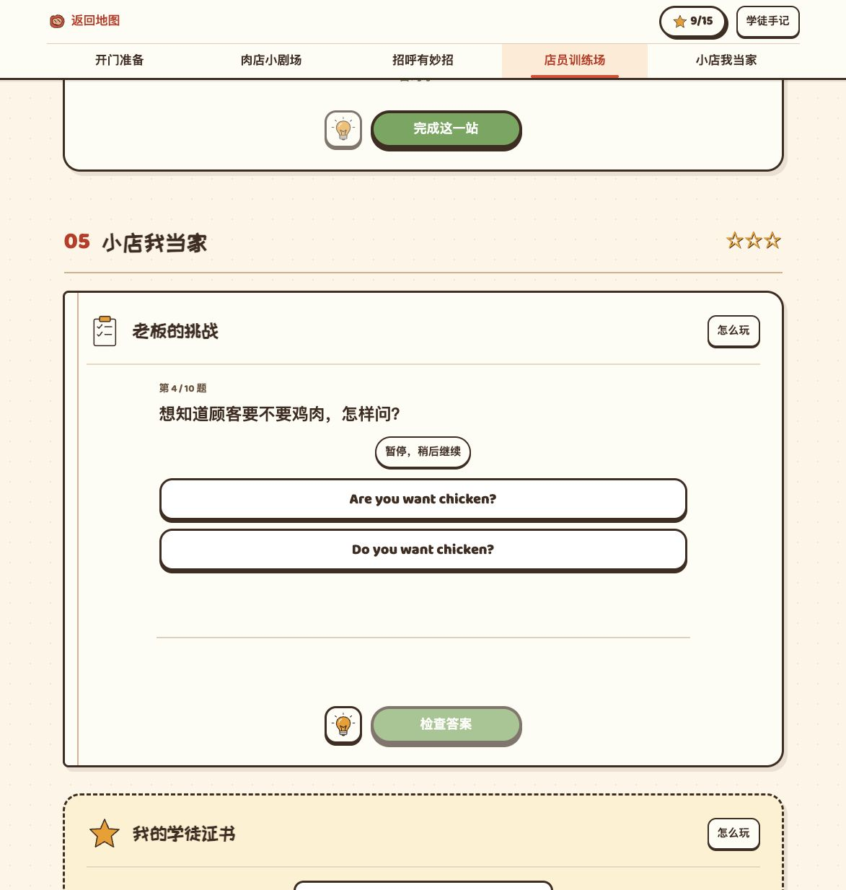

### 1. 入口

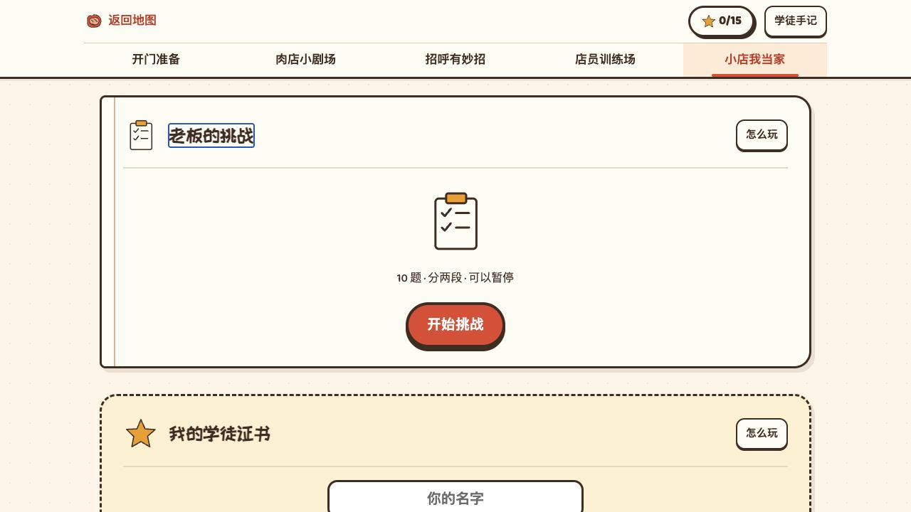

### 2. 听力题

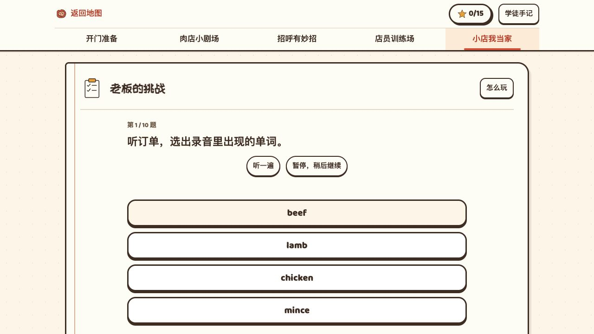

### 3. 错答反馈与进入下一题的位置

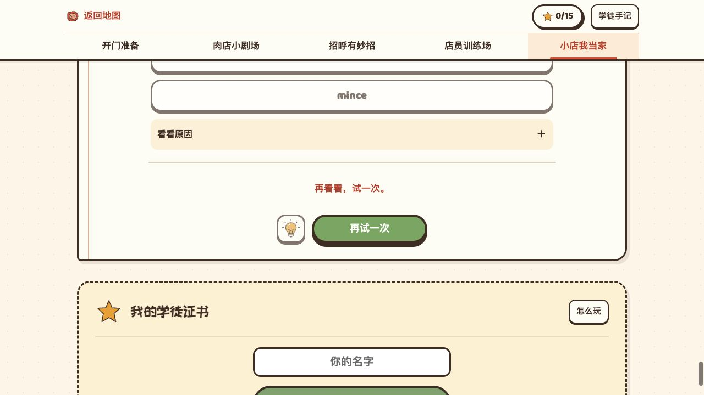

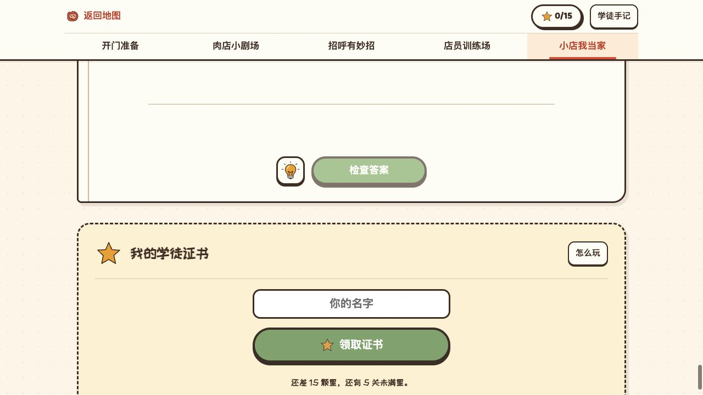

### 4. 阅读题与暂停

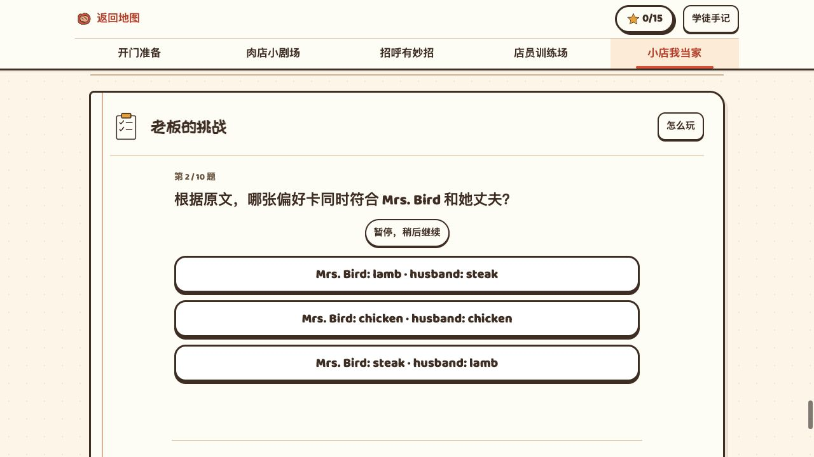

### 5. 拼句题

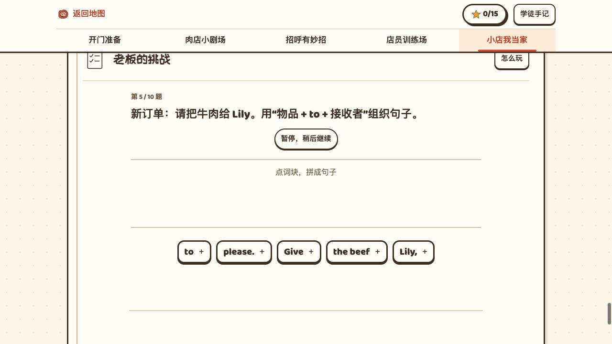

### 6. 中场、交接与灯泡

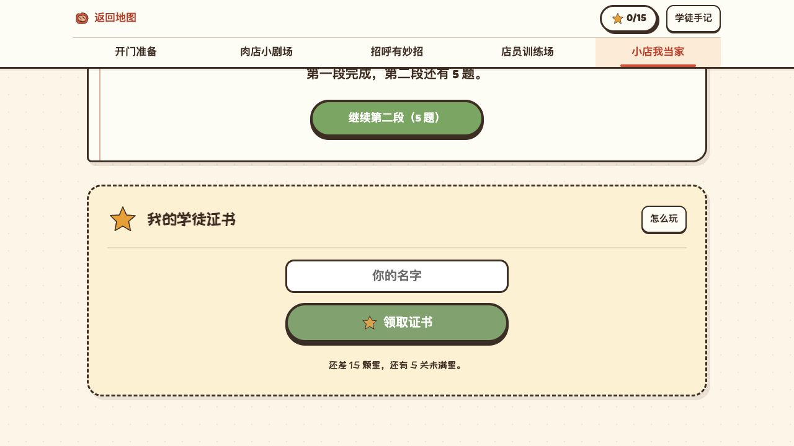

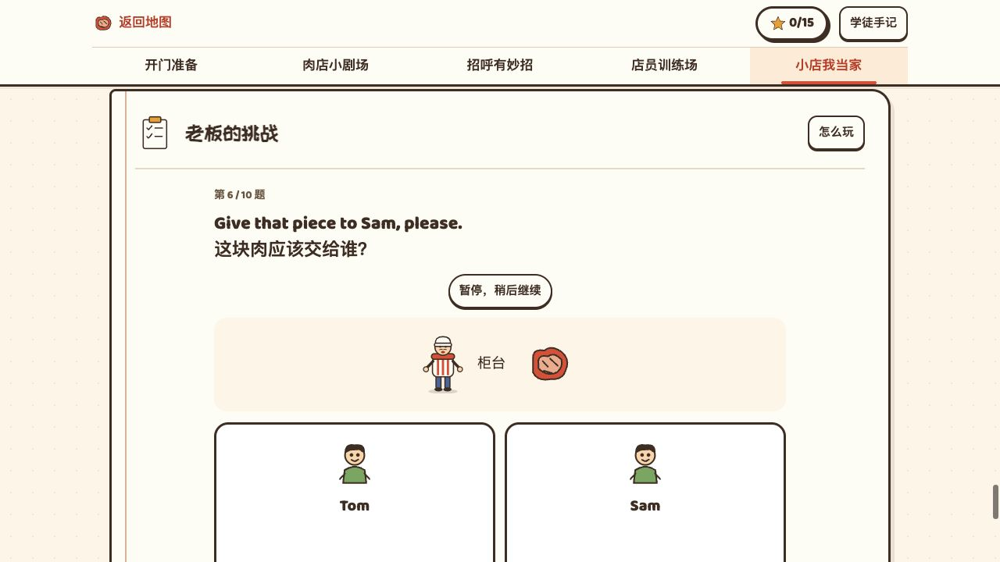

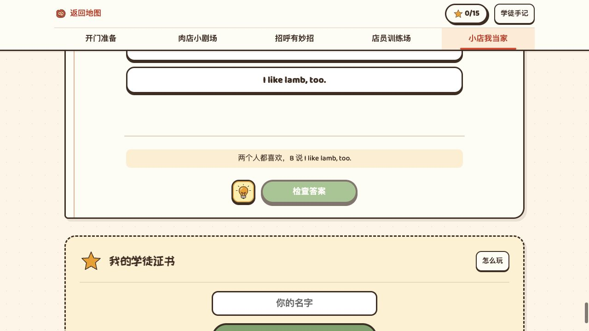

### 7. 完成与结果

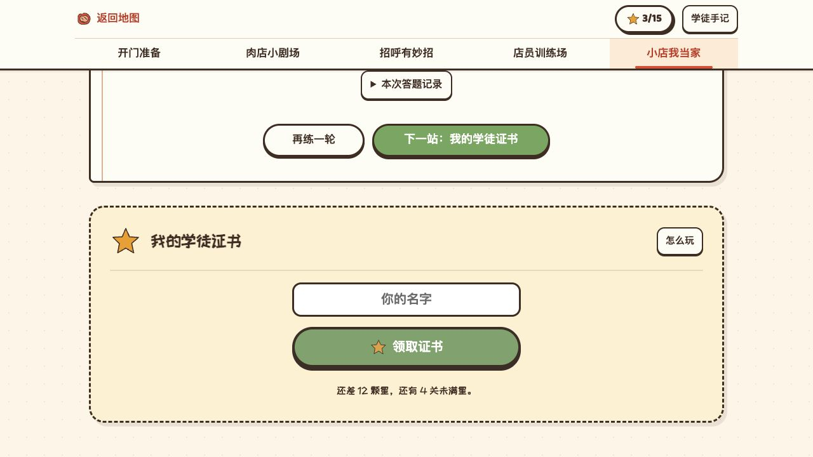

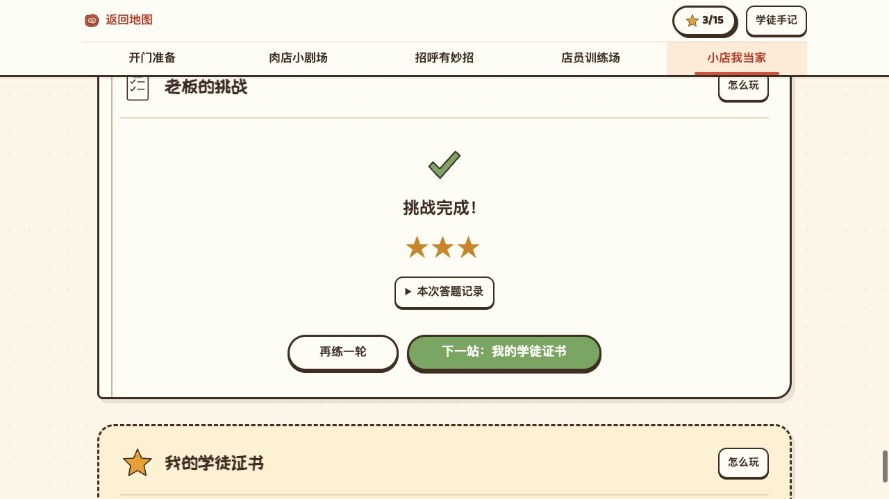

### 8. 窄屏补查

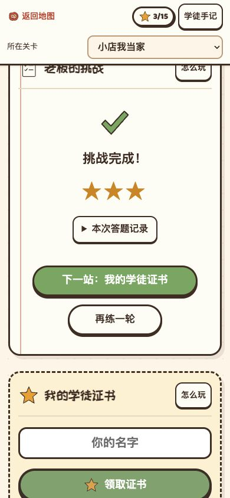

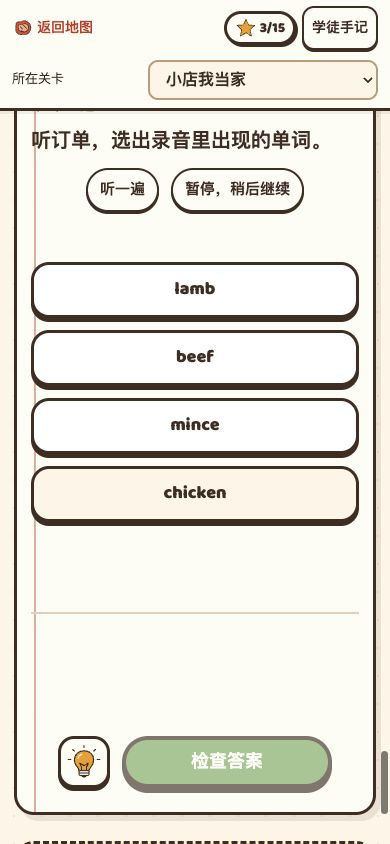

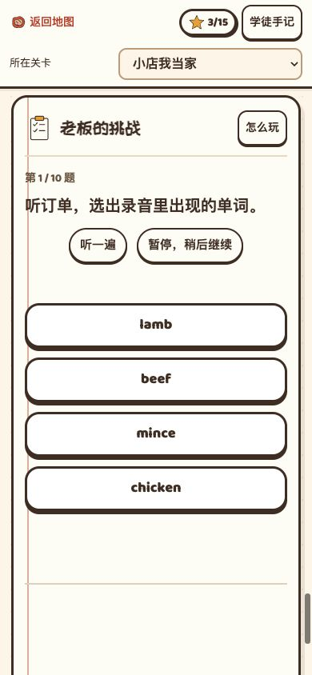
