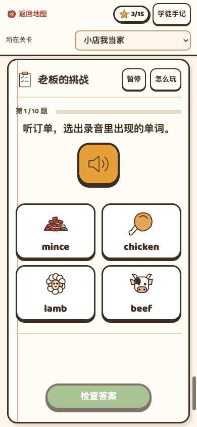
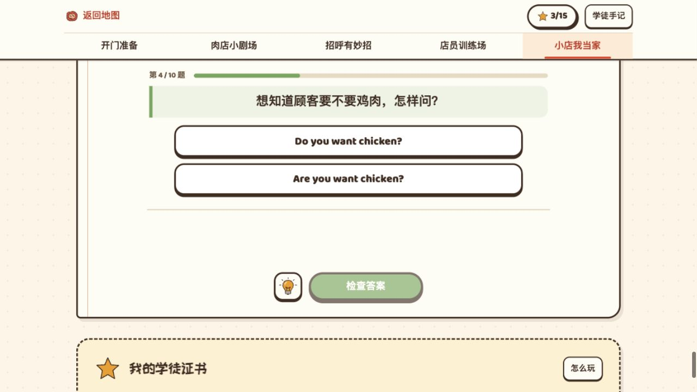
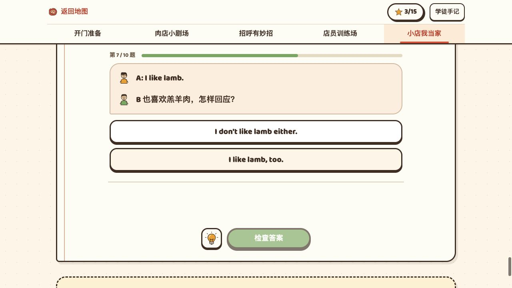
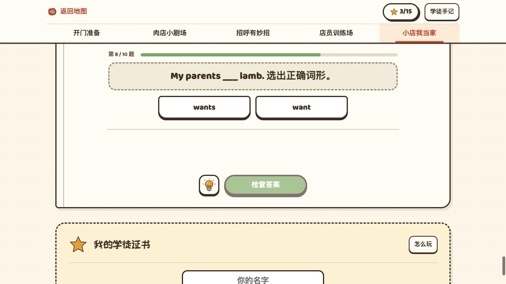
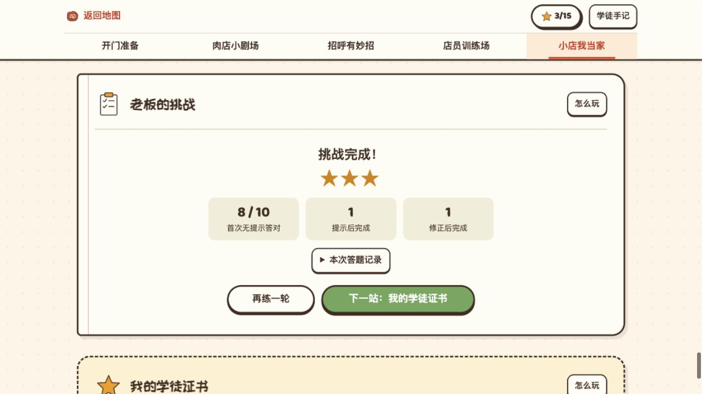
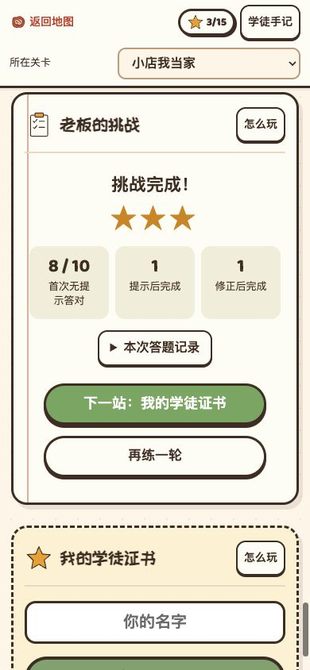

# 老板挑战与统一作答体验 v1.11

时间：2026-09-19 02:16 起。状态：已实施并完成本地页面验证。分支：`codex/butcher-version`。

本轮根据[布局审视](2026-09-19-0143-v1.11-老板的挑战-布局审视.md)实施，并把同类变化同步到 Lesson 49 的其他练习。保留连续长页、肉店画风、现有题目与学习记录。

## 已完成的变化

| 内容 | 统一后的体验 |
| --- | --- |
| 听辨 | “听音寻宝”和挑战听力共用大喇叭、两列图标＋英文选项。听完录音才能检查；正常重听不算提示。两处都没有无效线索按钮。 |
| 问句选择、回应与填空 | 按题型共用题面、选项尺寸、居中对齐和选中态。挑战中的同类题沿用前面练习的表现。 |
| 偏好卡 | 将 Mrs. Bird 与丈夫的偏好分成两行，配现有人物图标。桌面三张并排，手机单列。 |
| 拼句与交接 | 统一词块的选择、撤回和原位占位；缩短桌面拼句区及柜台的多余留白。窄屏保留足够高度，乱序也能放下全部词块。 |
| 提示与反馈 | 有线索的题保留检查按钮左侧灯泡。提示、正误反馈和“看看原因”共用稳定区域，展开内容不挤动下方按钮。没有灯泡时，主按钮单独居中。 |
| 进度与暂停 | 各练习使用题数＋进度条。挑战的“暂停”在标题旁；暂停和中场只显示简短进度及继续按钮。 |
| 完成页 | 挑战保留一个完成标题、奖励星星和三项本轮记录；详细记录可展开。桌面次按钮在左、主按钮在右；手机主按钮在上，两个按钮同宽。 |

“首次无提示答对”“提示后完成”“修正后完成”沿用原有记录口径。星星奖励完成活动，不代表已能独立口语或写作；若同一道题既用了提示又修正答案，两类过程记录可同时计入。

## 修复与防御

**换题后看不到题干。** 原先所有重绘都保持旧滚动位置，长题切到短题时，题干可能留在顶部导航后面。现在只在换题、暂停、续答和重练时检查新题的位置：题干已可见则保持位置；不可见则让题干和可容纳的题数区回到导航下方。选择、检查、重听、展开提示和原题重试不主动滚动。

**相同题型外观不一致。** 原样式依赖活动名称，挑战没有复用。现在按题型选择共享样式，听辨选项从同一份词卡图标中取图；问句、回应、填空、交接和拼句也共用对应表现。

**答案与操作之间空白重复。** 原先原因区和提示区分别占位。现在合并为一个稳定反馈区。内容较长时在该区域内查看，检查按钮位置保持不变。

**本轮回归发现的窄屏裁切。** 压缩拼句区后，320 与 600 像素下的乱序词块可能放不全。已按宽度恢复必要高度，保留“全部词块可见、词库与检查按钮不被顶动”的原测试要求。

额外保护：新题的延后聚焦不会抢走奖励弹层的键盘焦点；空反馈保留可访问的状态区域；移除灯泡后的单按钮仍保持完整宽度与居中位置。

**旧页面缓存混用组件。** 最后刷新用户原预览时，浏览器保留了旧角色舞台脚本，却加载了新练习脚本，触发 `helpers is not iterable`，使初始化中断。相关样式、课程数据与 Lesson 49 组件现已使用同一资源版本；构建入口规则也允许课程数据脚本携带版本参数。再次刷新后，原有 9 颗星、挑战第 4 题及其他草稿恢复正常。未清除用户记录。

## 验证

按要求只用真实页面行为测试。测试里的音频替身仅用于控制浏览器播放边界；学习操作通过可见按钮完成，没有用内部函数直接过关。另保留真实本地录音逐段播放检查。

- 新增回归先复现：长听力题换题后题干不可见、挑战听辨缺少大喇叭与图卡、答案到检查按钮间距过大，以及同题型样式不一致。
- 新增检查：已可见的新题不滚动、无提示按钮居中、奖励弹层键盘关闭、成绩记录和重练。
- 旧测试中“换题后滚动值必须完全不变”改为“新题可见”；检查、提示、选择、原题重试时不跳动的要求继续保留。
- 完整页面专项：170 项通过；命令为 `npm run test:l49:behavior -- --reporter=list`。
- 资源升级后的补充回归：21 项通过，覆盖旧资源地址失效时的新版本加载、星星和草稿恢复，以及本轮全部新交互。执行文件为 `tests/e2e/l49-v111.spec.js` 和 `tests/e2e/l49-focus.spec.js`。
- 人工页面操作：使用独立 `localhost:4175` 记录走完 10 题，包含错答、重试、提示、暂停后刷新、续答、中场与完成；结果为首次无提示 8/10、提示后完成 1、修正后完成 1。
- 截图检查覆盖桌面 1280×720、手机 390×844；窄屏词块另由 320、600、768、1280 宽度的页面测试验证。
- 1280×720 的第 4 题实测：导航底边为 111.2，题数顶部为 127.4，题干为 157.8–216.3，操作按钮为 500.3–552.3。旧审视中该题题干为 −29–5；修复后题干与操作都可见。

上一轮检查主要确认滚动值不变、按钮存在，没有要求新题位于导航下方；最终稳定截图也不能替代检查瞬间的几何位置。现在两类行为分别验证，避免用“页面没动”代替“新题能看到”。

## 页面效果

### 手机听辨

### 同题型共用题面

### 完成页

## 交付边界

本次为本地代码、页面验证与记录更新。未提交、推送或发布；用户对新布局的最终体验评价仍待查看预览。

用户原预览已刷新到 `http://127.0.0.1:4175/lesson49/#learn/exam`，保留原有 9 颗星和挑战第 4 题。临时验证页面已关闭，预览尺寸已恢复。

保留连续长页；较短或横屏设备仍可滚动查看完整活动。原审视中提到的“按剩余关卡改变证书入口”和“奖励弹层新增继续按钮”是后续流程建议，本轮未改变。
