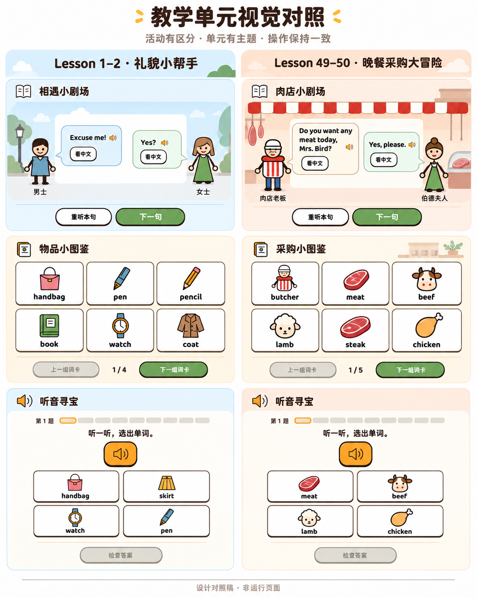

# 教学单元设计标准与验收清单 v1.17

**历史版本，已由 [v1.20 统一设计标准](publish/2026-09-24-2031-v1.20-教学单元设计标准与验收清单.md)替代。** 下文保留截至 2026-09-22 18:50 的规则与历史记录，不再作为现行交付依据；其中“本文”“当前”“本轮”均指当时版本。

适用分支：`codex/butcher-version`。整理于 2026-09-20 13:25。

2026-09-22 13:32 修订：所有课程答错只提示“再看看，试一次。”，保留原题供孩子重试，不自动展示、朗读或标亮正确答案。灯泡只给思考方向；具体规则见第 4、8 节，[全课程整改记录](2026-09-22-1332-v1.0-全课程错答反馈与线索整改.md)列出实现与本轮验证，替代历史文档中的“答错直接纠正”要求。

2026-09-20 17:21 补充：沿用 Lesson 49 的学习入口与词卡音标要求，见第 4、6、8 节；Lesson 1–2 的调整和验收见[本次实施记录](2026-09-20-1721-v1.1-Lesson1-2学习顺序与音标验收.md)。

2026-09-21 00:18 补充：必做练习逐题核对判断任务与递进，避免仅换名词的机械重复；见第 1、8 节及 [Lesson 3–4 接力修订](2026-09-21-0018-v1.1-Lesson3-4接力练习优化与验收.md)。

2026-09-21 00:39 补充：明确禁止高度重复的必做题，审查范围包括同一活动、不同环节和相邻单元；判定及交付检查见第 1、8 节。[三个单元的重复题审查](2026-09-21-0039-v1.0-三单元必做题重复审查.md)记录现有问题，标准更新不代表题目已经修改。

2026-09-21 后续整改：三个单元已按去重要求改写，必做题分别为 27、27、73 题。现行改编题稿、原目标的保留方式与实际检查状态见[三单元整改记录](2026-09-21-0055-v1.0-三单元练习去重与验收.md)；00:39 的审查保留为修改前快照。

2026-09-21 21:43 补充：发音按文件、真实页面、逐条人工听审三层验收；明确短词裁切、词性读音、完整人名和生成例外的防护要求。见第 6、8 节；[全课程发音排查](2026-09-21-2143-v1.0-全课程发音排查.md)记录本轮问题及尚未修复、未听审的范围。

2026-09-22 00:18 落实：上述排查的五处确认问题已在本地修复；生成配方检查、真实文件防回退及更换录音时的旧进度保留已实施。见[五处发音问题修复与验收](2026-09-22-0018-v1.0-五处发音问题修复与验收.md)。人工听审和其余疑似项继续单列。

2026-09-22 00:39 补充：Lesson 7–8 试行不依赖配音的课堂配套版本。网页练习与教师带读分工、进度迁移和验收规则见第 6.5、8 节；[现行题稿与验收](2026-09-22-0039-v1.2-Lesson7-8课堂配套版本与验收.md)。其他单元仍按各自现行模式运行。

2026-09-22 01:31 扩展：Lesson 9–10、11–12 继续采用课堂配套模式，新增词汇与语境词义题、阅读挑战及旧记录迁移见[两单元现行题稿与验收](2026-09-22-0131-v1.1-Lesson9-12课堂配套版本与验收.md)。

2026-09-22 11:36 扩展：Lesson 13–14 从第一版采用课堂配套模式；[题稿、教材边界与验收](2026-09-22-1136-v1.0-Lesson13-14教学单元与验收.md)单独记录。没有录音的项目标记“不适用”，不冒用旧单元的听审结果。

**以后制作、修改和验收教学单元，先读这一份。** 本文合并 Lesson 49、Lesson 49–50、Lesson 1–2 已确认的教学与交互要求，并纳入“活动有区分、单元有主题、同类操作保持一致”的视觉方向。原 v1.14、v1.16 和各次设计补充保留为历史，不再作为并列的现行标准。

本文曾作为当时的共用设计与验收要求。用户确认的主题与容器方向已应用到 Lesson 1–2、Lesson 49–50 的本地页面；本次改动和实际检查见[双单元主题实施与验收](2026-09-20-1521-v1.17-双单元主题实施与验收.md)。标准确认、页面验证、人工教学验收和线上发布分别记录。

## 1. 先确定孩子要学会什么

从教材决定学习目标，再决定活动。相邻两课可组成一个完整单元，但不能为了套模板加入无关语法或凑题数。

| 材料 | 必须做到 |
| --- | --- |
| 原文 | 对照教材页图，保留全部句子、顺序、人物及重复句；记录纸页、PDF 页和稳定编号。 |
| 新词 | 全量覆盖。名词配准确图卡；功能词结合本课例句解释，图片只作辅助。 |
| 偶数课练习 | 保留替换、问答、书写等原训练目标。线上优先点选与词块，课堂保留真实对话、自由表达和适量书写。 |
| 改编题 | 写明目标、教材或新情境依据、答案、干扰项理由、纠错、图片与录音。作者信息不出现在孩子的界面里。 |
| 学习结果 | 首次独立、提示后、修正后分别记录。星星和证书奖励完成，不等同于自由口语或独立写作能力。 |

出题与配图共同遵守：

- 单选答案唯一；题干、图片、选项考同一件事。问“谁”就选人物，问“哪个词”才选词。
- 原文事实与另设情境分开。不能从职业猜性别、从拒绝购买猜不喜欢，也不能把题目没有提供的信息当成已知条件。
- 否定某个状态不等于肯定另一个状态，例如“不冷”不能单独推出“热”。教材某个职业人物的状态不代表整个职业；身体、年龄与外貌描述不评价人的好坏，休息不能自动等同于懒惰。
- 物主练习须给出明确归属和说话对象，不能只因某人在场就认定物品是他的。perhaps 等不确定表达不能当作已经确认；同一符号如 ’s 的不同语法用途按完整句子区分。
- 理解题前提供必要材料；听辨前不显示答案。插图、标签、位置和颜色都不能暗示正确选项。
- 目标是理解英语时，核心判断要依赖英文材料；中文用于交代必要场景，不把答案全部翻译后只考常识。提问须区分“直接问某人”与“向别人打听某人”，避免让 you／he／she 都说得通。
- 人称、单复数、指代、词形分别讲。I 是第一人称单数，we 是第一人称复数；一般动词的规则不能直接套到 be、can 等结构上。
- 不把未教的新结构放入必做题。本课解释要说明范围，不能把一次指代写成单词永远只有这一种含义。
- 物品必须画对。例如 pen 与 pencil、dress 与 skirt 应可区分；house 不能变成可拿走的失物。
- Lesson 1 的 Pardon? 是请求重复；Yes? 与 Yes, it is. 的用途不同。不能用同一条笼统解释代替。
- 不为了增加点击量拆碎课文、加入无意义分支，或让低年级默认整句打字。
- 必做题必须遵守下方的去重要求。教材原文中的重复句照常保留；教材覆盖不等于把全部替换组合都做成必做关卡。

### 禁止高度重复的必做题

**同一判断已经覆盖后，不得只换名词、人名、图片、题目标题或选项位置，继续堆成一组必做题，也不得换一个活动名让孩子再做一遍。** 操作保持熟悉，学习任务应有区别；不能用机械换词凑题数、凑关卡或延长学习时间。

先看孩子实际需要作出什么判断，再看题目外观。审题时将普通替换词和装饰场景暂时隐去：如果已知条件、判断步骤、干扰项所针对的错误和所需支持都相同，就先归为同一组，再判断有没有保留必要。仅给每道题写不同的 `target` 名称不能证明递进。

| 情况 | 如何处理 |
| --- | --- |
| 十件物品都选 `Is this your …?`，所有选项只在物品名上不同 | 实际主要是认名词，不能声称逐题都新增了问句训练。词汇已有覆盖时，必做保留代表题，完整替换组放点读示范、选练或课堂。 |
| “听不清同学”换成“车声盖住朋友”，仍从同一组表达里选 `Pardon?` | 可以作为有计划的复习，不能仅凭场景换皮标成新能力或迁移；不应在多个环节整组重复。 |
| 新词逐词听辨，或比较不同主语、肯定／否定、已知／未知归属、不同说话人 | 新词本身或改变的条件要求重新判断，可以沿用同一控件；仍要检查是否在前后环节重复覆盖。 |
| 从已教示范到撤去支持后的独立组织，或隔开后的抽样复习、针对错题回练 | 写清撤去了什么支持、复习哪个易错点、出现时机与数量。仅把选择换成拼句不自动算递进；已能拼完整句后，不再强制把同句拆成几道更简单的题。 |

每道必做题的作者记录须能回答：**孩子依据什么信息、作出什么判断；与前题或前一单元相比，增加了什么，或为什么需要复习。** 连同答案和干扰项一起审查，说明“巩固一下”不足以保留一整组同构题。完整替换材料移到示范或选练，不等于删掉教材词汇与训练目标。

综合挑战可以抽样复习已学内容，但不能把前面多个练习换词后整组重做。标为“迁移”的题须说明真正改变的判断条件；没有变化就如实记录为复习，并审查重复总量。相邻单元衔接先看新增目标，不默认让所有孩子重做已学词和旧句型的整套题。

不规定“每隔几题必须换题型”，也不为减少重复引入未教结构、复杂题干或额外操作。必要对比、词汇覆盖与适量复习保留；无新增判断、无必要覆盖、无具体复习用途的重复必做题，**验收不通过**。

三个单元修改前的重复题对见[审查快照](2026-09-21-0039-v1.0-三单元必做题重复审查.md)；当前题稿、保留理由及实际验证见[整改记录](2026-09-21-0055-v1.0-三单元练习去重与验收.md)。

## 2. 统一什么，允许什么变化

采用“明显的活动区别，加适度的单元主题”。变化集中在故事、背景和容器；熟悉的答题方法可以直接迁移到下一课。

| 层面 | 固定规则 | 可变化范围 |
| --- | --- | --- |
| 全站画风 | 抽象人物与物品、深棕描边、圆角语言、现有本地字体 | 人物身份、物品和与教材相符的场景 |
| 同类操作 | 播放、选择、检查、提示、继续、重练和反馈规则 | 对应教学内容，不另造一套操作 |
| 单元主题 | 同一单元的封面、导航定位、章节与领奖相互协调 | 场景色、少量装饰、故事环境 |
| 活动容器 | 题目与操作清楚，层次有主次 | 舞台、图鉴、答题面板、拼装区和领奖区 |
| 作答状态 | 选中、正确、错误、禁用、焦点可识别 | 不随单元主题改换含义 |

中文标题沿用快乐体，英文与数字沿用 Baloo 2 等已有本地字体。正文以易读为先。保持人物画法与物品图标的风格，不在不同单元间切换水彩、写实、像素或三维风格。

同类题在综合挑战里也沿用相同控件。例如挑战中的听辨仍使用同一大喇叭、图卡和检查区；可以改变挑战标题周围的场景提示。

## 3. 背景、颜色与容器怎么用

### 颜色各司其职

背景表达“在哪个故事里”；按钮表达“可以做什么”；反馈表达“刚才发生了什么”。主题色不能覆盖状态色。

| 用途 | 规则 |
| --- | --- |
| 全站基底 | 以暖白或浅奶油纸面承托内容。页面纹理克制，题干和选项后方保持安静。 |
| 主操作 | 推进、检查和继续沿用明确的绿色主按钮；封面开始入口可沿用珊瑚红。主次关系不随主题变化。 |
| 次操作 | 重听、返回、重练、帮助用次要按钮；浅底棕边为常用方案。无需把所有次操作都涂成橙色。 |
| 播放与线索 | 听辨大喇叭和灯泡保留熟悉的暖黄色提示；灯泡不能与主操作争抢注意。 |
| 作答反馈 | 正确绿色、错误红色、当前题黄色描边、未答对灰色。结合文字、图标或边框，不能仅凭颜色辨认。 |
| 选项 | 同一道题中所有未选选项使用同等底色、边框和尺寸待遇；不能随机涂成不同颜色或突出正确项。 |

必须检查文字与底色的对比、选中边框、焦点和禁用状态。不能因背景变浅就把文字、边框也淡到难以辨认。

### 两个单元的主题方向

下表是本轮确认的方向，颜色是实施起点；最终仍需结合文字对比和真实页面检查调整。

| 项目 | Lesson 1–2 礼貌小帮手 | Lesson 49–50 晚餐采购大冒险 |
| --- | --- | --- |
| 氛围 | 清爽、轻快的相遇与日常物品 | 温暖的商店与采购 |
| 场景底色 | 淡蓝 `#EAF3F8`、暖白 `#FFFDF8`，少量浅杏点缀 | 暖桃 `#FCEBDD`、奶油 `#FFF8EE`，少量砖红 `#C45D46` |
| 主题元素 | 人物相遇、手提包、日常用品 | 店铺招牌、柜台、食品、采购物品 |
| 使用边界 | 不沿用肉店红白遮阳棚；不提前把手提包归给某个人 | 红白条纹可用于店铺舞台，不铺到所有练习容器 |
| 保持不变 | 抽象画风、文字可读性、操作区和题型规则 | 同左 |

### 按活动选择容器

| 活动 | 推荐处理 | 应避免 |
| --- | --- | --- |
| 小剧场 | 有场景底色的舞台，人物在两侧，白色对话区突出；环境线索集中在边缘 | 把详细场景放在对白后面，或每个单元都照搬肉店条纹 |
| 图鉴、表达卡 | 像整理好的收藏页；可点击卡片清楚，大容器减轻边框与阴影 | 大框、小框、卡片层层使用同样粗重的描边和阴影 |
| 听辨、单选 | 干净的答题面板；题目、主要入口、选项、反馈、操作顺序清楚 | 花纹穿过文字或选项，给不同选项不同主题色 |
| 拼句 | 已选区和待选区结构清楚，词块像可拿起、可放回的小块 | 只换背景色，却让拼句位置或撤回方式与其他课不同 |
| 结束与证书 | 名字、已获得徽章和完成感突出；庆祝集中在完成时刻 | 每次选项点击都触发大动画，或未完成就显示已获得奖励 |

外层容器先用间距、分组、浅底色和细分隔；需要时再加边框。点击卡片、按钮可以保留更明确的描边和下沿，避免背景框看起来比按钮更能点击。

进入单元时，场景区别可以明显；专心答题时收敛装饰；完成后增强认可感。不为主题增加走地图、开门、找人物等必经操作，也不增加与教学无关的功能。

### 双单元对照稿

这张图展示同一方向下两个单元的“小剧场、词卡、听辨”。它用于比较视觉层次，不是已运行的页面，也不是题目、音频或状态规则的来源。图中如有文字或状态偏差，以审定题稿和本文为准。

## 4. 页面与题型操作

### 默认学习顺序

沿用 Lesson 49：**词汇小图鉴 → 听音寻宝 → 课文小剧场 → 故事理解 → 表达与句型练习 → 综合挑战 → 证书**。活动可按故事命名；教材没有的目标不额外添加。特殊教学顺序需要明确依据，不随换主题或扩课自行改变。

首次从首页或封面开始，进入图鉴。图鉴供自由点读，不要求逐张点击刷进度。导航、页面顺序、活动结束的“下一站”和证书徽章顺序一致。已有记录继续原位置，单纯换序不清除答案、星星或证书；旧章节链接仍指向原来的内容。

### 同类活动的操作

采用连续长页、章节导航和每项练习的当前题。导航供回看；“下一站”由孩子主动点击。每一站有清楚名称，不用长说明替代界面本身。主界面保留必要题干与操作信息，删去“听完了，准备好再选择”等没有帮助的重复说明。

| 类型 | 必须一致的操作 |
| --- | --- |
| 词卡 | 正面保留大图、英文和下方较小的配套音标，音标默认可见；点整卡发音并翻看词义，再点可返回正面。前后组是按钮，首组禁用上一组，末组提供下一站。无“教材词／补充词”等编写标签。 |
| 听辨 | 居中的大喇叭为主要入口；大图加英文选项。指定录音真实播放结束才允许检查，重听不限次；无灯泡、无无效提示。 |
| 课文 | 完整保留原文。按教材人物安排舞台，双人对话沿用两侧人物；固定高度对话区内追加历史句，只滚动内部。 |
| 历史点读 | 点旧句即可重听，突出正在播放的句子；不代替当前句计进度。中文按句开关，不另设“已听原文”重复区域。 |
| 理解题 | 先获得所需课文再作答；题干直接说明判断目标。原文人物题不能伪装成需要孩子补充个人经历的题。 |
| 单选 | 选项组居中，状态明确；主动检查、主动继续。题干、配图与选项构成一个完整问题。 |
| 拼句 | 点候选加入、点已选撤回，候选原位置留空；全部词块用完才检查。刷新和重试保留候选位置。 |
| 句型对照 | 正反变换在空间允许时一行显示；小屏自然换行并保留方向，不产生横向溢出。 |
| 线索 | 有帮助才提供。灯泡位于检查按钮左侧，使用后如实计为提示。只指出关注对象、回顾位置或思考方法，不给正确选项、答案译词或完整词块顺序；没有独立线索就不显示灯泡，禁止用答案解析兜底。 |
| 帮助 | 玩法与本题线索分开，按需打开。涉及答案的规则提示如实记录，不能算首次独立作答。 |
| 反馈 | 答对用简短成功提示和统一音效。答错只显示“再看看，试一次。”及错误反馈音，保留原题并允许重选／重拼；不追加解析，不朗读、填入或标亮正确答案，不自动跳到下一题。连续答错、刷新恢复也遵守此规则。没有“看看原因”。 |
| 结束 | 最后一题先反馈，孩子主动点击完成才结算。下一站为主、再练一轮为次，集中成组；无无效的额外分支按钮。 |
| 挑战 | 同类题沿用上述布局，暂停与答题操作分开；继续后恢复当前题，阶段衔接和结算规则清楚。 |

选择、听音、展开灯泡和反馈不应推移操作区或让整页跳动。换题只在题干不可见时调整视口。小屏可换行，但操作次序不能随意颠倒。

重试不是代答：未作答、答错都不增加完成进度；孩子真正改对后才计完成，并保留“首次未答对／修正后完成”。使用线索、规则或示范后完成不能算独立完成。只改线索文字不清空有效记录；题干、选项、答案或内容版本变化，必须重新核对旧完成记录是否仍适用。

学习区仍可展示完整课文、词义和不同例句。练习中的示范须与当前题错开，不能复制当前题完整答案。没有配音的课程不因这项规则恢复英语配音；有配音的听辨保留孩子主动重听的入口。旧单课允许直接重选按钮，重试不得删掉错误选项来自动排除到只剩正确项。填空在未答对时使用真正的占位文字，不能仅把答案文字设成透明，让读屏仍读出答案。

可点击内容使用符合用途的按钮、链接或展开控件，外观与用途一致。主要触控入口至少 44 像素；键盘焦点清楚，弹层可关闭并返回原焦点。保留“减少动态效果”支持。已移除的课堂投屏不重新加入。

## 5. 进度、记录与导航

### 进度对应真实作答

题号表示“正在看第几题”，绿色表示“本轮已答对多少题”，两者不能混用。

- 第 1 / 4 题未答对：第 1 格黄框，四格均未填绿。
- 第 1 题答对、还没继续：立即一格绿色。
- 第 4 / 4 题未答对：前三格绿色，最后一格黄框。
- 第 4 题答对、还没结算：立即四格全绿。
- 再练一轮：本轮归零。选择、播放、提示、错答和重复提交都不增加绿色。

有回练的活动按原题最近一次有效结果填格。重复答对不能加格，再错应撤回对应绿色，修正后恢复；首次成绩单独保留。

### 保存与隔离

课程、活动、内容版本、题目和练习轮次分别标识。历史完成、当前草稿和历史成绩分开。

- 新题、重练、扩充题量不能由旧答案自动填成正确。刷新恢复的是经过校验的本轮状态。
- 教学内容升版应使受影响的完成凭据失效；纯视觉变化不清除孩子的有效学习记录。
- 单元进度不读取其他单课或单元的星级；旧星级不能冒充新题已经答完。
- 浏览器保存失败须有明确提示和重试，不能显示虚假的保存成功。
- 首页按单元独立恢复有效位置。损坏或未知地址回到开始入口，首页不覆写答题草稿。
- 根目录与 `/lesson/` 的记录隔离；重开只清理用户确认的网站版本和课程范围，保留取消和确认步骤。

### 导航简洁直接

首页以课程卡片直接选课。课号、单元名、开始／继续和必要的恢复位置足够；设置为次要入口。新单元可以使用自己的主题元素，但首页本身保持统一。

封面的“继续”回到上次访问或操作的学习位置，“下一站”推进到下一个活动。手动滚回封面后，即使地址没有改变，“继续”也必须重新定位，让目标标题出现在屏幕上，保留未提交的选择和星星。验收不能只检查地址；还要覆盖连续点击、手机、键盘、刷新与浏览器返回。问题和修复见[继续按钮定位验收](2026-09-20-1832-v1.2-继续按钮定位修复与验收.md)。

返回“我的课程”、浏览器前进后退、旧入口及必要的单课入口继续可用。没有脚本时尽量保留静态课程链接；不以主题包装增加必经层级。

## 6. 声音、插图与资源

### 6.1 先保证教的是正确读音

- 英语录音与正误反馈音分开；文字与录音逐条对应，相同角色和同组词卡音色保持一致。
- 复用音频保留来源、文字映射、声音参数、文件校验值和原验收状态；复用不等于本轮已经人工听审。
- 新完整句子使用完整录音，不用词音拼接代替自然句子。英美口音、音标和文字保持一致。
- 词表中的单词与短语都补齐音标，不因简化界面或更换音频直接省略。按本课词义、词性核对权威词典，保留来源；教材与录音口音不同时，明确采用哪套读音并成套核对。
- 词卡采用对应的独立读词形式；课文中的自然弱读、连读另按语境核对，不能把词卡音标解释为所有语境的唯一读音。词典核对、真实播放验证和人工听审分别记录。
- 高风险材料单列：I、a、am 等短词，Mr. 等称谓和缩写，人名、品牌名，以及 read、lead、excuse 等随词义或词性变音的词。音标本身也要审查，不能只关注录音是否播放。最小音对必须听得出本课要训练的差别。

### 6.2 生成和修复必须可追溯

- 若用上下文合成后裁出词音，必须核对目标词的完整边界，不能夹带引导语或丢失词头；不能只凭时长、文件存在或播放结束判定正确。短词既可能裁错，也可能独立合成失真，不能把“改成独立合成”直接视为修复完成。
- 保存实际音素、停顿、目标词边界、引擎和模型版本、音色、速度及处理方法。生成配方与例外规则进入版本管理，不能只留在临时文件里；关键分词或音素变化、缺词、越界裁切时停止生成，不静默忽略或换用其他声音。
- “有音素”不等于“整个词读全”。人名的连字符、所有格和其他变形须逐个核对实际输出，例如 Chang-woo 不能只剩 woo，Paul’s 不能只剩所有格词尾；发音例外规则必须验证确实命中了完整目标，不能只记录“启用了规则”。同形异音词须按本课词性选择读法，例如 Excuse me 中的 excuse 是动词，不能沿用名词词尾。
- 发音修复使用新的录音文件名；页面回归检查实际收到的录音，覆盖重复点读、刷新和 `/lesson/` 路径，防止缺陷文件被缓存或批量生成带回。文件一致性检查只防回退，不代替人工听审。
- 只更换录音、教学文字和题目未变时，不应清空孩子的已听位置、完成记录或其他作答；用真实旧页面产生的记录验证升级，不能把任意旧题稿都当作兼容版本。
- 修复时保存原样例，先建立能暴露原问题的检查，再用同一路径复验，并排查同类短词、同一生成批次及共用录音的其他课程。不得仅为通过测试而更换录音校验值。案例见 [Lesson 7–8 的 I 词音修复](2026-09-21-2112-v1.1-Lesson7-8词音修复与防护.md)。

### 6.3 三层验收分别记录

| 层次 | 检查什么 | 通过不能代表什么 |
| --- | --- | --- |
| 文件与来源 | 文字映射、可解码、非静音、文件校验值、起音、边界和生成记录；旧课程缺记录须明示。 | 不代表读音正确、自然或音色合适。 |
| 真实页面 | 从词卡或句子点击，实际录音加载、原生结束、重听、失败重试、离开与刷新；根路径和 `/lesson/` 的引用一致。 | 不代表人工已经听过，不能用模拟播放器代替录音检查。 |
| 人工听审 | 新增或更换录音逐条对照文字和音标，核对漏词／多词、词头词尾、重音、停顿、自然度和同组音色；记录审核人、日期与文件校验值。 | 不代表整课教学内容或儿童体验已经验收。 |

自动语音识别只能辅助筛出复核队列：同音词、数字写法、缩写和人名都可能转写不同；短词即使被正确识别也不保证声音自然。不能把识别差异直接算作“错误数”，也不能把无差异算作“人工通过”。音标标错、文字绑定错误等证据充分的问题，与“疑似发音异常”“只是转写差异”“尚未检查”分开报告。

没有逐条人工记录的录音包维持待听审状态；重新生成后不得继承旧文件的听审结论。审核记录完整、校验值不变且教学语境未变的复用录音，可以引用既有结论，但要注明来源和日期。发布时不能用播放成功、识别通过或旧单元的验收代替本次门槛。

- 指定录音失败可重试；浏览器后备朗读不能充当“已听完指定录音”的证据。
- 快速重听、切题、取消、离开、刷新后，旧播放回调不能推进新题或新句。

### 6.4 插图与访问路径

- 插图准确且同风格，人物与物品应完整清楚；装饰不得遮挡教学线索或提前泄露答案。
- 本地使用 HTTP 预览，不使用 `file://`。根路径和 `/lesson/` 的导航、录音、图片、字体都须可用，资源请求不能跑回另一套站点。

### 6.5 不依赖配音的课堂配套版本

当前适用于 Lesson 7–8、9–10、11–12、13–14，以下规则覆盖该模式下的点读与听辨要求；不默认把其他单元一起改掉。

- 先写清分工：网页训练词义、阅读和句子组织；发音、听力、跟读、真实交流由课堂教师安排。不能把英译中或看图选择记为听力达标，证书只奖励实际完成的练习。
- 移除英语播放入口、点读动作、播放中状态和“听完才能继续”的门槛；不得悄悄使用系统朗读。正误与完成反馈音独立保留，声音完全不可用也不妨碍学习。
- 词卡仍放在最前面，保留图、英文和经过核对的音标，点击展开中文。纯阅读示范卡不做成播放按钮。
- 听辨改为明确的词义或阅读任务，可混合英译中、中译英、看图选英文；每题有不同的词汇覆盖或判断用途，不把整组正反翻译强制做两遍。图片题不能在选项重复同一图片，让孩子绕过英文直接配图。
- 关系词、物主词、多义词和抽象词用本课语境限定含义；不从单个人物头像猜亲属关系，不用物品外观猜主人，不把休息直接解释为懒惰。选项数量服从有效对比，不为凑选项引入未教的新英语结构或新词。
- 课文仍保留全部原文、人物和顺序；由孩子主动展开下一句并确认完成，旧句可回看，中文按句展开，内部滚动不带动整页或按钮跳动。
- 旧听力成绩不自动完成新阅读题；新题使用新题号，完成规则变化时重算对应活动。未改的词卡页、姓名、阅读位置及练习证据保留，只允许已核对的具体旧版本迁移。
- 暂停使用的录音及清单可留作历史材料，但须标注学生页面已停用。今后恢复配音仍须完成第 6.1–6.3 的逐条听审与页面验证，不能因文件还在就重新启用。

## 7. 证书与线下练习

名字突出，故事人物与已获得的关卡徽章围绕孩子展开。领取前显示真实的已完成与待完成状态，未完成不能领证。

页面、实际保存图片与打印使用同一组名字、人物、文案、徽章和首次领取日，允许按画布尺寸调整排版。组合单元当前 PNG 为 1440 × 1100，打印适配一张 A4。

空名字有友好称呼，长名字不挤成竖列；图片加载失败不能输出残缺证书，要能重试。减少动态效果时仍完整显示。

线下对话和纸笔练习按需展开，不伪装成已经完成的线上口语测评。打印必须实际渲染查看：页数正确之外，文字、人物和书写区域也必须可见。

## 8. 每次交付的验收清单

产品功能沿用用户要求，仅通过页面行为测试。预期答案来自教材与审定题稿，不从程序答案字段生成。下列空项是每次交付要重新填写的清单，不代表现有页面已知有错。

| 范围 | 待验证事项 |
| --- | --- |
| 内容 | [ ] 页图、原文、词表、题干、唯一答案、干扰项、纠错与配图逐项核对；新情境边界清楚。 |
| 必做题去重 | [ ] 逐题写明依据、判断、干扰项作用及新增内容／具体复习用途；按实际任务归组，已删除或改写无必要的同构题。换词、换图片、换题型和打乱选项不作为去重证据。 |
| 跨环节递进 | [ ] 连同前一单元、示范、应用、拼句、挑战一起对照；没有换活动名后整组重做，也没有先做完整任务、再强制拆碎重复。标为迁移的题确有新的判断条件。 |
| 必要复习 | [ ] 新词与关键对比完整覆盖；抽样复习有明确对象和数量，错题回练有依据，不要求所有孩子重走整套已会题；示范、必做、选练和课堂分工清楚。 |
| 学习入口 | [ ] 无记录时首页与封面从图鉴开始；听辨或对应的词义练习后进课文、课文后进理解；导航、下一站与徽章顺序一致。手动滚回封面后，“继续”仍把旧位置带入屏幕，保留作答与星星。 |
| 词卡音标 | [ ] 每组、每张正面都有与读音目标一致的音标；词性与短语形式正确，来源可查；小屏、翻面再返回、翻页与刷新后可见且不裁切。 |
| 完整流程 | [ ] 从空记录走完全部必做内容到证书；下一站无断路、无无效按钮。 |
| 题型状态 | [ ] 未选、错答、重试、答对、下一题、末题、结算、重练均覆盖。 |
| 作答公平 | [ ] 听音、线索、旧成绩、图标和选项颜色不自动作答或暗示正确项。 |
| 错答不泄题 | [ ] 首次及连续错答、末题、刷新后都只有短提示；不追加答案解析、不标亮正确项、不朗读答案、不自动翻题；读屏名称和空格中也没有预填答案。 |
| 原题重试 | [ ] 单选、拼句、分类、配对和挑战均可重新操作；改对才记作答对，首次结果、提示使用及修正记录不被覆盖；无独立线索时没有空灯泡或解析兜底。 |
| 进度 | [ ] 首末题答对立即填绿；错答和重复提交不加格；回练按原题、重练归零。 |
| 保存 | [ ] 刷新、返回、暂停、旧格式、扩题、内容升版和其他单元不串用记录。 |
| 课文 | [ ] 当前与历史句交替重听；失败、取消、切换后的回调不误计进度。 |
| 真实录音 | [ ] 从页面控件点击每个新增或复用录音，验证加载、播放、原生结束及文字绑定；不能只请求文件网址或替换播放器。 |
| 发音正确性 | [ ] 文字、词义、词性、音标、口音和实际录音一致；短词、称谓、人名、品牌及最小音对已单列核对。识别差异有复核结论，不直接当作错误。 |
| 声音防回退 | [ ] 修复有原样例、版本化配方和例外规则；页面实际文件、缓存路径及同类影响已检查；更换文件后重新听审。 |
| 听审记录 | [ ] 每个新增／更换文件有审核人、日期、校验值和结论；未听审或存疑项明确保留，不能标成已验收。 |
| 课堂配套模式 | [ ] 阻断全部音频后仍走完词卡、原文、全部必做题和证书；无英语音频请求或系统朗读。历史位置能续读、新题不被旧听力成绩代答、反馈音独立验证；上述录音播放与听审项对停用材料记为“不适用／历史待审”，不能勾成通过。 |
| 主题与活动 | [ ] 不同单元有辨识度，舞台／图鉴／练习区有层次；同类题的控件和状态保持一致。 |
| 视觉公平 | [ ] 所有未选选项同等视觉待遇；背景不干扰题干，主题不重写反馈色；无答案泄露。 |
| 布局稳定 | [ ] 检查、线索、重听、反馈及结束操作稳定；必要时检查过渡过程，而非只看最终截图。 |
| 屏幕 | [ ] 320、390、768、1280 宽度及短屏无横向溢出，题干和必要按钮可达。 |
| 可操作性 | [ ] 键盘、焦点返回、关闭、触控面积、文字对比和减少动态效果可用；颜色不是唯一信息。 |
| 导出 | [ ] 未完成不能领证；完成后真实下载 PNG，证书和练习纸实际渲染可见且单页 A4。 |
| 路径 | [ ] 首页独立继续；本地模拟 `/lesson/` 的导航、素材、声音及记录隔离通过。 |
| 原页面 | [ ] 修改共享控件后回归受影响课程；纯视觉修改保留原题、作答与进度。 |
| 人工验收 | [ ] 全量人工听审、教师内容验收、儿童试用分别记录，未做写“待验收”。 |

发现问题时记录症状、复现、原因、此前为什么漏检、修复、同类影响和可执行的防护检查。不能用“以后注意”代替防护，也不能为了换主题放宽原来的页面检查。

页面截图不等于完整行为验证；浏览器通过不等于人工听审或儿童喜欢。旧测试次数不能相加，也不能当作本轮重新通过。

## 9. 文档、提交与发布边界

- 共用要求只在本文维护。单元文档记录教材范围、学习目标、题稿、素材来源和实际验收，引用本文，避免再复制一份公共规则。
- 本目录新文档按 `YYYY-MM-DD-HHmm-v版本号-名称.md` 命名，时间到分钟。被替代文件加历史说明并指向本文件。
- 内容审定、设计确认、代码完成、页面验证、人工听审、教师／儿童验收、提交、推送、发布分别报告。
- 收到提交或推送请求时，按[测试说明](../../tests/README.md)运行或复用相关检查；说明范围后再执行授权的 Git 操作。推送以目标远端提交号一致为准。
- 正式发布另按[发布指南](../../deploy/README.md)执行。针对 `/lesson/` 从已提交版本构建、核对清单与资源，再切换发布目录并检查正式页面；保留独立回退方式，不影响官网根目录。
- 本地预览、对照稿、文档或检查通过，都不等于线上已经更新。凭据不写入设计文档、代码或发布包。

## 10. 来源与本轮状态

内容与交互来源：Lesson 49 在 `1d8b261` 的基准、Lesson 49–50 组合单元、Lesson 1–2 本地实现，以及用户确认的 B＋C 视觉方向。

| 对象 | 当前记录范围，不作为扩课配额 |
| --- | --- |
| Lesson 49 | 14 项活动、75 道基础题，另含分拣回练 |
| Lesson 49–50 | 15 项活动、73 道基础题、11 段课文；分拣十一题，错题原题重试 |
| Lesson 1–2 | 10 项活动、27 道必做题、7 句课文、21 条词汇与表达、38 段录音 |
| Lesson 3–4 | 11 项活动、27 道必做题、12 句课文、25 条词汇与表达、63 段录音；基础拼句在四题接力之前 |
| Lesson 5–6 | 12 项活动、27 道必做题、20 句课文、24 张带音标词卡、80 段录音；两组示范与十组替换材料放入点读图册和练习纸 |
| Lesson 7–8 | 课堂配套版：12 项活动、27 道必做题、16 句课文、22 张带音标词卡；13 题词义／看图练习替代听辨，姓名／国籍／职业、直接询问与谈论他人递进，完整职业替换留在阅读图册和练习纸；65 段历史录音停用 |
| Lesson 9–10 | 课堂配套版：11 项活动、26 道必做题、14 句课文、22 张带音标词卡；13 题词义／看图练习替代听辨；问候、状态描述、He’s／She’s／It’s 与有依据的判断递进，十二组描述放阅读与纸笔练习；57 段历史录音停用 |
| Lesson 11–12 | 课堂配套版：10 项活动、23 道必做题、16 句课文、18 张带音标词卡；13 题词义／语境／看图练习替代听辨；追踪物主、说话视角、所有格与 is 缩写及不确定证据，十二组认领问答保留在阅读／纸笔练习；55 段历史录音停用 |
| Lesson 13–14 | 课堂配套版：10 项活动、26 道必做题、13 句课文、21 张带音标词卡；17 题分别覆盖新词与新颜色词，颜色询问、same／too、双色描述及物主信息逐步整合；十幅配色图、A 五组合句、B 十二组问答在图册和练习纸完整保留，不新增英语配音 |

Lesson 5–6 沿用本文和最新去重要求，新增目标、与前两个单元的衔接及实际验证见[新朋友见面会单元文档](2026-09-21-1132-v1.0-Lesson5-6教学单元与验收.md)。这一条只记录本地新增范围，不改变其他单元的验收或发布状态。

Lesson 7–8 的现行操作与改编题见[课堂配套版](2026-09-22-0039-v1.2-Lesson7-8课堂配套版本与验收.md)；教材、性别指代边界、音标来源仍见[初版单元文档](2026-09-21-1601-v1.0-Lesson7-8教学单元与验收.md)。实现、页面检查与人工验收分别记录，不承接其他单元的发布状态。

Lesson 9–10 现行改编与验收见[课堂配套版](2026-09-22-0131-v1.1-Lesson9-12课堂配套版本与验收.md)；教材页图、状态与职业的区分、音标来源仍见[初版单元文档](2026-09-21-1712-v1.0-Lesson9-10教学单元与验收.md)。未将其他单元的人工或发布状态移用于本单元。

Lesson 11–12 现行改编与验收见[课堂配套版](2026-09-22-0131-v1.1-Lesson9-12课堂配套版本与验收.md)；教材页图、物主条件和逐题递进仍见[初版单元文档](2026-09-21-1810-v1.0-Lesson11-12教学单元与验收.md)。教师教学验收、儿童试用和正式发布单列，不以自动检查代替。

Lesson 13–14 的题稿、逐词音标来源、颜色图与物主卡条件见[新衣配色屋](2026-09-22-1136-v1.0-Lesson13-14教学单元与验收.md)。新单元记录独立；网页证书记录课堂配套练习完成，不代表听说能力达标。

2026-09-21 的[整改前审查](2026-09-21-0039-v1.0-三单元必做题重复审查.md)核对了当时的 166 道基础必做题。用户确认整改后改为当前的 127 题；上述数量是实现记录，不是建议题量。题目改写与验证结果只以[整改记录](2026-09-21-0055-v1.0-三单元练习去重与验收.md)为准，旧审查不作为当前未完成清单。

以下保留 2026-09-20 整合标准与主题实施时的记录，其中“本轮”指当时工作，不作为后续提交或发布状态：

现已完成整合标准、视觉对照稿和两个单元的本地主题实施。共用要求在本文维护，主题的实际结果见[主题实施与验收记录](2026-09-20-1521-v1.17-双单元主题实施与验收.md)；本次入口和词卡补充的结果见[学习顺序与音标验收](2026-09-20-1721-v1.1-Lesson1-2学习顺序与音标验收.md)。每份记录分别列出实际检查与仍待人工确认的范围，不能互相替代。本轮未提交、推送或部署。

对照稿已目视复查，并修正初稿中的伯德夫人标签、移除多余装饰英文、统一物品图标、减轻听辨区背景。最终图由内置图像生成工具基于现有页面和人物参考制作；[完整提示词与修订指令](evidence/2026-09-20-1325-v1.17/生成提示词.txt)随图保留。它不替代后续真实页面的布局、颜色对比、交互与教学验收。

文档相对链接、图片引用和格式检查通过。旧标准及主要导航入口已指向本文；历史内容和原检查结果保留，不改写为本轮验证。

需要追溯时再看：

- [v1.14 历史标准](2026-09-19-2117-v1.14-Lesson49现行标准与验收清单.md)、[v1.16 历史标准](2026-09-20-1053-v1.16-现行标准与验收清单.md)
- [进度修订](2026-09-20-0002-v1.15-题目进度与验收.md)、[证书修订](2026-09-20-0042-v1.1-Lesson49-50证书设计与验收.md)、[子目录发布记录](2026-09-20-0109-v1.2-lesson子目录发布.md)
- [Lesson 1–2 题稿与实际验收](2026-09-20-1053-v1.0-Lesson1-2教学单元与验收.md)、[历史索引](2026-09-11-2306-v1.1-文档索引.md)
