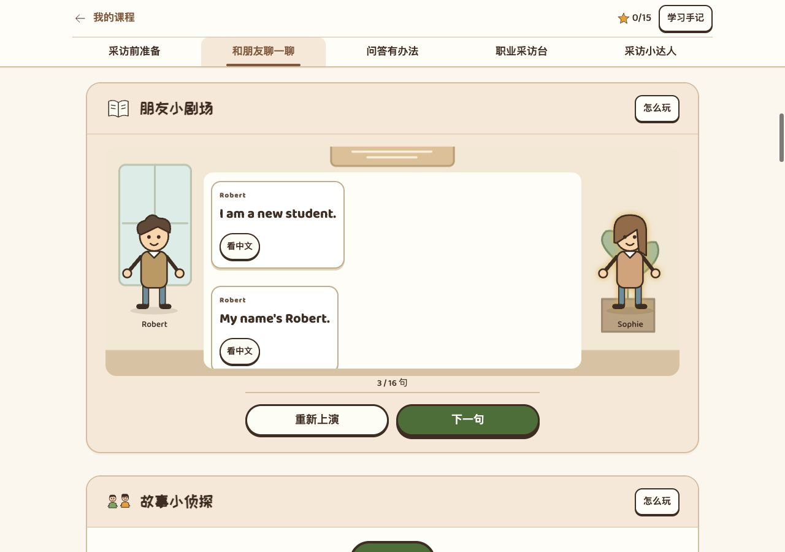
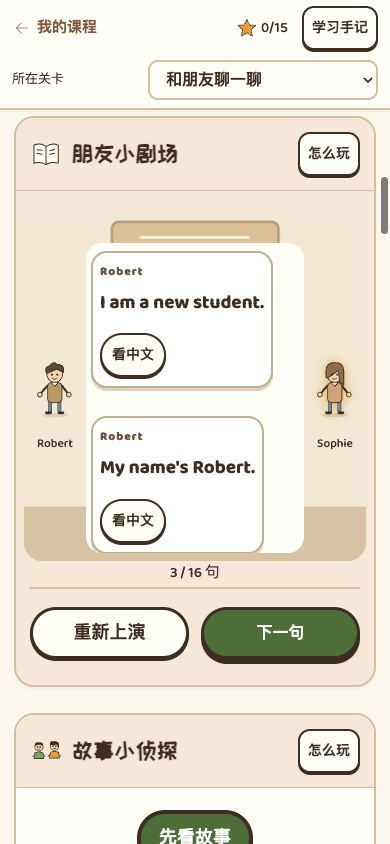
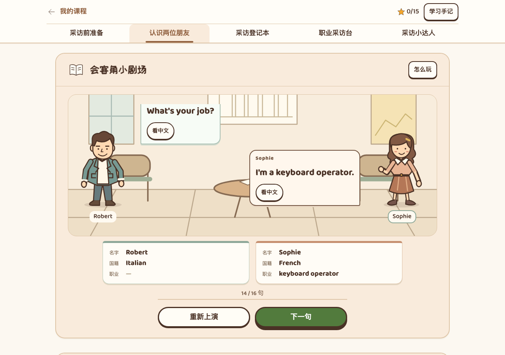

# Lesson 7–8 无配音优化方案与审视 v2.0

> 后续版本：最终挑战已扩为十题，全课现为 32 题，见[综合挑战与验收 v2.1](2026-09-26-1521-v2.1-Lesson7-8综合挑战与验收.md)。本文的 25 题及检查数量保留为当时记录；人物与场景设计仍适用。

2026-09-26 09:46。分支 `codex/butcher-version`，审视基线 `4434211`。用户已明确本轮处理 **Lesson 7–8**，接续 Lesson 5–6。

**状态：用户确认后，已在独立工作树完成本地实施。** 现行为新人物、会客角和采访档案串联的无配音版，五关、10 项活动、25 道题。实施和验收记录见第 6 节。未提交、未推送、未发布。

执行依据是[统一设计标准 v1.21](publish/2026-09-25-1136-v1.21-教学单元设计标准与验收清单.md)及[加载缓存设计](publish/2026-09-24-2031-v1.0-网页加载缓存设计.md)。本文只记录本单元决定，不复制共用规则。

## 1. 结论与教材依据

改造前 Lesson 7–8 **已经是无配音版**。词卡翻中文、课文逐句阅读，英语录音不参与页面操作和进度。此次提升人物、空间、任务和题目质量，保持无配音模式。

已重新查看用户提供的《外研社新概念英语智慧版1》PDF 第 47–50 页，即纸页 14–17：

- Lesson 7：Robert 与 Sophie 的 16 句完整对话，姓名、国籍、职业及肯定／否定回答。
- Lesson 7 词汇与注释：11 个词，另保留 `keyboard operator` 整体词组；`My name’s`、`I’m`、`What’s` 缩写。
- Lesson 8：10 个职业／身份词和介绍句；Written A 的 `am / is`；Written B 的 `his / her / he / she / a / an` 问答。
- **Robert 是新学生，也是工程师。** 学生身份不排斥职业，不能把人物画成幼童来“解释”课文。
- 不因同名便认定 Lesson 5 的 Miss Sophie Dupont 与本课 Sophie 是同一个教材人物；本课明确的职业是 keyboard operator。

保持 22 张词卡、默认可见的配套音标、16 句原文及完整纸笔材料。网页不评判自由口语、听力或真实发音能力。

## 2. 改造前：实际页面与题稿一起审视

本轮在同一工作树、同一浏览器中对照 Lesson 1–2、5–6 和 7–8。桌面为 1280 × 900，窄屏为 390 × 844。证据在[本次目录](evidence/2026-09-26-0935-unit7-8-review/)。

| 步骤 | 实际状态 | 结论与优先级 |
| --- | --- | --- |
| 1. 图鉴与词汇题 | 22 张词卡、13 个重点词的单次练习；翻卡不播放英语；选错后只提示重试 | 基本操作保留。13 题分别覆盖新词，不为追求少题而删掉必要词汇。 |
| 2. 阅读小剧场 | 人物同一身体轮廓；中间不透明大框遮挡环境；Sophie 的脚与背景花盆重叠 | 优先重做人物和场景组合；不能只换主题色。见图 A。 |
| 3. 手机对白 | 两个人物缩在两侧，正文区域也被挤窄；长句更易换行 | 优先让英文占整行、人物放在对白下方，保持身份可辨认。见图 B。 |
| 4. 理解与问答 | 否定回答跨活动重复；一题只需追踪人名标签；`ask-her` 实际考 `she / an` | 改题目判断本身，不只改标题和配图。 |
| 5. 示范与独立作答 | Written A 参考卡显示后续填空原句；职业示范包含后续问法和完整拼句答案 | 区分学习示范与独立练习。改用不同情境示范，教材整套答案放在完成后的核对区。 |
| 6. 完成与证书 | 27 题完成后能领取 15 星证书，但仍主要是通用星星、徽章和两个人像 | 增加本课完成的两份采访档案，反馈和领奖操作继续共用。 |

**图 A：改造前 Lesson 7–8，小剧场显示三句后刷新。** 人物与空间关系不足，白色面板占据舞台中心；刷新后当前第三句在可见区下方。

对照：[Lesson 1–2 同尺寸、三句对白](evidence/2026-09-26-0935-unit7-8-review/05-unit12-reference-desktop-1280.png)有清楚的街景、前景手提包和人物气泡；[Lesson 5–6 同尺寸、三句对白](evidence/2026-09-26-0935-unit7-8-review/04-unit56-reference-desktop-1280.png)能看出教室、教师与同学的关系。借鉴其完成质量，不复制其故事。

**图 B：改造前 Lesson 7–8 手机布局。** 两侧人物过小，中间框又占据主要空间。

对照：[Lesson 1–2 手机样板](evidence/2026-09-26-0935-unit7-8-review/07-unit12-reference-mobile-390.png)和[Lesson 5–6 手机样板](evidence/2026-09-26-0935-unit7-8-review/08-unit56-reference-mobile-390.png)。小图不可辨认、对白拥挤属于本次可见风险；本轮没有做完整读屏、键盘和对比度验收，不能称为全面无障碍通过。

## 3. 已确认主线：认识两个人，完成两份采访档案

保留“新朋友采访站”单元名。把流程串为：**认识词语 → 看两位新朋友聊天 → 核对资料 → 选择合适的问法 → 完成采访手账。**

区别于 Lesson 5–6 的“老师向全班介绍新同学”，本课重点是两种关系：

- 当面问本人：`your / you`，对方介绍自己用 `I / am`。
- 向另一人打听：`his / her`，谈论他／她用 `he / she / is`。

儿童通过选择、检查和熟悉的词块拼装完成，不增加扮记者走地图、开门、强制打字或等待动画。课堂采访只使用给定的虚构资料卡，不要求孩子填真实国籍或家庭职业。

### 人物、空间与道具取舍

| 对象 | 决定 | 具体做法 |
| --- | --- | --- |
| Robert | 重画 | 保留抽象风格，采用较宽肩线、短发、开襟外套与长裤；用服装结构形成辨识度。不能靠安全帽提前暴露工程师答案。 |
| Sophie | 重画 | 与 Robert 在发型、身形、上衣和下装轮廓上明显不同；不用相同矩形身体换颜色，也不简单复用 Lesson 5 的人物。 |
| 会客场景 | 重画 | 参考教材插图中的面对面交流，设置能看懂的小圆桌、两把椅子和后方资料架。深棕描边，浅杏与暖白为基底，桌面与人物处在合理前后关系中。该环境只是视觉包装，不变成教材考点。 |
| 采访档案 | 新增 | 两张有姓名、国籍、职业位置的手账卡，由原文已经确认的信息逐步填入。初始职业不显示工具或名称。 |
| 对白 | 调整 | 透明或轻量外层，紧凑的浅底气泡指向说话人。短句不做成长卡片；英文优先，中文按钮轻量但仍易点。只滚动对话区。 |
| 词汇图标 | 按实际用途检查后复用 | 国籍用现有国旗；职业须有可辨认的工作动作或道具，不能只靠男女发型猜。此次不认定未逐张验看的图标已经全部合格。 |
| 封面 | 调整 | 只展示两人、桌子和待填写档案，移除开场提前展示的 Italian／engineer 组合。单独学习词义不构成剧透，但不能在人物档案尚未确认时提前绑定答案。 |
| 完成画面与证书 | 调整 | 统一复用两位新人物和采访手账。结束时展示实际收集、核对过的两份档案；仍由孩子点击完成后领奖。 |

先完成一个代表片段的“初始—说话—信息确认—完成”四种状态，再用于封面、题目和证书。不能先批量替换素材、最后才检查它们能否与对白共存。

### 原文信息何时出现

| 读到的原文 | 档案状态 |
| --- | --- |
| 开始前 | 两份待填写卡；原有说话人标签可见，姓名等字段不冒充已读记录 |
| 第 2、4 句姓名介绍后 | 分别填写 Robert、Sophie 的姓名 |
| 第 6 句回答法国人、第 10 句介绍意大利人后 | 分别填写 Sophie、Robert 的国籍 |
| 第 12 句否认是老师后 | 不把 teacher 写为 Sophie 的职业；仍等待明确职业 |
| 第 14、16 句介绍职业后 | 才填入 keyboard operator、engineer；此时才可展示对应职业工具 |
| 用户点击“完成课文” | 展示两份已收集档案，提供下一站与次要的再看一遍 |

阅读中档案表示“已经在课文里读到”，不是“已经独立答对”。理解题的正确记录只在检查成功后出现。错选、展开线索或回看旧句不能提前确认答案。

## 4. 现行活动与 25 题取舍

把 12 项活动整理为 10 项，仍是五关。合并相邻的小练习，减少不断进入只有一两题的新面板；不是删除教材内容。

| 关卡 | 推荐活动 | 必做 | 与当前的变化 |
| --- | --- | ---: | --- |
| 采访前准备 | 采访小图鉴 → 单词寻宝 | 13 题 | 保留 22 词卡、13 个重点词；不做整组正反翻译 |
| 认识两位朋友 | 会客角小剧场 → 朋友资料卡 | 16 句＋2 题 | 保留职业信息和否定理解；删除主要靠看名字标签的题 |
| 采访登记本 | 采访小锦囊 → 填好采访记录 | 3 题 | 合并保留的国籍问答与两道主语搭配；删除重复否定回答 |
| 职业采访台 | 职业人物册 → 完成采访对话 | 4 题 | 同一任务内选问法、拼问答；真正训练 his／her |
| 采访小达人 | 采访小挑战 → 我的单元证书 | 3 题 | 保留新人物的信息提取、说话对象切换和独立组织 |

### 每个保留判断为什么必要

| 项目 | 判断、答案及边界 |
| --- | --- |
| 13 个词汇题 | 分别覆盖 Italian、keyboard operator、engineer 与 Lesson 8 十个职业／身份词；题量依据新词覆盖，不依据统一配额 |
| Robert 资料 | 从 `new student / Italian / engineer` 中识别职业；正确为 engineer，不能暗示学生身份与工作互斥 |
| Sophie 资料 | 根据 `No, I’m not.` 理解她不是老师；保留 `No, she isn’t.`，而不是重复让 Robert 再答一次同类否定题 |
| 国籍问答 | 给出 `What nationality are you?`，选择 `I’m Italian.`；姓名与职业回应是有意义的干扰，不能只保留词义题而漏掉开放问句 |
| 两项登记 | `My name ___ Robert. I ___ Italian.` 选 is／am；`Sophie ___ not Italian. She ___ French.` 选 is／is。呈现为不同视角的登记卡，不重复整组 am／is 填空 |
| 打听他 | 向 Sophie 询问 Robert 的职业，选 `What’s his job?`；your 会问到 Sophie 本人，her 指代对象不符 |
| 打听她 | 向 Robert 询问 Sophie 的职业，选 `What’s her job?`；替换现有只考 she／an 的题。人称由题干与明确人物关系决定，不从职业猜 |
| 当面问答拼装 | 独立组织 `What’s your job? I’m an engineer.`，保留 your→I 与 an 的运用；示范不提前展示这道题的完整答案 |
| 谈论他拼装 | 独立组织 `Is he a taxi driver? Yes, he is.`，检验第三人称确认，保留 he／is 与 a 的运用 |
| 最终三题 | 从新的 Italian／nurse 自述提取资料；走到一位 mechanic 本人面前改用 Are you；以新角色 Ben 的信息组织姓名与职业缩写介绍 |

删除 `reply-no` 和 `story-turns`，共减两题。`ask-her` 改题。合并活动而非机械叠加新题。冠词的必要对比仍在工程师与出租车司机句型中，完整 Written B 保留在线下材料中；不是为保留每种词面而重复刷题。

### 避免示范直接给答案

- 主学习区可保留完整原文和词义；练习前的示范使用不同人物、不同完整句，不复制当前试题。
- am／is 规则只给教材 Xiaohui 示例，Robert 与 Sophie 的完整答案放在做完后核对；不能展开规则就看到两题答案却仍算独立完成。
- 职业学习册保留十种职业介绍；十二组完整 Written B 问答作为完成后核对／课堂材料，不与独立拼句并排。
- 练习中的灯泡只指向关注对象或思考方法，位于检查按钮左边；没有有效线索就不显示。使用后保留辅助完成记录。
- 职业词说明保持准确：不由职业推断性别；冠词看起始音素，不看字母；旧称谓的说明不扩充为额外必考词。

## 5. 无配音、学习记录与缓存

无配音是本单元明确模式：不请求英语录音、不启用系统朗读、不要求听完、不把静态句子伪装成播放按钮。反馈音可以保留，失败不能阻塞评分、推进和领证。65 段旧录音及映射只用于历史追溯，学生包仍排除它们。

课程定义显式使用 `mode: 'classroom'`。保留原学习记录命名空间和未变题目的版本；合并活动单独使用 v2 作答记录，改写的 her 题使用新题号。打包资源指纹随源码、人物和场景变化，不以清空整课进度实现改版。

本次 25 题改版已经实现：

- 词卡页、证书姓名、未变的词汇题和完整课文阅读位置应保留。
- 新题和改写后的 `ask-her` 使用新题号／凭据；旧 she／an 答对不能算新 her 题已答对。
- 合并活动只接受明确旧题的有效结果，不把整个旧活动的完成标记直接当作新活动全部完成。
- 旧 `#learn/reply`、`#learn/be`、`#learn/interview`、`#learn/trans` 定位到对应内容，不能跳到无关页面或留下空活动。
- 人物／背景纯视觉变化不能导致所有成绩归零。15 星仍表示五关有效完成。
- 新图、新场景状态与实际证书导出素材加入整课资源清单；全部准备好后进入。词卡换页、课文换句不重复出现全屏加载。

## 6. 本轮实际检查与实施验收

### 改造前基线检查

- 在内置浏览器中逐题操作现行 27 题、读取全部 16 句，并领取证书。
- 在独立本地源码页面阻断全部 MP3／WAV／OGG：36 次反馈音请求被阻断，英语音频请求为 0，仍能完成；刷新后为 15 星。
- 词卡 I 可翻中文；错答只显示“再看看，试一次。”；第 12 道词汇题刷新后未代选、未提前开放检查。
- 已对照桌面与 390 宽度下的实际场景，检查当前证书：[手机证书](evidence/2026-09-26-0935-unit7-8-review/10-unit78-current-certificate-mobile.png)。
- 行为证据见 [baseline-behaviour.json](evidence/2026-09-26-0935-unit7-8-review/baseline-behaviour.json)。检查使用独立预览记录，没有访问或修改线上学生数据。

基线证据边界：功能走查使用本地源码入口；视觉对照也查看了本地打包入口。曾同时绕过 Service Worker 与阻断声音，打包加载未完成，撤销后恢复；该组合实验没有用于证明断音通过，也未判为产品故障。当时未完成整包冷缓存断音恢复、账号同步、真实安卓微信、导出证书图片和教师／儿童试用验收。实施后的新增检查另列在下方，不能用基线代替新版验收。

### 实施结果与防御措施

2026-09-26 用户确认实施后，在 `/Users/permission/.codex/worktrees/butcher-version/canranstudio.cn` 完成；没有切换其他会话的工作目录。

- **新增**：重画 Robert、Sophie 与会客角；增加逐句填写的两份档案、资料题与登记题场景；完成画面和证书带上采访成果。手机英文占整行，人物在下方，桌面保留左右人物。档案职业栏预留高度，换句时不顶动操作区。
- **题目调整**：12 项活动合并为 10 项，27 题减为 25 题，删除重复的否定回答和看姓名标签题；her 题明确询问 Sophie 的职业。参考答案移至对应活动完成后的核对区。保留全部 22 词卡及音标、16 句原文和 Written A／B 材料。
- **旧记录处理**：新增题保持未答；只有题稿一致、题号和本轮作答归属匹配的旧记录可以合并。旧课堂版全部完成后升级会显示 12 星；重答新 her 题并主动结束本活动后恢复 15 星。未提交草稿不会由历史分数补答，重练也不会再次导入旧答案。旧 be／trans 书签落到合并活动。

实施中修复了两处实际流程缺口：

| 问题与原因 | 修复与后续防护 |
| --- | --- |
| 打包入口刷新时，内容尚被加载层隐藏就计算了对白滚动位置，当前句可能落到可见区域下方；源码页没有加载层，单测源码路径会漏掉。 | 在课程真正显示后恢复当前句，事件名避免被存储命名空间重写。增加真实缓存包离线刷新检查，确认离线响应标记和最后一句实际可见。 |
| 旧账号同步只接受现行完整活动，合并题稿后会过滤旧活动，导致另一台设备无法迁移有效答案；同一浏览器本地迁移检查发现不了。 | 服务器只为显式声明的前身活动保留经过题稿、完整提交和作答归属校验的迁移来源；新题不算已完成。用旧服务器真实完成 27 题，再升级服务器和更换浏览器环境，验证 12→15 星及证书姓名。 |

历史页面样例和素材变化已纳入相关检查选择；测试使用自己的端口，避免误测其他会话的预览。

### 实际验收

证据保存在[新版实施目录](evidence/2026-09-26-1116-unit7-8-implementation/)，逐项结果见 [verification.json](evidence/2026-09-26-1116-unit7-8-implementation/verification.json)。

| 范围 | 实际结果 |
| --- | --- |
| 本单元真实页面 | 最后一轮 **29 项全部通过**：完整 25 题＋16 句、22 张音标词卡、全部声音失败仍通关、正常正误反馈音、错答与重试、独立／提示／修正记录、旧页面迁移、旧路由、参考答案开放时机、词块撤回与刷新。 |
| 布局与成果 | 320／390／768／1280 宽度检查通过；对白翻句操作区稳定、图像完整、页面无横向溢出。已目视复核桌面与手机场景、任务完成页，以及实际导出的证书 PNG。证书和练习纸各为一张 A4。 |
| 整包加载与离线 | 人物资源未准备好时不展示半成品课程；完整加载后离线换句、刷新当前句、词卡换组均通过，验证 `X-Course-Offline: 1`，没有英语配音请求。 |
| 账号与跨设备 | **5 项通过**：本地保护入口的 3–4／5–6／7–8 通关与证书跨设备恢复、5–6 翻卡稳定、7–8 旧服务器升级后换设备继续。全部使用临时虚构账号与临时数据库。 |
| 共享题型与证书 | 包括上述 29 项在内，共 **113 个不同页面用例**得到通过结果，覆盖原 Lesson 49 作答防御、其他单元去重／错答反馈、49–50 证书和导航。不是一次全套运行：一轮中断前的已通过项目与补跑完成的单元套件按名称去重统计；中断不算成功。原日志保留。 |
| 其他检查 | 相关 JavaScript 语法、差异空白检查通过；检查工作流的 10 项自检通过。 |

**桌面：** 读到第 14 句时，只填入 Sophie 已明确介绍的职业；Robert 的职业仍为空。

[手机版场景](evidence/2026-09-26-1116-unit7-8-implementation/story-records-390.png) · [窄屏完成操作](evidence/2026-09-26-1116-unit7-8-implementation/finish-320.png) · [真实保存的证书](evidence/2026-09-26-1116-unit7-8-implementation/certificate-saved.png) · [证书 A4](evidence/2026-09-26-1116-unit7-8-implementation/certificate-print.pdf) · [练习纸 A4](evidence/2026-09-26-1116-unit7-8-implementation/writing-print.pdf)

本地预览：`http://127.0.0.1:4190/lesson/unit7-8/`。当前内置浏览器已显示新版，原第 3 句续读位置保留。预览端口属于此工作树，线上账号与数据未改动。

尚未进行教师审稿、儿童课堂试用、真实安卓微信与完整无障碍验收；这些不能用桌面浏览器模拟替代。本轮 **未提交、未推送、未部署**，线上版本未更新。
