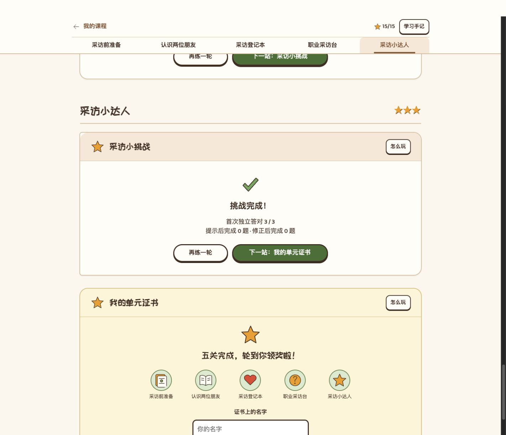

# 最终挑战覆盖审视 v1.0

2026-09-26 13:47。分支 `codex/butcher-version`，独立工作树。本文保留当时的**审视与建议**。后续经用户授权，标准更新至 v1.22，Lesson 7–8 十题改造与实际验收另见[实施记录](2026-09-26-1521-v2.1-Lesson7-8综合挑战与验收.md)；下文三题／25 题数量属于修改前快照。

本次以用户正在查看的 Lesson 7–8 为完整题稿审视样本；另统计 Lesson 1–30 的 15 个配对单元最终题量，未逐课判断其目标覆盖。依据为现行[统一标准 v1.21](publish/2026-09-25-1136-v1.21-教学单元设计标准与验收清单.md)、[Lesson 7–8 v2.0 方案](2026-09-26-0946-v2.0-Lesson7-8无配音优化方案与审视.md)和实际运行的题稿。教材范围沿用已审定的纸页 14–17、PDF 47–50；本轮没有重新逐页审校教材。

## 结论

Lesson 7–8 的三题有局部综合运用，但定位更接近课末抽查，不能独立承担全单元核心目标的综合练习。题量偏少与覆盖遗漏同时存在。全课保留了 22 张词卡、16 句原文、25 道必做题；材料呈现、前面练过、最终独立检验是三种不同证据。

之前的方案明确保留三道最终题，强调去重与少量迁移抽查。现行统一标准允许抽样复习、禁止机械重复，但缺少一张必须验收的“核心目标—前置练习—最终挑战”对照表。建议补上这一要求，而非统一规定每课必须做同样多的题。

## 1. 当前页面与三题

实际页面：`http://127.0.0.1:4190/lesson/unit7-8/#learn/exam`。只观察现有完成页并滚动，没有重练或改动用户的答案记录。

| 步骤 | 证据与判断 | 状态 |
| --- | --- | --- |
| 1. 阅读题 | 题稿为 `I'm Italian. I'm a nurse.`，选国籍与职业组合；需要核对两项英文信息，但只抽到极少词汇。 | 有效，局部覆盖 |
| 2. 交谈对象题 | 从 `She is a mechanic.` 转到当面询问，选 `Are you a mechanic?`；条件确实发生变化。没有要求回答，也未检验 his／her。 | 有效，覆盖有限 |
| 3. 自我介绍拼句 | 拼 `My name's Ben. I'm an engineer.`；提供的词块已经包含正确缩写和整块 `an engineer.`。可观察句子组织，不能独立证明孩子会选择冠词或解释缩写。 | 有效，但不能扩大解释其结果 |
| 4. 完成记录 | 实际页面显示首次独立答对 3／3、提示后与修正后数量、重练和下一站。记录区分方式合理；分母只有三题，不能代表所有本课能力。 | 操作结果清楚，评价范围较窄 |

前三步的题干分析来自 `unit7-8/content.js:118–121`，不是本轮重新作答的截图证据。第四步来自上图及页面可见文本。本轮没有重新验证键盘、读屏、手机重排或完整答题流程，不作无障碍合格结论。

## 2. 目标覆盖

| 本课目标 | 前面已有的材料／练习 | 最终三题实际检验 |
| --- | --- | --- |
| 新词词义 | 22 张词卡；13 个重点国籍／职业词逐词练习；功能词另结合例句 | 抽到 Italian、nurse、mechanic、engineer 的理解或使用；并非逐词检验 |
| 姓名、国籍、职业三类信息 | 原文、资料卡、国籍回应 | 姓名介绍与国籍／职业提取；没有独立检验国籍开放问句 |
| 当面询问国籍和职业 | 国籍选择回应、职业问答拼装 | 只检验当面确认职业；没有完整开放问答 |
| 肯定与否定回答 | 完整原文、Sophie 否定理解、第三人称肯定拼句 | 没有作答任务 |
| your／his／her、you／he／she 随交谈关系改变 | 两道人称问法题与第三人称拼句 | 只检验 she→you 的对象切换；没有 his／her 判断 |
| am／is／are 与主语搭配 | 两道登记填空及原文／示范 | 部分句型出现，但没有充分的形式选择对比 |
| a／an | 职业介绍示范，前面工程师／司机拼句 | `an engineer.` 整块给出，不构成 a／an 独立选择；前面拼句也有相同局限 |
| 缩写与整句组织 | 三组缩写说明，前面问答拼装 | 能观察带给定缩写的句子组织；不能由此判断三组缩写均已理解 |
| 礼貌初次见面、原文人物理解 | 原文中的问候、资料理解 | 不在最终挑战单独复测；可融入综合情境，不必将旧问候另扩成一组必做 |

**只有孩子必须据此作出判断，才算测到相应目标。** 正确选项、固定词块或插图标签里出现了知识点，不能自动计为该目标的检验。一个综合题同时涉及数个目标，也不能从一次正确就认定每项都稳定掌握。

无配音网页可观察词义、阅读理解、语境选择和有支架的句子组织；真实听力、发音、自由口语和独立书写由相应课堂活动承担，不计为网页挑战已检验。

## 3. 其他单元的题量现状

读取当前各单元最终 `questions.exam` 定义，未改动题稿：

- Lesson 1–2：2 题。
- Lesson 3–4、5–6、7–8、9–10、11–12：各 3 题。
- Lesson 13–14、15–16、17–18、19–20、21–22、23–24、25–26、27–28、29–30：各 2 题。

共 15 个单元：10 个为 2 题，5 个为 3 题。可确认轻量收尾是普遍设计；不能据题数直接断言其他单元各自漏了什么。Lesson 49–50 不在本次统计结论内。

## 4. 建议的调整方向（待实施决定）

Lesson 7–8 可先按 **8–10 道短题**设计，建议以 10 题为题稿草案起点，再依据逐项覆盖与儿童实际负担增减。这是本单元的设计建议，不是科学定额或所有课程的统一题量。

| 组合 | 草案题量 | 用途 |
| --- | ---: | --- |
| 词义与信息整合 | 2 | 重点易混职业词、英文人物资料；避免重新刷全部职业词 |
| 情境问答 | 3 | 国籍开放问答、当面询问职业、按明示资料作肯定／否定回应；问候可融入情境 |
| 人称与搭配 | 3 | his／her 的明确人物关系、am／is／are 的必要主语对比；不从职业或外貌推断性别 |
| 句子组织与完整表达 | 2 | 第三人称确认问答、自我介绍；让 a／an 和缩写中的必要选择真正由孩子作出，不全部锁在正确词块中 |

此表是分配起点，编写正式题稿时仍须检查肯定／否定、your／his／her、三种 be 形式、必要冠词对比各自是否有实际作答证据。不能为维持“10 题”而遗漏目标，也不能把一题堆成冗长多步测试。

组织方式：围绕一项采访任务交错安排，复用熟悉的单选、图卡和词块操作。前面的练习负责有支架学习，最终挑战负责间隔后抽样复习与整合；如实标注复习，不把换人物或换词伪称新能力。不得复制前面整组题。

建议纳入统一标准的验收项：

1. 每单元先列完整核心目标及线上／课堂分工；最终挑战对每个适合线上检验的核心目标给出独立作答机会，未覆盖项必须明确说明。
2. 对照真实题干、干扰项与词块，记录“孩子需要判断什么”；排除知识点只出现在现成答案中的伪覆盖。
3. 必要对比有辨别证据，重点词合理抽样；不强制逐词、逐句和全部替换组合重新刷一遍。
4. 首次独立、提示后、修正后继续分开记录；结果可按目标指出需要再练的内容，不能以完成证书宣称整课全部掌握。
5. 全单元检查重复总量，并由真实儿童走查题干长度、理解负担与完成节奏；本轮尚无该证据。

当前只保存审视记录和一张实际页面证据。课程代码、登录权限、统一标准及用户学习记录均未修改。
