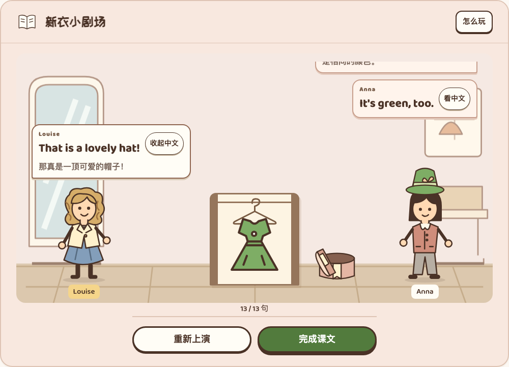

# Lesson 13–14 本轮页面审视与验收

范围：`codex/butcher-version` 独立工作目录中的无配音课堂配套版。教材依据为用户提供 PDF 第 59–62 页（纸页 26–29）。本轮实际打开旧页面、Lesson 1–2 样板与改后页面；未以历史截图代替现状。方案、覆盖矩阵和独立答案稿见[设计文档](../../2026-09-26-2154-v2.0-Lesson13-14场景与综合练习优化.md)。

## 五步审视

1. **配色小图鉴：保留，页面检查通过。** 原有 21 张卡带音标，功能词有语境，17 个新词各练一次；没有再造一组换词不换判断的必做题。检查翻页、中文翻面和图片完整。证据：[原图鉴](before-words.jpg)、[改后手机首屏](01-words-390.png)。首屏截图只证明当屏布局，全部卡片和按钮通过实际翻页另验。
2. **新衣小剧场：重做，页面检查通过。** [原页面](before-story.jpg)两个人物仅换色，白色对话框遮住背景，道具未参与故事；[同次走查的 Lesson 1–2](reference-unit1-2.jpg)用于比较完成质量。新版人物轮廓不同，楼梯、衣柜、衣架、帽盒按原文出现。最新句子及中文在固定对话区内呈现，操作不移动；缓存入口刷新也恢复到最新句子。证据：[桌面](02-story-1280.png)、[320 宽度](02-story-320.png)。
3. **理解与表达：保留有效题目，改善证据画面。** too 承接 new、问颜色与问主人、双色描述等保留；帽盒及服饰与当前任务对应，选中或错答不提前出现成功画面。证据：[颜色判断首屏](03-colours-1280.png)，全流程与错误路径见页面日志。
4. **配色小画册：减少同屏内容，材料保留完整。** [原页面](before-models.jpg)纵向铺开十幅图、十二组问答和五组合句；改为十幅图逐页展示、十二组问答在展开区翻页，五组合句保留在参考区。最后一页直接衔接词块练习，页码刷新保留。证据：[桌面首屏](04-album-1280.png)、[320 宽度图卡](04-album-320.png)、[完整纸笔练习](writing-print.pdf)。图卡截图用于检查内容可辨认，不作为操作区证据。
5. **综合挑战：补齐必要目标，页面检查通过。** [原版两题](before-exam.jpg)不足以检查本单元核心表达；现行十题覆盖 same、too、邀请、物主与颜色、两种 ’s、拼问句、合句、赞美。证据：[第九题作答区](05-exam-1280.png)、[手机结束布局](05-finish-390.png)。长句、五词块和末题在四种宽度实际作答；原两题成绩有效保留，新增八题不能自动完成。

## 页面检查

只使用真实页面学习、控制和导出；预期答案取自独立题稿及教材。旧学习记录先在冻结旧页面实际完成，再升级；没有直接注入已完成数据。登录测试使用临时账号和服务器，不读取或修改线上学生。

| 检查 | 命令与证据 | 实际范围 |
| --- | --- | --- |
| 本课完整页面 | `COURSE_TEST_PORT=4192 npx playwright test tests/e2e/unit13-14 --reporter=line`；[日志](final-course.log) | 36 项：无配音通关、34 题／13 句／21 卡、错答与提示、末题空白、词块撤回、四宽度、短屏、材料翻页、旧记录承接、断网和刷新 |
| 本课登录／升级 | `npx playwright test -c playwright.login.config.js tests/login/unit13-14-upgrade.spec.js tests/login/course-integration.spec.js --grep '13–14' --reporter=line`；[日志](login.log) | 2 项：新账号全程、旧服务器升级、新八题补完及跨设备；旧姓名与证书日期保留 |
| 账号回归 | `npx playwright test -c playwright.login.config.js tests/login/access.spec.js tests/login/root-mount.spec.js --grep '证书\|完整通关' --reporter=line`；[日志](account-regression.log) | 实际匹配 access 中 2 项：本课重开隔离旧设备；49–50 作为共享账号的配音参照。没有匹配 root-mount 用例，也不代表完整登录套件 |

初始新增页面检查暴露没有分镜、没有翻页和挑战只有两题；随后视觉检查捕获共享样式优先级导致的人物位置错误，[布局失败日志](layout-red.log)保留。缓存预览还发现刷新后显示开头旧句：页面准备期间没有可滚动高度。用保留真实图片、延后解码 80ms 的页面场景稳定复现后，改为在页面解除隐藏时恢复对白；[失败日志](restore-red.log)和最终通过记录均保留。这是人为延时复现，不等同于真实手机测量。

## 实际导出与限制

[证书 PNG](06-certificate.png)、[单页证书 PDF](certificate-print.pdf)、[单页练习纸 PDF](writing-print.pdf)均由页面生成并目视核对。练习纸完整保留 A 五组和 B 十二组，未把给出答案的阅读示例算成独立测评。

角色和主要道具在 320／390／768／1280 宽度检查了可见边界；按钮键盘操作、内部滚动、焦点和长文换行有页面检查。不能据截图推断完整无障碍合规；读屏、真实安卓微信／iPhone、教师与儿童课堂验收仍待进行。

前后首轮审视与样板均按当时相同视口截图；其后用户调整过预览窗口，桌面与手机对比以文件名标注的自动化固定宽度为准。`after-*.jpg` 是本轮人工走查补充，部分记录滚动位置，不替代完整区域截图。

状态：本地实施与上述验证完成；本轮未提交、未推送、未发布。其他单元、线上账号与数据保持原有工作边界。
