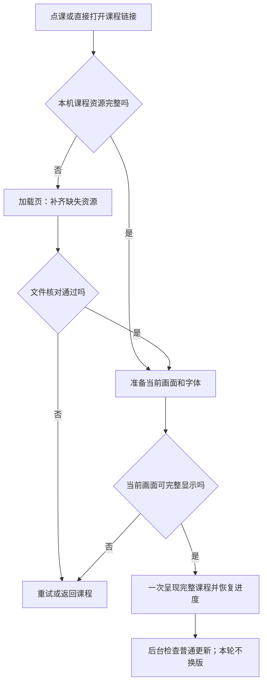

# 网页加载缓存设计 v1.0

更新：2026-09-24 20:31。适用：`codex/butcher-version` 的课程导航、全部已发布课程和后续单元，正式入口为 `/lesson/`。

**状态：已提交、推送并部署至 `/lesson/`；本地及线上验收范围见第 9 节与[发布记录](../2026-09-24-2322-v1.0-缓存与品牌发布验收.md)。** 用户已明确：允许点课后等待加载，不接受进入课程后图片缺一部分，再次进入应很快。本文是加载与缓存规则的唯一维护位置；教学、题型、声音模式和学习记录规则继续见[统一设计标准 v1.20](2026-09-24-2031-v1.20-教学单元设计标准与验收清单.md)。

用户确认按方案 A 实施：先打开本机完整版本，后台准备新版，下次进入启用；本轮页面始终锁定自己的完整版本。

## 1. 孩子应该感受到什么

**第一次把这节课准备齐，再开始；以后用已经准备好的内容快速打开。** 缓存单位是导航中的一门课程，例如 Lesson 1–2，不是全站所有课，也不是仅第一屏。

| 情况 | 页面表现 |
| --- | --- |
| 打开或刷新首页 | 加载页标题显示“灿然英语工作室”。 |
| 第一次点课 | 立即出现本课加载页，显示课名、简短状态和真实进度；准备好后自动进入原定位置。 |
| 再次点同一课 | 本机资源完整时直接恢复学习；极短的检查不刻意展示加载动画。 |
| 某张图片没下载成功 | 留在加载页，自动有限重试；仍失败时显示“还没准备好，再试一次”，提供“重试”和“返回课程”。不能先进入缺图页面。 |
| 上次下载中断 | 复用已经核对完成的文件，只补缺失部分，不从零下载整节课。 |
| 普通课程更新 | 本轮保持同一个完整版本；新版准备完成后，下次进入再使用。 |
| 断网 | 本机完整课程可继续；未准备好的课程说明需要联网，保留返回入口。 |
| 浏览器不能保存资源 | 可在本次完整准备后学习，但提示“这次可正常学习，下次可能需要重新准备”，不显示已保存。 |

加载页沿用当前圆角按钮与单元配色，只显示课名、网站星花图标、进度和必要操作。图标直接复用 `assets/brand/starflower.png`，与导航品牌一致，不再单独绘制近似版本；构建时把原图嵌入页面，使用系统字体，不能再等待一张远程加载图。进度根据已完成并核对的资源计算，下载结束后显示“正在准备画面”；只有画面可进入才显示完成。没有真实百分比时用阶段文字，不模拟从 0 跑到 99。

成功自动进入，尊重孩子点击的具体章节与续学位置；不再加一次“开始”确认。加载超过 200 毫秒才展示完整进度界面，失败提示立即显示。减少动态效果、键盘操作与读屏均可用；播报状态按阶段更新，避免每个文件都播报。

## 2. 改造前为什么不能保证这种体验

2026-09-24 实施前的基线如下；保留用于说明设计依据，当前发布结果见第 9 节。

| 当前实现 | 对体验的影响 |
| --- | --- |
| 正式课程 HTML、SVG 都返回 `Cache-Control: no-cache`，带有 ETag。 | 可以存储，但通常再次使用前需要向服务器验证；不等于完全没有缓存，也不保证复访无需等待网络。 |
| `unit1-2/unit.js`、`scene.js` 等在渲染时陆续创建图片；课程入口没有全课资源就绪检查。 | 首屏出现不代表后续词卡、场景与证书图片已经可用。 |
| `scripts/public-base-path.js` 生成的子目录 Worker 只隔离官网根作用域 Worker，没有资源缓存处理；没有旧 Worker 控制时还会直接跳过注册。 | 不能将官网另一个版本的离线能力当成 `/lesson/` 已有能力。 |
| 当前发布清单核对整个发布包，没有面向每节课的完整依赖清单。 | 发布文件齐全不等于某个孩子的浏览器已把本课下载齐。 |
| 现有 CSP 为 `connect-src 'none'`；公开运行时检查禁止 `fetch`、`serviceWorker`、`indexedDB`。 | 需要同步调整明确的缓存边界，不能只插入加载代码后就声称可运行。 |

`no-cache` 的含义见 [MDN HTTP 缓存规则](https://developer.mozilla.org/en-US/docs/Web/HTTP/Reference/Headers/Cache-Control)。

当前本地发布包约 187.35 MiB；字体目录约 0.83 MiB，Lesson 1–2 自有目录约 0.56 MiB，其中录音约 0.47 MiB。以上是目录体积，用于说明不应首次下载全站，**不是单课完整依赖或实测网络耗时**。实际课包须包含它使用的共用代码、图标、字体等，再由构建报告给出准确体积。

## 3. 什么必须准备齐

### 每节课建立一份资源清单

由构建生成清单，作者只补充程序动态选择的资源和使用范围，不能手写一份与页面脱节的第二套素材表。清单覆盖 HTML、脚本、样式及其递归依赖；追踪内容数据、CSS 背景、动态路径、人物状态、响应式图片和导出素材。

| 分组 | 包含内容 | 是否影响进入课程 |
| --- | --- | --- |
| 课程画面与操作 | 本课代码、内容、样式、实际字体，全部词卡、人物、背景、状态图、图片选项、图标、完成页和证书图片。可在课内随时打开的选练也包括在内。 | 必须齐全；少一项不能宣布课程已准备好。 |
| 配音版英语录音 | 当前启用且审核符合标准的词音、句音、听辨材料。 | 与画面分开记录。默认随课准备，但失败不阻塞阅读等非语音活动；依赖播放的活动仍必须真实播放完指定录音。 |
| 无配音版英语录音 | 目录中停用或历史保留的录音。 | 不进入本课运行清单，不下载、不预加载、不播放。 |
| 正误和完成反馈音 | 共用音效或其生成代码。 | 尽力准备，失败不能阻止作答或领取证书。 |
| 外部扩展与独立大文件 | 另行下载的教师材料、外链等。 | 按需准备；提供独立加载结果。课内必需图不能借此归为“可选”。 |
| 其他课程与历史美术 | 本课用不到的资源。 | 不下载。 |

导航另有一个很小的公共包，包含导航、课程目录、品牌图标、必要字体和设置入口。课卡所需图片准备好再显示卡片，不预下载全部课程。共用资源以内容校验值去重，多课使用同一图标或字体只保存一份。

配音资源的“文件已保存”和“已真正听完”完全分开。下载成功不增加题目进度，也不解锁听辨检查；缓存方案不改变教材模式与人工听审要求。无配音版本断开全部声音仍能通关。

加载页进度只计算进入课程所需的画面与操作依赖。另行区分“画面可进入”“启用配音已准备”“整课可离线”三个状态：配音版须连同启用录音全部保存才可标记整课可离线；无配音版不等待英语录音。反馈音失败不改变作答资格，不给孩子增加三个技术状态按钮。

### 两次就绪检查

1. **资源齐全。** 所有必需文件状态正确、格式与大小合理、内容校验值匹配；HTTP 200 的错误 HTML、损坏图片与缓存中的半截文件都不能算成功。
2. **画面齐全。** 实际使用的字体已准备，当前页面图片可解码且尺寸有效，课程初始化与布局完成，再整体显示课程。首次下载对全部课程图片做有界并发的解码验证，不把所有大图永久留在内存。

后续章节、换词卡、反馈和证书仍使用已下载的文件，并在新画面显示前完成本地图片解码。保持旧画面，准备好后整体替换，不能先插入空图再等待。浏览器可能释放图片的解码内存，因此“下载过”不能取代每次场景呈现的就绪判断。[MDN 的 `decode()` 说明](https://developer.mozilla.org/en-US/docs/Web/API/HTMLImageElement/decode)提供了图片可显示的检查方式。

CSS 背景、图片候选尺寸与伪元素装饰也在清单中；不能只检查 DOM 里的 ``。关键图片不使用进入可视区后才联网的懒加载。给图片预留正确比例以防跳动，但占位块不能充当进入课程的验收通过。

## 4. 缓存、更新和学习记录

### 分开四个版本

| 标识 | 作用 |
| --- | --- |
| 发布版本 | 指向固定发布产物，便于核对与回退。 |
| 课程包版本 | 由该课内容、运行代码、声音模式及完整资源清单决定。别的课更新不让这节课重新下载。 |
| 文件内容校验值 | 文件内容相同就复用；内容改变必须换资源地址，不依赖手动修改 `?v=1.1`。 |
| 学习内容版本 | 沿用现有作答与进度兼容规则。修图、调整缓存不清空成绩；题意或答案变化才按标准重新核对受影响记录。 |

建议用三层：浏览器 HTTP 缓存用于传输复用；Cache Storage 保存已核对的资源；一个仅属于本应用的 IndexedDB 索引保存课包清单、完整状态、使用时间和版本指针。现有学习记录保持原来的独立存储，不迁入资源缓存。Cache Storage 不会自动按 HTTP 缓存头更新内容，需要应用自己管理版本。[MDN Cache 说明](https://developer.mozilla.org/en-US/docs/Web/API/Cache)

新课包先处于“准备中”，所有必需文件写入并核对后，才在一次索引事务中切换为“可用”。Cache Storage 与 IndexedDB 不构成同一个事务：断电、关页或写入失败留下的半包不得被索引误报为完整；启动时核对文件存在性，发现不一致便补齐。已核对的单文件可以在重试时复用。

同一轮页面锁定自己的课包版本，共用代码也使用该包声明的固定版本。普通更新的下载只能生成另一个完整包，不能覆盖本轮正在读的图片、题目或脚本。新旧两个标签页可以各自保持一致；缓存清理必须保护仍在使用的版本。

### 普通更新与教学纠错

已采用 A：复访不等待联网查询，先使用本机完整包，后台获取轻量更新索引；只下载本课变化的文件。准备完成后，下次真正进入或刷新时切换，不在答题中自动刷新。后台任务可能随关页停止，下次继续补齐，不能假定关闭浏览器后仍能下载完成。

教学错误的紧急撤回单独处理：更新索引可声明不可再用的课程版本。客户端**已经得知撤回**后不能继续把它作为快速进入的版本；先保存当前位置，在进入下一道题前停下并准备替代版本，不中途改写正在显示的题。联网索引尚未返回或完全断网时，无法知道刚发生的撤回，不能宣称离线课程永远是最新纠错版。普通样式更新不滥用这一机制。

进入前强制等待新版未被采用。教学紧急撤回通过专用清单处理，不能用普通更新打断正在学习的页面。

### 资源清理不等于重置学习

- 只清理带本应用前缀且确认归属 `/lesson/` 的资源缓存与包索引。不能删除同域官网的缓存、Worker 或记录，也不能调用全站清除。
- 首版建议以 128 MiB 作为本应用资源软预算，并依据浏览器空间估算提前清理最久未用的课包；这是待真机验证的参数，不是浏览器承诺。仍在学习的课程、正在切换的完整旧包与公共包受保护。
- 共用文件只有在没有课包或活动页面引用后才能删除。空间不足时先清理中断残留，再清理未使用的旧版本与久未打开的课程；不能删一半还显示课程已缓存。
- 导航的学习设置提供“清理课程资源”，明确保留学习记录。原“重新开始学习”保持独立，不借重开课程删除无关缓存。
- 浏览器或用户仍可能清除本站全部数据。持久资源存在时才能承诺复访加速；学习记录也不能被宣传成云端备份。[MDN 存储限额与清理规则](https://developer.mozilla.org/en-US/docs/Web/API/Storage_API/Storage_quotas_and_eviction_criteria)

首版不主动弹持久存储授权，不要求安装应用。存储能力被禁用或写入失败时，只在当前会话完整准备并持有必需资源后进入；图片从当前会话资源仓库取用，不再转回可能断开的网络。只承诺本次可用，不标记为持久缓存。设备连本次完整包也承载不了时明确失败，不降为半幅课件。

## 5. 加载失败与速度目标

| 边界情况 | 处理 |
| --- | --- |
| 单文件超时、断网、服务器失败 | 建议无数据进展 15 秒判为停滞，最多自动重试 2 次并逐步延迟；用户可继续重试或返回。具体参数在弱网检查中校准。 |
| 长时间加载 | 8 秒后给出简短“网络有点慢，正在准备”，保留已完成进度；超过 30 秒提供重试选择，不伪造剩余秒数。 |
| 图片 404、类型不对、解码或校验失败 | 不标记完整；定位具体资源供维护者排查，学生只看到简短重试提示。旧完整版本未被撤回时可以继续用旧版。 |
| 缓存索引存在但文件被清理 | 按缺失清单修复；失败留在加载页。已经进入时发现资源异常，暂停受影响区域并覆盖完整准备界面，不暴露半图；恢复后保持原题与选择。 |
| 取消、快速切换课程 | 取消无消费者的下载和旧页面显示回调；已核对文件保留。课 A 的完成回调不能把孩子从课 B 拉走。 |
| 两个标签页同时下载 | 相同文件与课包任务合并；索引按事务处理，关掉一页不能取消另一页还需要的任务。 |
| Worker 不可用或注册失败 | 使用本次会话完整准备路径；不给虚假的离线／下次快开承诺，不出现隐藏整页后永远空白。 |
| 字体失败 | 默认留在准备界面重试。只有经过各题型与导出验收的完整后备字体方案才能降级，并在本轮固定使用；不能进入后再突然换字、挤动按钮。 |
| 配音加载或自动播放被限制 | 保留显式点播和重试；不能因为下载完成就自动发声或完成听力。声音失败按教学模式处理，不冒充图片准备失败。 |

以下是验收目标；本轮实际设备、样本和结果另列第 9 节，不能推广为所有设备的保证：

| 指标 | 目标与测量条件 |
| --- | --- |
| 点课有回应 | 100 毫秒内出现按下／准备状态；无额外强制动画等待。 |
| 完整缓存复访 | 固定测试设备上，从点课到恢复位置可操作，P95 不超过 1.5 秒；首轮要记录设备、浏览器、课包大小和至少 20 次样本。重启浏览器另测，不能只测同页返回。 |
| 首次进入 | 逐课报告实际下载字节与耗时。按固定 10 Mbps、150 毫秒往返延迟环境，参考课包目标不超过 5 秒；高图片量课程超出后先优化资源并解释预算，不压低画面完整性要求。 |
| 进入后的必需资源 | 完整预备后阻断网络，课程换题、人物状态、完成与证书仍不因缺图失效；当前已准备内容不再依赖网络下载。 |
| 画面完整 | 首次与再次进入都不得出现可见破图、空背景、无脸人物、缺图选项或残缺证书。以逐帧观察与图像就绪事件配合实际操作检查，不只看最终截图。 |
| 更新成本 | 无改动文件不重新下载；更新别的单元不使本单元失效。 |

并发下载建议从 4 个开始，图片解码从 2 个开始；限制峰值内存。后台更新低于前台准备优先级，尊重省流量偏好。首版不自动下载尚未选择的下一课，也不为提高测速成绩偷偷预热测试环境。

维护者：实现与发布边界

## 6. 实现契约

### 资源地址与清单

稳定入口 `/lesson/unit1-2/#learn/text` 等保持不变。构建增加轻量课程更新索引、每课不可变清单与内容定址资源，例如 `/lesson/resources/<sha256>/handbag.svg`。这些路径由构建自动生成，源码课程入口无需逐份手工插入加载脚本。

当前清单字段为 `schema`、`basePath`、课程 `id`、`mode`、课程包 `revision`、运行协议 `protocol`、`entry`、`shell`、`route`、`required`、`narration` 与 `feedback`，`audio` 是后两者的合并队列。学习内容版本继续由原课程运行时代码、进度命名空间与题目兼容规则管理，不额外创造一套可清除学习证据的缓存版本。每个资源有逻辑标识、不可变 URL、字节数、SHA-256、类型和所属就绪分组。课程运行通过同一资源映射读取，动态拼接图像路径必须纳入构建检查，不能一份路径用于预载、另一份用于实际显示。

构建须证明资源依赖闭合：不存在未声明的运行资源、缺文件、路径逃出 `/lesson/`、无配音版误收英语音频或同 URL 对应不同内容。解码验证在浏览器端做；SHA-256 仅证明版本一致，不替代教学或发音正确性。

先用完整文件下载与核对，不做大文件分片续传；“续传”在产品中指复用已经完整核对的文件。音频从缓存返回时仍需支持正确的 Range／206／416 行为，不能把一段 206 响应当成整份音频缓存。

### 同源、作用域和 HTTP

| 对象 | 约定 |
| --- | --- |
| HTML 引导页、更新索引、Worker 脚本 | 网络侧 `Cache-Control: no-cache`，不能长期冻结版本指针。应用仅对明确的离线导航提供完整已提交包。 |
| 带内容校验值的不可变资源、固定课包清单 | `Cache-Control: public, max-age=31536000, immutable`；同一地址永不覆盖。没有改成不可变地址的旧文件继续 `no-cache`。 |
| 应用缓存 | 只按本课完整清单取精确版本；禁止任意 `caches.match()` 命中其他版本，也不忽略用于区分版本的查询参数。 |
| 控制范围 | 生产 Worker 作用域严格为 `/lesson/`；资源、数据库与缓存名均以本应用为前缀。根路径验证使用隔离的本地来源与浏览器资料，不把根作用域 Worker 发布到线上官网。 |

当前 `connect-src 'none'` 须对 `/lesson/` 调整为允许同源请求，Worker 仍只允许同源，其余现有限制保留。构建的静态运行时检查允许**专用缓存模块**使用必要网络与存储接口，普通课程代码仍不得接入身份、统计或跨域服务。同步修改 header 合约、构建和对应检查，不整体删除边界校验。

Service Worker 要从当前“仅在根 Worker 接管时注册隔离 Worker”迁移到明确的 `/lesson/` 缓存注册。尽量更新同一子目录注册，禁止注销官网根 Worker。首次接管、旧隔离 Worker 和已打开的课程标签页都需专门验证。普通更新不直接沿用旧隔离脚本无条件 `skipWaiting()`／`clients.claim()` 的方式抢占正在学习的页面；新旧运行协议和完整课包须可兼容后再激活。[Service Worker 生命周期说明](https://web.dev/articles/service-worker-lifecycle)

### 入口与生命周期

- 导航点课、深链接、刷新、收藏链接、浏览器前进后退均通过同一准备逻辑。深链接不能先执行并展示旧课程脚本，再补加载遮罩。
- 轻量引导页能独立显示加载／错误状态。课程初始化只在依赖明确后进行，不用固定延时冒充就绪；初始化异常不放行。
- 首次访问尚无 Worker 控制时也执行完整准备。完成接管若必须重载，保持目标课程、哈希位置与任务标识，最多一次可控重载；失败显示恢复入口，不循环刷新。
- 每个活动页面锁定课包版本，重新取得焦点或从浏览器页面快照恢复时核对依赖是否仍可用。缺失先修复，不偷偷换新内容。
- Worker 可能被浏览器停止。下载状态、已验证文件和课包索引需可恢复；单次页面中的 Promise、全局变量或 Worker 内存不作为永久真相。
- 全课就绪后才能标注资源已保存。复访至少核对完整清单与实际缓存条目，画面解码仍单独检查；损坏条目失效并按原版本补齐。

### 发布与回退

服务器必须实际保留不可变资源对应的文件；仅保留旧磁盘发布目录而不给旧资源 URL 提供访问，不能满足旧包补齐。建议 `/lesson/resources/` 使用独立不可变资源存储，先上传文件并验证，再发布课程索引；保留仍可用的课包及其引用资源，未设计保留／回收策略前不自动清理。

包部署继续以固定提交、发布清单和原子切换为准，但回退需同时验证入口、课程索引与 Worker 协议。不能仅把 `current` 指回旧目录就假设所有浏览器立刻回退；客户端已缓存的新版本有独立生命周期。保留旧兼容入口、记录撤回版本并明确下一次进入规则，不使用全域清缓存解决回退。

沿用[发布指南](../../../deploy/README.md)和[子目录发布记录](../2026-09-20-0109-v1.2-lesson子目录发布.md)，不得修改官网根目录的缓存配置或发布内容。HTML、资源与 Worker 的响应头需在线验收。

## 7. 页面行为验收清单

只有填入实际执行结果才算通过；本轮结果与未完成范围见第 9 节。产品行为沿用“仅通过页面行为测试”的要求；网络、存储与文件核对用于解释页面结果，不直接伪造孩子答题记录。

| 编号 | 真实操作与故障条件 | 必须看到的结果 |
| --- | --- | --- |
| C01 | 新浏览器资料首次从导航进入，分别延迟词卡、人物、背景、证书图片。 | 先加载，资源齐全才进入；后续逐站显示完整，无补图闪现。 |
| C02 | 分别使一张图 404、返回 HTML、损坏；使字体失败。 | 不假报完成；提示、重试、返回可用，成功后回到原目标位置。 |
| C03 | 缓存完整后再次进入并重启浏览器。 | 记录点课到可操作耗时，无重新下载完整课包；原进度与选择恢复。 |
| C04 | 清缓存／缺单个文件／准备中关页，再次打开。 | 缺什么补什么；无完整标记掩盖半包，也不清学习记录。 |
| C05 | 真实学完一个场景后断网，逐站到证书；浏览器重启后继续断网访问。 | 完整已准备课程可用，未知课程不伪装成功；配音包另核对声音状态。以实际网络请求失败、缓存响应及页面结果证明，不能只看 `navigator.onLine`。 |
| C06 | 旧版正常学习时发布新版，同时开两个版本标签页。 | 各页面无资源混版，旧页不被刷新；新版完整后按更新策略启用。 |
| C07 | 更新一张图、仅改另一节课、改变教材答案三种发布。 | 分别只补变化文件、不重下本课、按原内容迁移规则核对受影响证据。 |
| C08 | 收到明确撤回版本、更新失败与服务器回退。 | 不再新开已知撤回版；保留位置，无循环刷新、无错误版本拼接。 |
| C09 | 限额不足、存储接口禁用、Worker 注册失败。 | 清理仅作用于本应用资源；可完整会话降级时如实提示，否则安全停在准备页。 |
| C10 | 两页同课下载、取消后立即换另一课、关闭其中一页。 | 不重复整包传输，不错误取消另一页，旧回调不跳错课。 |
| C11 | 同源官网已有根 Worker 与缓存，进入 `/lesson/` 并执行资源清理。 | 官网继续可用，Worker、缓存与孩子学习记录不被删；子目录资源不逃到根站点。 |
| C12 | 无配音版全程；配音版真实点播、Range、失败和重试。 | 无配音版零英语音频请求；配音版听完才计进度；反馈音失败不阻塞练习。 |
| C13 | 深链接、刷新、前进后退、旧章节链接与继续学习。 | 均经过必要准备并定位正确，按钮和窗口不乱跳。 |
| C14 | 320／390／768／1280 宽度、短屏、减弱动态、键盘与读屏。 | 加载和失败操作可达；图片、字体和按钮无可见缺失或布局跳动。 |
| C15 | 所有本课题型、人物状态、回看、重练、完成页、实际证书下载与打印。 | 所有运行资源都在清单中；不能只走正确路径或只测第一屏。 |

Chrome、Safari（含 iPhone／iPad）和 Edge 分别记录浏览器版本。自动化可以覆盖大部分故障，但至少保留一次真实移动设备首访、重启复访和弱网验收。没有完成的浏览器保持待验收，不以一个 Chromium 结果代替。

## 8. 实施顺序与本次边界

1. **资源清单与地址。** 汇总全部课程依赖及体积，先保证动态路径、字体与证书不漏项，明确不可变资源的服务器保留规则。
2. **完整进入。** 用 Lesson 1–2 验证配音版、Lesson 29–30 验证无配音版；做加载页、两次就绪判断和失败恢复，保持现有题型与记录行为。
3. **快速复访。** 加入持久资源、原子课包索引、版本锁定、增量更新与清理，再验证旧根 Worker、存储失败及回退。
4. **全课程接入。** 导航中的每个单课、组合单元和音标课均接入并逐项验收，不把两个样板通过当成全站完成。
5. **正式发布。** 获得实施与发布范围后，分别完成代码、页面验证、提交推送和在线验收；发布后再测真实冷启动、复访和断网。

本轮已按用户授权完成提交、推送和正式部署。下方先保留开发阶段证据；完整发布及线上结果以[发布记录](../2026-09-24-2322-v1.0-缓存与品牌发布验收.md)为准。后续发布仍须先准备固定资源再切换入口。

## 9. 本轮实现与验收记录

### 已实现的行为

- 导航及 23 个课程入口统一生成加载引导页；全部必需文件校验成功，当前图片、背景和字体准备好以后才执行展示。后续画面若有尚未解码的图片，先遮住整幅画面，准备好再显示，保留题目与选择。
- 共用图片和字体按内容去重。同一课程再次进入检查已存文件，只修复缺失或损坏项；首次已完成解码验证的同内容图片不重复全课解码，当前画面仍须通过就绪检查。
- 正常更新在后台准备，下一次进入启用。课程资源与学习记录隔离；已知撤回版本会在下一次操作前停下，不带着错误题目继续。
- 导航的“学习设置 → 清理课程资源”保留学习记录、当前导航和仍打开的课程。软预算为 128 MiB；共享资源按引用保留，配额失败可退回本次会话完整准备。
- 无配音单元没有英语录音预取；配音版保存录音与真实听完分别处理，缓存录音支持分段播放。

### 维护入口

| 文件 | 负责什么 |
| --- | --- |
| [course-packages.js](../../../scripts/course-packages.js) | 自动收集资源、声明教学模式、生成固定版本清单与引导页。新课必须明确加入配音或无配音名单，未声明即构建失败。 |
| [course-loader.js](../../../core/course-loader.js) | 加载页、文件与画面就绪、错误恢复、会话降级、后台更新。 |
| [course-cache.js](../../../core/course-cache.js) | 内容校验、共享文件、完整包索引、并发协调与清理。 |
| [course-worker.js](../../../core/course-worker.js) | 精确课程版本、离线导航、音频分段响应、保护活动课程。 |
| [course-withdrawals.json](../../../core/course-withdrawals.json) | 明确撤回的 `课程 id@包版本`；默认空数组，只有教学错误等必要情况才登记。回退新发布也必须考虑撤回已缓存的错误包。 |
| [stage-course-resources.js](../../../scripts/stage-course-resources.js) | 将已核对发布包的固定资源安全加入长期存储；同地址不同内容立即拒绝，不覆盖、不删除旧资源。 |

本地使用 `npm run preview:cached`，访问 `http://127.0.0.1:4176/lesson/`。这个预览与正式 `/lesson/` 使用同一套课包生成器和响应头。此前 4175 的普通文件预览仍只是源文件预览，不能用于证明新缓存流程。

### 实际验证与边界

2026-09-24 本地完成 **65 项页面检查**、26 项现有发布／边界／工作流检查。独立临时副本两次生成 3836 个发布文件，清单一致；1741 个不可变文件可重复加入长期存储。该开发阶段尚未提交，后续已完成正式发布。见[页面日志](../evidence/2026-09-24-2143-cache-loading/browser-checks.txt)、[合约检查](../evidence/2026-09-24-2143-cache-loading/contract-checks.txt)及[构建核对](../evidence/2026-09-24-2143-cache-loading/build-checks.json)。

| 本机指标 | 结果 |
| --- | --- |
| 首次从导航打开 Lesson 1–2，10 Mbps／150 ms | **3.46 秒**，画面完整后可操作。 |
| Lesson 29–30 完整缓存复访，20 次 | **P95 0.554 秒**，最快 0.231 秒，最慢 0.622 秒；没有重新下载图片、字体和脚本。 |

检查中修正了三个问题：同内容异名图标造成错误的未缓存判断；全课反复解码导致复访变慢；正式服务器的 `application/javascript` 被本地过严的类型判定拒绝。对应页面场景先失败后通过，HTML 错误页仍不会被当作资源。真实应用内预览也已从导航进入 Lesson 1–2，确认完整词卡显示后返回导航。

本轮坚持从真实页面观察结果；储存损坏、断网与服务器改版只在相应边界注入故障，不改写孩子作答记录。验收证据集中在[本轮证据目录](../evidence/2026-09-24-2143-cache-loading/)。

| 范围 | 本地结果 |
| --- | --- |
| C01、C02、C04 | 导航和全部 23 个入口完整呈现；手提包延迟、404、错误类型、损坏文件、字体失败留在准备页；重试复用好文件；损坏缓存只补目标文件。 |
| C03 | 在 Apple M1、macOS、Chromium 151 上做 20 次复访；原词卡位置保留且无图片、字体和脚本重新下载。实际样本见下列指标。 |
| C05 | 浏览器关闭并重启，关闭本地服务器后仍能打开已准备课程；新课程要求联网。Lesson 7–30 的 12 个无配音单元分别断网走完全部题型并实际保存证书。 |
| C06、C07 | 上游替换课程包后，旧页面仍显示旧版，下一次进入显示新版，只下载变化文件；资源变化不清空词卡位置。 |
| C08 | 明确撤回且替代包未就绪时，停下后续操作，保留位置；普通更新不刷新旧页。正式发布时使用真实新旧发布包做隔离回退演练；结果与服务器切换分开记录，见发布记录。 |
| C09、C10、C11 | 禁止持久存储／Worker 时以当前会话完整图片继续；双标签页中关闭一页不阻断另一页；清理保留活动课程、进度与官网缓存；官网根 Worker 共存时真实录音可播放。实际设备低磁盘配额仍待真机验证。 |
| C12 | 全部无配音单元零英语配音请求；配音原生点播、答对音效、断网音频分段读取与“下载不算听完”通过。配音质量仍按教学标准人工验收。 |
| C13、C14 | 指定章节、刷新与续学、导航返回正常；320、390、768、1280 宽度的准备／失败界面可操作，键盘可重试。真实读屏与 iPhone／iPad 尚未验收。 |
| C15 | 无配音 12 单元完整课程与证书通过；49–50 组合单元完整领奖与保存、Lesson 49 的词卡和听题通过。其余配音课程本轮验证入口，不把它写成所有题型与打印已通过。 |

首次点课测量使用已准备好的导航作为起点，并设置 10 Mbps 下载、150 ms 延迟；完整缓存复访测量没有额外预热其他课程。原始结果见 [首次点课](../evidence/2026-09-24-2143-cache-loading/first-visit.json)和 [20 次复访](../evidence/2026-09-24-2143-cache-loading/warm-visits.json)。这些是本地模拟与本机成绩，不是线上或手机实测。

[逐课体积](../evidence/2026-09-24-2143-cache-loading/package-sizes.json)按同内容去重：组合单元必需资源约 1.18–1.22 MiB，导航约 1.33 MiB，英语配音另计。旧单课及音标课保留多种地标图片规格，必需包约 18.6–25.1 MiB，首次加载会更长；不能用组合单元的首访成绩替代它们。后续压缩这些素材时仍须保留完整画面与打印质量。

正式首访流程、复访、断网重启、原生录音和证书已验证；最新文件校验状态见[发布记录](../2026-09-24-2322-v1.0-缓存与品牌发布验收.md)。真实 Safari、iPhone／iPad、Edge、低存储空间设备和人工读屏仍待验收。关闭脚本时提供文字导航与明确恢复方式，不保留无限等待的加载页。

### 发布时必须一起完成

1. 提交已验收代码后，构建 `/lesson/` 固定发布包并逐文件核对；未提交源码不能冒充固定发布包。记录发布提交和归档校验值。
2. 在有 Node.js 的构建机运行 `node scripts/stage-course-resources.js <已核对的发布目录> <固定资源暂存目录>`。在切换入口前，将核对过的固定资源与清单加入服务器 `/var/www/canranstudio-lesson/immutable`；服务器可用已有运行环境完成同样的逐文件校验与只增不改操作，无须专门安装 Node.js。同地址不同内容必须拒绝，没有完整保留策略前不自动删除旧资源。
3. 使用更新后的子目录 Nginx 配置：仅 `/lesson/` 允许同源准备请求；固定资源一年缓存，入口、索引和 Worker 重新验证。官网根配置保持隔离。
4. 核对文件、配置后原子切换 `current`；用 `verify-subpath.js` 核对文件、缓存头与 Worker 范围，再做真实页面首访、断网和回退验收。

## 10. 班级访问版本的缓存边界（2026-09-25）

本节仅适用于尚未上线的 `codex/login-version`，覆盖前文“完全离线新进入”的公开版本规则；前文已发布验收保留为历史事实。新进入顺序是身份与班级资格核验 → 完整资源准备 → 显示课件。缓存命中减少下载，不代替授权；完全断网不能新进入，已核验的当前学习在有效期内可短时断网继续。2 小时及后台 30 分钟自动续核，成功时无弹窗、无换题；失败保存当前操作并允许重试。

新 Worker 接管收到更新的在线旧窗口，重新核验；旧公开课包必须更新为受保护格式才能启动。退出／换学生撤销旧窗口的缓存使用许可，其他标签停止操作；Service Worker 重启仅恢复该窗口有效期内的许可，新导航仍必须联网。个人清单、成果和身份响应不进入公共缓存，图片字体按内容摘要复用。

服务私有目录保留七天受保护历史课包，资源下载仍按课包所属课程核验。旧静态资源 alias 必须在部署时一并移除；资源无法取得就等待重试，不降级为公开副本。不承诺远程收回完全离线且未收到更新的旧浏览器。

验收同时覆盖[访问方案 A03–A05、A12–A15](2026-09-25-1151-v1.1-班级课程访问设计与验收.md#8-验收清单)与本文图片完整性要求。本地进展见[实施记录](../2026-09-25-0156-v1.0-班级访问实施与本地验收.md)，生产迁移与真机检查未执行。
