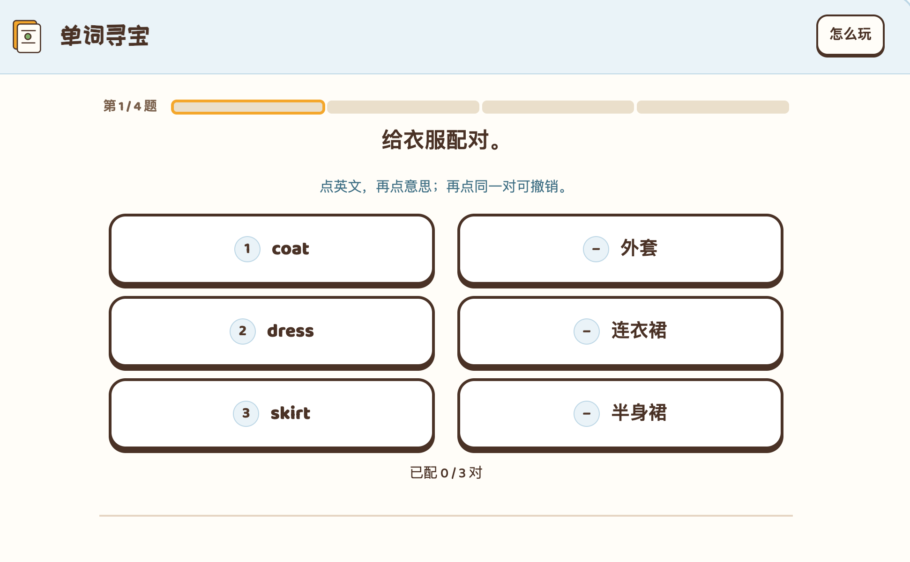

# 问题记录

## 单词寻宝

修改：不用加冗余的提示词：点英文，再点意思；再点同一对可撤销。

给衣服配对。 -> 给衣服选择配对

小标题不要加句号，有点儿丑。

## 手提包的故事

 1 、按钮布局存在问题

2 、2 / 7 句原文 ->  2 / 7 ，这样简洁些就好了。

## 故事小侦探

1 、用中文词块说出这句话的意思。-> 翻译这句话

保持像 duolingo 中题干的简洁扼要。

2 、点词块拼句；点已选词块可以撤回。-> 直接移除，不需要这个提示。

## 句子小工坊

1 、不要出现需要用户输入单词的题目。

## 礼貌小挑战

1 、暂停功能的设计令人迷惑，目的是什么？我觉得可以直接移除。

2 、全单元的怎么玩功能我觉得也是没有必要的设计，可以直接移除。

3 、同学把书送回来，问“Is this your book?”。书确实是你的。你先确认，再感谢，怎样说？ 这种题干读起来有点儿难以理解，duolingo 是如何设计这一类题目的呢？
