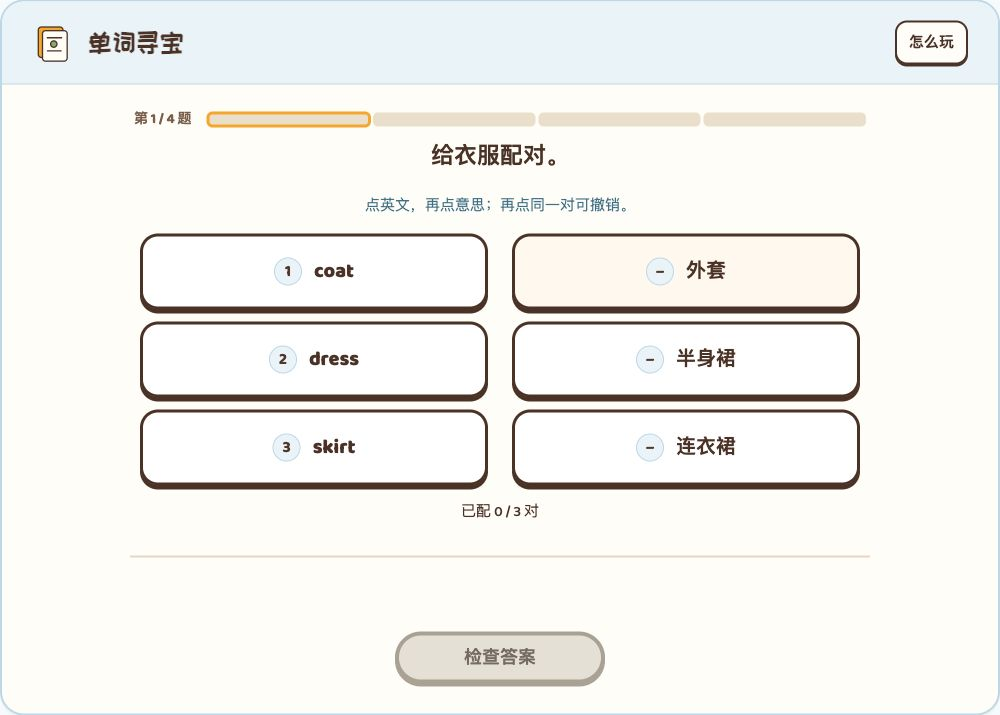
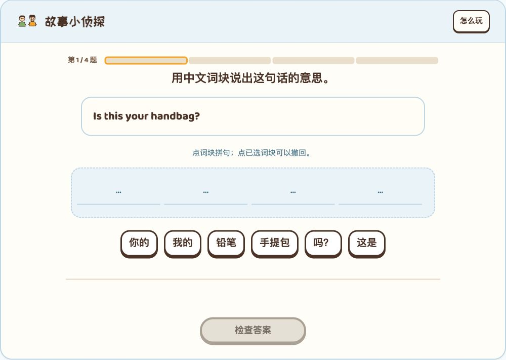
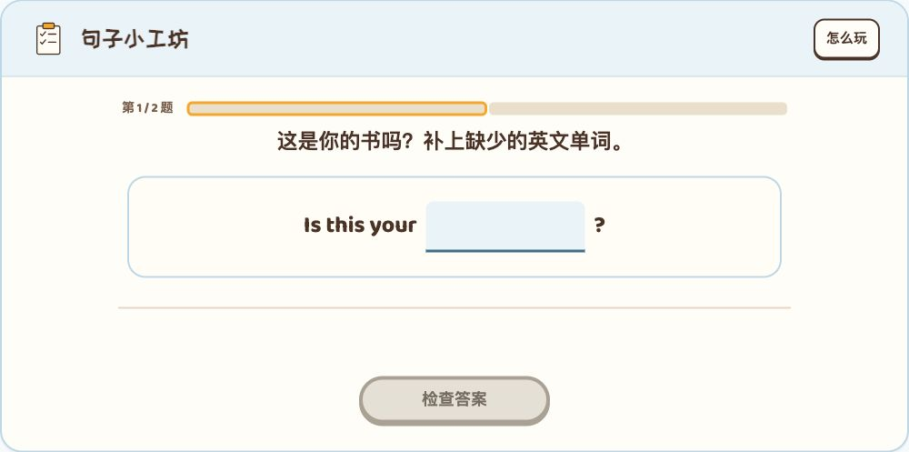

# Lesson 1–2 体验问题审查与修改方案

建议采用“无配音、全点选、短指令、自动续学”的统一方向。反馈中的主要问题成立；“给衣服选择配对”建议再缩短为“选择配对”。去掉说明时保留必要的语言情境，去掉暂停入口时保留自动保存。

本次范围为 [question.md](../question.md) 的五个环节，核对了原稿两张截图、当前课件实际操作、两课相关代码与统一标准 v1.26。本文件是修改方案，正式课件尚未应用这些调整。

## 逐项建议

| 步骤 | 当前状态 | 修改方案 |
| --- | --- | --- |
| 1 单词寻宝 | 可以作答，说明重复 | 删除“点英文，再点意思……”；题干改“选择配对”，也可保留“给衣服配对”。不采用更长的“给衣服选择配对”。保留已配数量、对应标记、选中和撤回状态。 |
| 2 手提包的故事 | 按钮确有布局缺陷 | 初始只显示居中的“开始看课文”；阅读中左侧“从头看”、右侧“下一句”；结束后左侧“再看一遍”、右侧“下一站”。两按钮同行、操作区稳定。进度改“2 / 7”，读屏仍有完整含义。 |
| 3 故事小侦探 | 指令与说明重复 | 题干改“翻译这句话”；删除“点词块拼句……”；保留原句、空位、词块、撤回与检查按钮。 |
| 4 句子小工坊 | 必须键入，不符合新的交互要求 | 将 book 输入题改为点选补空；Lesson 25–26 的 clean 输入题同步处理。替换后不再评价单词拼写，不再计作 E07。证书姓名属于必要表单，不随练习输入题删除。 |
| 5 礼貌小挑战 | 长题干较重，暂停页增加一步 | 对话题拆分为短指令、必要情境、英语话轮、选项；删除暂停入口及暂停页，保留自动续学；删除两课所有活动的“怎么玩”按钮和玩法弹层。 |

小标题、短指令和按钮不加末尾句号；教材完整英文、问号和必要语义标点保留。不要全局清除标点。“怎么玩”与“看中文”、教学示范、“给点线索”不同：后者有具体学习用途，不能一并移除。

## 按钮问题的原因和修法

实际阅读中“下一句”和“从头看”的纵坐标分别为 391 和 455 像素，确实错行。`core/unit-theme.css:79–82` 固定主按钮在右列，并分别给次按钮的 first-child／last-child 设置位置；无配音版只有一个次按钮，它同时命中两条规则，最终落到第二行。Lesson 25–26 已有 only-child 修正规则，Lesson 1–2 缺少对应处理。

建议按未开始、阅读中、结束三种状态明确组织操作行，而不是继续靠按钮在容器中的首尾位置判断用途。DOM 顺序与视觉顺序统一，保证键盘也是先次操作、后主操作；手机保持至少 44 像素的触控目标。初始状态不需要“从头看”。

## 暂停的现有作用

当前暂停操作设置 `group.paused = 'manual'`，把题面替换成“已暂停／继续挑战”，没有观察到需要暂停的计时流程。本轮通过真实页面验证：选中答案后不点暂停，直接刷新，未提交选择仍被保留。因此移除入口不必牺牲续学能力。

实施时须兼容旧的 paused 记录：进入后直接恢复对应题及草稿。不能只删除“继续挑战”按钮，留下无法恢复的旧暂停页。自动分段使用的 `chunkSize` 与手动暂停应分开配置，避免顺便改变结算或其他课程的分段行为。

## Duolingo 如何呈现这类题目

已有中文实测 E12 是“完成对话”短标题，下面直接显示 `Coffee or tea?`、待填写的回应气泡，以及 `Coffee, please.`／`Welcome.` 两项。指令、英文对白和答案分层呈现。它并不是一段中文把故事解释完后再问“怎样说”。参见[仓库原始题面](../../../research/duolingo-language-exercises-2026-09-27/assets/flows/060.png)与[研究记录](../../../research/duolingo-language-exercises-2026-09-27/REPORT.md#E12)。

Duolingo 的[官方沉浸式练习说明](https://blog.duolingo.com/new-immersion-exercises-maximize-your-language-learning/)也介绍了补句、补对话与阅读理解，并说明情境线索可以放在图片和周边文字中。这支持分层呈现的方向；不能据此声称当前所有课程都使用相同界面，本轮没有重新登录 Duolingo 实测。

建议将用户指出的这题改成：

> **先确认，再道谢**
>
> 同学递回你的书
>
> 同学：**Is this your book?**
>
> 你：……

| 选项 | 设计用途 |
| --- | --- |
| Yes, it is. Thank you very much. | 同时完成确认与感谢 |
| Yes, it is. Excuse me! | 已确认，但把引起注意的表达用在道谢处 |
| Pardon? Thank you very much. | 表达了感谢，但没有完成确认 |

这个方案保留了“书是你的”和“先确认、再感谢”的原考点，缩短的是呈现，而不是答题依据。错误反馈继续只给“再看看，试一次。”，不照搬研究中 Duolingo 错后展示答案的处理。相似的普通接话题可统一用“完成对话”；这道双目标题使用更具体的短指令。

## 对题型标准和旧记录的影响

E07 在当前 13 项目录中指键入缺词／整句输入。取消输入后，建议默认点选版使用 **12 项清单**，E07 保留在研究目录中作为扩展；两课实际覆盖由 11／13 类调整为 **10／12 类**。两道输入题可以替换而不是删除，题量仍可保持 25／27。点选补空归入已有题型，不算新的第 13 类。

若仍要求 13 类，应另选真正不同的点选任务，重新核对教材适配和重复程度。不能把点选补空仍命名为 E07。

纯布局、进度显示和辅助入口调整保留有效成绩。输入转点选、选项或判断条件变化的题使用新题号及内容版本，保留姓名与原证书日期。现有签名包含题干，连去末尾句号也可能使旧记录不匹配：应逐题建立经过核对的等价承接，不全局忽略题干差异，更不按旧星星代答新题。

统一标准 v1.26 的帮助、暂停、英语词块／有支架补全条款也要随采用决定更新，明确可见玩法入口不是必配；本次只提出修订，不直接改标准。

## 实施顺序与验收

1. 优先修复阅读按钮布局，替换两道输入题，重排综合对话题。
2. 统一两课短指令与标题标点，移除常驻说明、“怎么玩”和手动暂停，兼容旧暂停状态。
3. 更新题型统计、逐题迁移、统一标准和对应测试。共享组件用明确配置控制，先在这两课采用，不全局隐藏其他课程的控件。
4. 检查 320／390／768／1280 及短屏，覆盖未选、部分选择、错误、修正、正确、继续和结束；再验证刷新、退出重进、离线、登录换设备与证书，最后进行实体手机和儿童走查。

验收要点：阅读操作同行且稳定，展开中文不推移按钮；词块能撤回；空答案不能提交；去掉说明后仍能理解操作；去掉暂停后仍能恢复；只有已核对的旧题继承成绩。图片和本轮桌面操作不能证明全站可访问性合规，也不能代替真实手机或儿童体验。

## 本轮页面证据

以下截图来自本轮独立审查入口，没有重置用户体验页的学习记录。

### 1 单词寻宝

### 2 手提包的故事

### 3 故事小侦探

### 4 句子小工坊

### 5 礼貌小挑战

本次新增审查记录、截图与 [HTML 方案示意](index.html)。HTML 的本地文件预览被浏览器协议策略拦截，未完成渲染与交互验收；它不作为课件实现或已验证页面交付。上述实际课件截图已逐张检查。

正式修改及修改后的回归尚未执行。提交：未执行；推送：未执行；发布：未执行。
