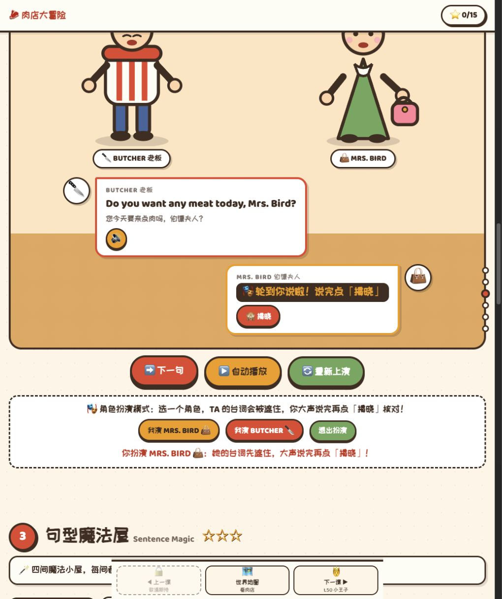
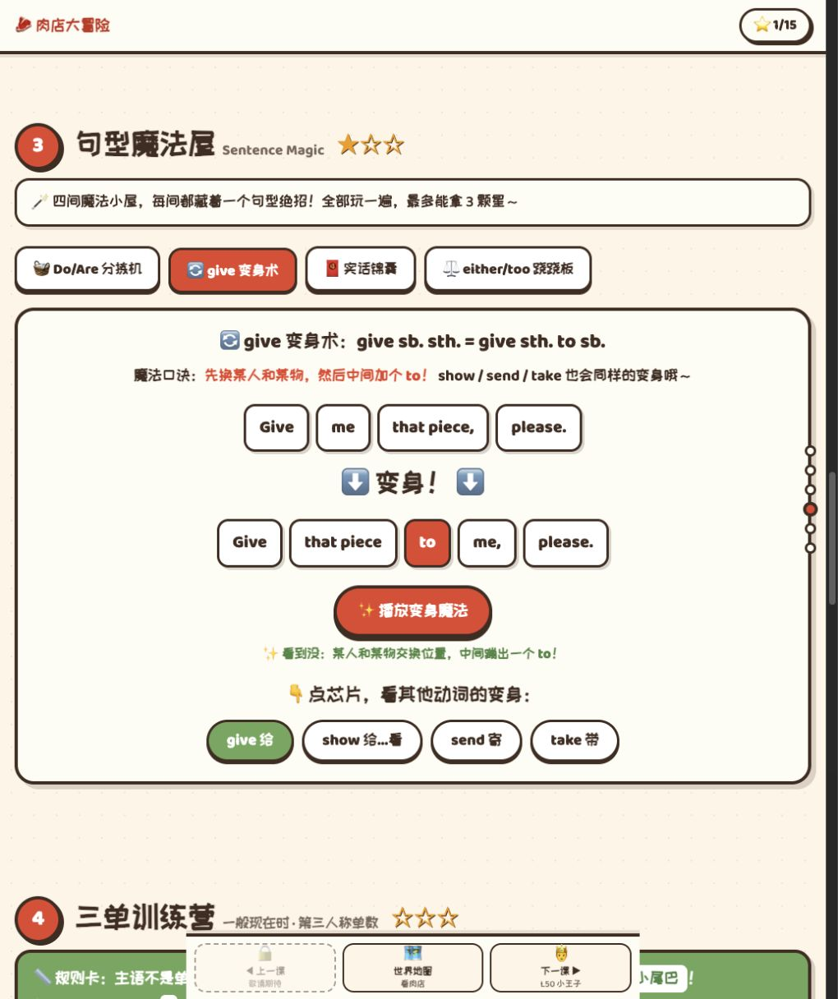
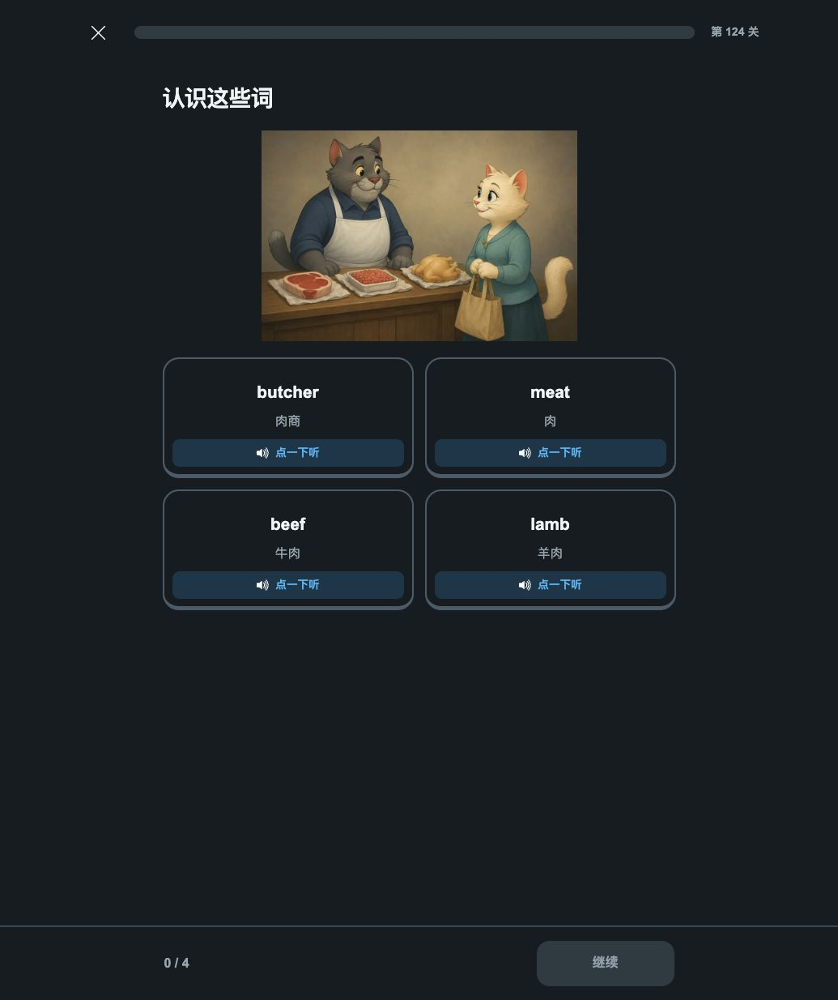

# 修正分析：main Lesson 49 与 codex/duolingo-version

2026-09-10 · 比较对象已由用户更正为 **Lesson 49**。本报告替代此前以 Lesson 50 为对象、用于解释这条客户反馈的结论。未修改课程。

**我的判断：客户的反馈有具体的课程设计依据。main Lesson 49 把角色扮演、句式对比、结构变化和主语分类做成了可参与的活动；新版保留了教材、连续路线和练习，却没有在本单元中等量保留这些教学处理。客户可能同时感受到了参与机会减少、规则关系不够显眼，以及重要教学活动覆盖变窄。**

这仍是对产品机制的分析，不是对真实儿童兴趣或学习效果的实验证明。主干也存在大量讲解、重复、看演示即获奖励和考查不足，不能因此认定它已经全面更好。

## 1. 本次重新检查了什么

- 主干：`canranstudio.cn-main` 的 main `7499a15`，实际打开 [Lesson 49](http://127.0.0.1:4173/lesson49/) 与其[课堂投屏](http://127.0.0.1:4173/lesson49/present/)。重新操作并截图，未复用上次 Lesson 50 的截图作证据。
- 新版固定比较版本：`1c6c3e8`，实际查看 [独立本地预览](http://127.0.0.1:42829/) 的 Lesson 49 故事、词汇与语法活动，并重新提取本单元完整 catalog。
- 新版开发目录：另外静态核对当前未提交的无键盘候选，单独保存目标单元和文件指纹；不把旧输入题截图称为该候选的当前页面。

孩子年龄、英语基础、教师参与程度，以及客户看到的准确版本仍未确认。主干单课与新版 Lesson 49–50 双课单元的内容范围不同，不能直接按总时长、总卡片数比较效率。

一个重要核对结果：**主干 11 段对话与新版 15 段对话，按顺序拼接并统一空白后，英文文本完全相同。** 新版把几段较长的同角色发言分开呈现；不是多出四段新的故事，也不是主干删掉四段课文。

原始证据：[主干活动清单](main49-authored-inventory.json)、[新版固定版本清单](duo49-50-current-source-inventory.json)、[当前无键盘候选清单](duo49-50-working-candidate.json)。

## 2. 按实际流程观察

| 步骤 | 检查内容 | 当前判断 |
| --- | --- | --- |
| 1 | 主干封面、词汇翻卡 | 身份与目标明确，操作直观；17 张卡集中呈现较密，部分图像仅是联想提示 |
| 2 | 主干课文角色扮演、遮词、揭晓 | 提供先尝试表达的机会；系统不能核实是否真的说出，也不能据此判口语达标 |
| 3 | 主干句型魔法屋：Do/Are、give、锦囊、either/too，及成长奖励 | 重要区别可见；演示、翻卡与有效考查混在一起，部分规则简化过度 |
| 4 | 主干三单分类与填空 | 21 个主语让规则超出 he/she/it 的背诵；连续分类较长，错后很快推进 |
| 5 | 主干老板考核 | 考点清楚；8 题没有检查全部教学内容 |
| 6 | 主干课堂投屏与教师提示 | 支持跟读、角色问答和教师组织；是课堂辅助入口，不能直接当作学生独立学习效果 |
| 7 | 新版故事、播放状态、中文帮助 | 有完整故事、猫猫场景、手动继续与按需帮助；未见主干式自主选角色遮词复演 |
| 8 | 新版词汇页、语法页与单元 catalog | 单屏操作清晰、记录边界较规范；相近练习流程重复，部分关键对比未成为专项任务 |

完整截图及逐步说明见[实际页面证据](实际页面证据.md)。本次只抽查代表性交互，没有完成每个关卡、所有题目及全部音频的人工听感验收。

## 3. 客户说的“关键考察知识点”，具体可能指什么

| 知识或能力 | 主干 Lesson 49 | 新版 Lesson 49–50 | 应怎样解读 |
| --- | --- | --- | --- |
| 核心词汇与词组 | 14 个词、3 个短语；8 轮听音选词 | 49、50 合并为 20 个词，另有序数词 | 主干多出的 mutton、pork、fish 属扩展，不能都称为新版遗漏教材。短语有的在新课文出现，但没有相同独立活动 |
| 完整课文与角色回应 | 11 段；可选角色，遮住台词先说再揭晓 | 同一课文拆为 15 段，嵌入 2 个理解检查 | 新版保留了课文；主干额外提供复演机会，新版额外提供有选项的理解检查 |
| Do you / Are you 的区别 | 6 题分拣，覆盖动作、形容词、身份与地点；终考再检查 | 有 Do you like…、Are you a nurse? 等句子和跨课组句，本单元未见同等专项对比 | “两种句子都出现”不等于“孩子需要在两者之间判断” |
| give 双宾语与 to 结构 | give、show、send、take 四组可视演示 | 课文出现 Give me that piece…；本单元未见对应的结构变换活动 | 主干确有教学范围优势，但演示本身还不是孩子独立变换的证据 |
| either / too | 6 道句末选择，肯定／否定并排对照 | either 有释义、例句、听义和选做挑战；too 在原课文出现，未见同等成对辨析 | 新版没有丢掉 either，但比较关系与辨析机会减弱 |
| 语用表达 | 5 张“实话锦囊”，可翻看和听音 | 原文中保留 To tell you the truth，未见同等扩展活动 | 主干提供可讨论的表达材料，但这 5 项不应被理解为同义替换 |
| 判断哪些主语是第三人称单数 | 13 个三单主语、8 个非三单主语；包含人名、名词短语、地点、并列主语 | 主要围绕 he/she、丈夫等语境训练，未见同样广的主语分类 | 主干能检查孩子是否理解名词短语与语法人称的关系 |
| 三单形式与句子应用 | 5 道填空、2 道选择，包含 watches、goes；2 张翻译自查卡 | likes、does 后原形、Does 疑问句有专门练习、错因与换情境任务 | 新版在否定／疑问和错因记录上有真实长处；主干 Lesson 49 并没有 Lesson 50 那套完整 s/es/ies/has 规则工坊 |
| 综合与复习 | 8 题，3 词汇、2 Do/Are、3 三单 | 15 个综合活动，包含跨课复习与语法迁移；另有选做挑战 | 主干的考查更紧贴本课列出的部分难点；新版承担更大的复习范围，不能凭题数判断优劣 |

上述“未见”限定在本次核对的 Lesson 49–50 单元及相应活动，不表示整个 1–144 课程从未出现过这些语言形式。

来源：[主干教学数据](../../../lesson49/index.html#L841)、[主干语法及考核题](../../../lesson49/index.html#L878)、[新版单元完整清单](duo49-50-current-source-inventory.json)。

## 4. 为什么主干可能让孩子更愿意参与

### 4.1 孩子可以换一种身份参与课文

主干允许选择扮演 Mrs. Bird 或 butcher，把对应台词遮住；孩子先尝试说，再揭晓。它允许教师组织对演，也允许孩子在低压力下检索刚学过的话。完成任务的感受可能从“我又看了一句”变为“现在轮到我回应”。

这不是开放对话系统，答案仍是固定课文；孩子也可能直接揭晓。价值在提供了可用的练习机会，是否发生真实表达取决于孩子与教师的实际使用。

### 4.2 规则被呈现为可以观察的关系

give 活动把同一意思的两种结构同时摆出来：人物与物品交换位置，to 出现。Do/Are 分拣把身份／状态与动作的区别摆到两个明确选项之间。三单训练要求判断 Lucy、my aunt、Tom and Jim，而不只填写 likes。

这里值得保留的是“孩子看见并判断什么关系”。动效能引导注意，但仅把文字放进会动的容器，并不能自动产生理解。

### 4.3 活动可以成为教师提问的支点

同一页可以停下来问：busy 是动作吗？为什么 my aunt 能换成 she？如果人和物换位置，少了什么词？这些问题紧贴屏幕中的可见对象，便于指认、讨论、同伴作答。

主干还有独立课堂投屏，实际教师提示要求老师扮演老板、全班扮演 Mrs. Bird，听完后回应 Yes, please。若客户在课堂中使用，教师、同伴和共同节奏可能是喜爱程度的重要来源，不能把全部效果归于页面。

### 4.4 能看见与本课有关的成长

本次点击 give 演示后实际出现了肉店增加红白遮阳棚的成长画面。这比单独增加一个数字更容易形成具体的进展感，但孩子是否更受激励仍待观察。同时，它也暴露出奖励与掌握的区别：这次奖励发生时，审阅者并没有独立完成双宾语转换题。

### 4.5 客户不一定是在反对规则和练习

主干有明确口诀、21 个连续主语分类、填空、选择和综合考核，教学密度并不低。因此，“主干更受喜欢”很难解释为孩子完全不愿学语法或不愿重复。更值得验证的假设是：孩子愿意在目标可理解、区别可观察、有角色参与和适当帮助时完成有挑战的学习。

## 5. 新版为什么可能被感受为“填鸭式”

“填鸭式”先当作客户对体验的描述。可以把它拆成下面几个可观察的问题。

### 5.1 材料覆盖与教学活动覆盖没有完全对齐

新版的课文、词汇和例句仍在，但原来针对特定难点设计的对比、变换与分类没有等量保留。保留一个 Source ID 或一句教材文本，只能证明材料存在，不能证明对应语言难点已被讲清或检查。

本单元有一个具体例子：`L49:story-check-9` 绑定的 sourceRef 是 `L49-D09`（Give me that piece, please.），题目却问“伯德太太和丈夫都喜欢羊肉吗？”，解释引用的是前面的偏好信息。这个题可以检查故事理解，**不能据它证明 Give me… 的句式已经被考查**。应分别维护剧情所在位置、实际语义依据与目标能力。[当前题目定义](duo49-50-current-source-inventory.json)

### 5.2 重复的操作未必带来新的判断

固定比较版本共 37 个顶层活动：1 个故事、10 组听读、6 道选择、6 道补句、8 道组句、6 道输入；故事另有 2 个理解题。听读组内部还有多张卡，不能把“37”当作全部操作次数。

词汇节点连续呈现两组 4 词卡，再以本组第一个词进行一道听义检查；20 个词分三个节点后，仅这三道听义题分别检查 butcher、tell、bean。其他词可能在课文或综合活动再次出现，但这些听义题不能证明逐词覆盖。

第 128 关的编排先呈现 4 个例句，再呈现 2 个例句，随后补句、组句、补句与语法任务。若孩子已理解，重复播放可能显得等待较多；若还没理解，听过例句也不一定足以支持后面的形式判断。应按真实表现校准，不能用增加题型名称代替教学编排。

### 5.3 场景存在，但没有始终参与作答

新版有猫猫肉铺图、故事题目和角色对话，这次实际页面已经确认。部分后续题面主要要求按中文补句或组织标准句，人物需求与场景结果不再构成作答的一部分。学生可能因此把学习感受为一串任务要求。

可以改善的方向是让孩子根据听到的信息选择货物、帮助人物回应，再以短而明确的规则活动解释语言差别；保留场景的同时，让场景提供完成任务所需的信息。

### 5.4 隐藏的帮助与有限的选择可能放大依赖感

新版故事默认不显示中文，提示可主动展开；本次实际验证了这一入口。主干通常直接显示双语，角色模式再隐藏本人的台词。前者有利于在适当水平减少依赖，后者便于教师与初学者迅速建立意义。不同基础的孩子可能有不同体验，不能只选一种界面就推断全部年级的偏好。

### 5.5 无键盘改造只能解决其中一部分

当前开发目录中的 6 个语法输入已改为点选、改错、回应和词块等；本单元仍为 37 个顶层活动、10 组听读，新增／替换机制已存在。本次没有完整实测这一候选。

这会改变操作负担，不能继续用旧版文本框截图指责候选仍强制打字。但它并未自动形成 Do/Are 专项辨析、give 结构变换、广泛的三单主语分类或主干式角色复演。体验方向需要继续在这些目标上检查。

## 6. 主干也需要正视的不足

1. **演示和自查不能直接当作掌握。** give 播放一次就记该子活动完成；锦囊按翻开次数计数；角色模式到最后一段就授予相应星星，没有核实是否说出；翻译只揭晓参考答案。它们可以鼓励参与，但不足以证明独立表达。[主干活动与奖励逻辑](../../../lesson49/index.html#L1256)
2. **讲过的内容不一定在终考检查。** 8 题没有双宾语转换，没有 either/too 的成对语境选择，也没有检查 5 张锦囊的不同使用场合。终考还重复使用前面出现过的例句，不能据通过断言迁移。[终考清单](../../../lesson49/index.html#L930)
3. **口诀有适用范围。** Do/Are 的“动词／非动词”说法需限定在本组一般现在时表达，不要让孩子认为 be 不是动词；三单“加 s”不足以解释 watches／goes 的拼写；either/too 应回到前后话语中“也／也不”的关系，不能无限推广为只搜 not 字符。
4. **“实话锦囊”的分类容易误解。** To tell you the truth 与 To be honest 适合引出坦白表达；Well、Yeah、That's to say 各有不同作用，不能由总标题暗示它们都等于“说实话”。
5. **图像和内容仍需审核。** steak 用培根图、mince 用碗图、butcher 用刀图，能形成联想但不等同准确图义对应。They drink beer every night. 等补充例句与儿童生活距离较远，可在保持语法目标的前提下选更贴近儿童的场景。
6. **节奏和负担不一定更轻。** 21 个主语连续分类、整页大量卡片与规则，对独立学习者可能较重。代码里分类短计时推进、课文自动播放每 3.4 秒推进，未以当前句真实音频结束作为自动推进条件；这次没有测量全部音频是否被截断，不能宣称已全面复现声音问题。[推进逻辑](../../../lesson49/index.html#L1275)
7. **无障碍仍需完整检查。** 本次 AX 中锦囊表现为容器与文本，未展示与普通词卡相同的可展开按钮语义；有潜在键盘／读屏问题。固定导航和自动滚动也需按实际小屏验证。本次截图不是完整 WCAG 或响应式认证。

关于语法核对，Cambridge 的公开检索摘要支持“either 用于连接否定意思”及部分动词可采用不同宾语结构；页面正文访问返回 403，因此未把它当作全文核读材料，也没有用它评价本课效果。[Cambridge：also/as well/too](https://dictionary.cambridge.org/grammar/british-grammar/also)，[Cambridge：宾语](https://dictionary.cambridge.org/grammar/british-grammar/direct-objects)。

## 7. 对客户反馈更完整的解读

| 客户表达 | 可能对应的真实需求 | 产品上如何验证 |
| --- | --- | --- |
| “主干更受小孩子喜欢” | 更愿意扮演、尝试、讨论，能理解任务与进展 | 看自主尝试、求助、放弃、再次选择，以及简短偏好访谈 |
| “有很多关键考点” | 重要混淆点被独立讲解、对比，并且便于老师检查 | 建立目标与题目对应表，分别记录讲解、练习、独立检查、迁移 |
| “新版填鸭” | 长时间被要求听读或还原标准答案，参与和解释机会不足 | 观察孩子是否知道当前为何要做、错误后能否理解、操作是否带来新判断 |
| “孩子不喜欢新版” | 也可能与版本、难度、设备、教师参与方式不匹配有关 | 分别比较课堂与独立使用；保持目标和语言基础相近，平衡版本体验顺序 |

不宜据此推断：所有孩子都偏爱某种颜色；语法讲解应全部删除；主干所有扩展都必须一次放入必修；新版没有学习科学基础；只要多做动画就能解决问题。

新版保留的清楚步骤、按需帮助、错因、复习和成绩支持条件都有价值。IES 指南支持示范与练习交替、连接具体与抽象表示、间隔学习和检索；这些原则可以与角色参与和明确对比共同使用。[IES 教学指南](https://ies.ed.gov/ncee/wwc/PracticeGuide/1)

Duolingo 官方 Adventures 也以购物、问路等具体任务、环境操作及角色回应组织语言练习。主干值得吸收的参与方式与既定 Duolingo 方向并不冲突，采用时仍需适配教材和本项目的儿童场景。[Duolingo Adventures](https://blog.duolingo.com/adventures/)

## 8. 对此前两套方案的修正

**方案一应改为 main Lesson 49 的改进：**保留课文扮演与四间句型屋，优先补上演示后的判断、双宾语实际应用、either/too 语境、主语分类后的迁移，以及准确反馈与可控节奏。不能把 Lesson 50 的投喂、魔法锅和完整形态规则作为 Lesson 49 现有功能继续扩写。

**方案二应以 Lesson 49 的教学目标建立新版样板：**先核准 Do/Are、双宾语、either/too、三单主语与课文表达的目标去向，再用当前无键盘能力重编教学流程，最后向其他单元推广。无需为了回应这条反馈，立即把 Lesson 50 的全部扩展规则堆进同一关。

修正后的两套方案详见[方案修正版](两套改进方案-修正版.md)。

## 9. 验证边界与下一步判断依据

先用实际目标学生做形成性观察，分别记录独立操作与教师带领，使用目标与难度相近的任务；比较顺序需要平衡，迁移题换材料。兴趣、操作成本、当场表现与延后表现分别判断，不把停留时间长直接当作投入，也不把有词库答对当作自由表达。

这次没有真实儿童试做、全量音频人工试听、整课通关、全尺寸检查或正式站点验收。实际审阅中的星星、跳级状态和播放行为不代表学生学习数据。截图采用当前浏览器默认视口，期间视口有变化，不用于同尺寸视觉优劣结论。

本报告完成的是问题重述后的重新分析；课程代码、提交、推送和发布均未由本任务改动。
