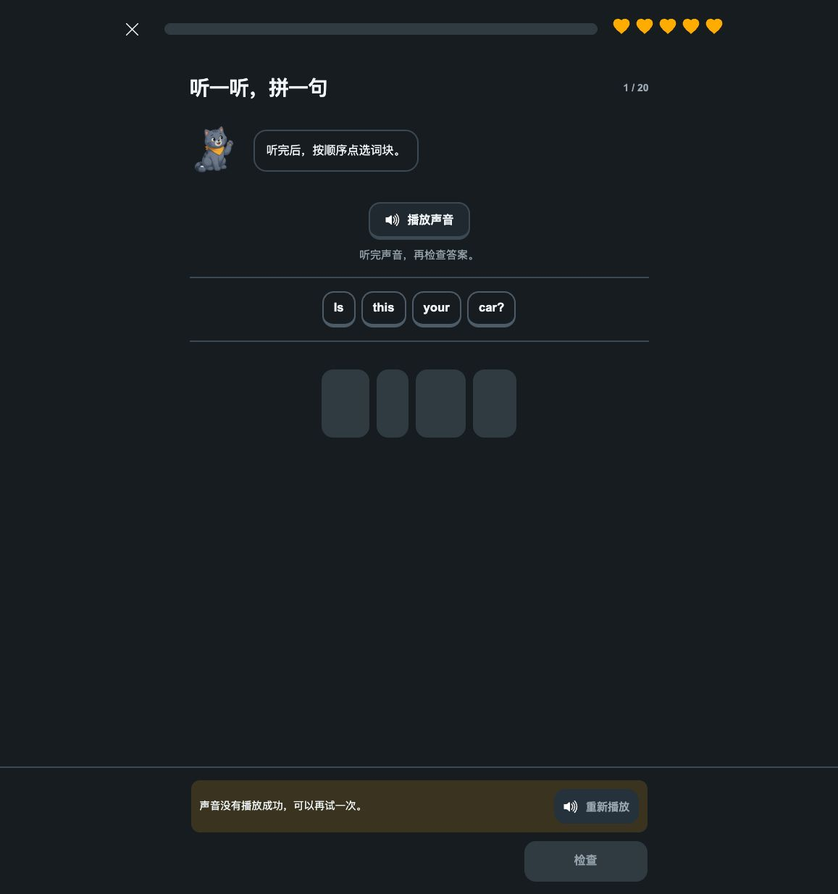
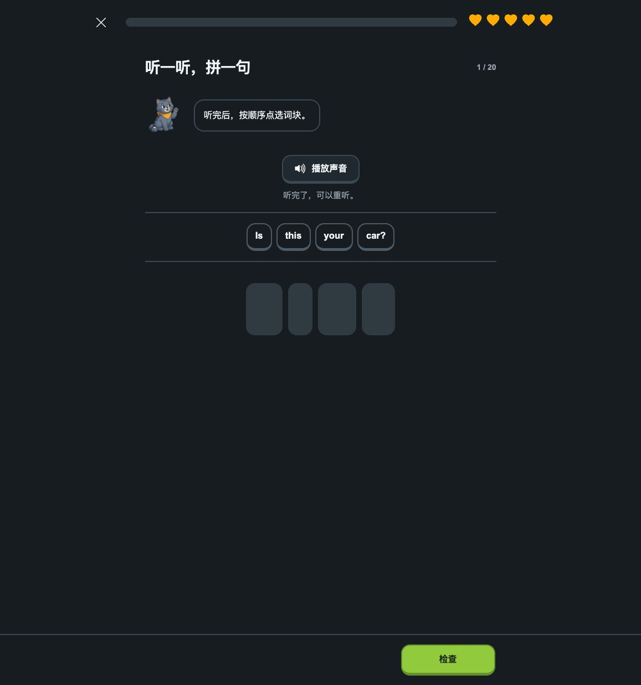

# 本地人工试听：播放失败与恢复

2026-09-10。`lesson1-144-v7.0` 本地预览 `http://127.0.0.1:42827/`。本次修复范围为预览服务的启动与存活检查，课程内容、判分、界面和素材没有修改。

## 症状与复现

用户进入跳级第 1 / 20 题「听一听，拼一句」，目标为 “Is this your car?”，页面提示「声音没有播放成功，可以再试一次」，「检查」禁用。实际检查时，用户已排好四个词块；点击「重新播放」仍失败，五次机会均保留。

最小复现命令：

```bash
node scripts/check-local-preview.js 42827
```

修复前连续执行两次，均以状态码 1 退出并输出 `Preview check failed: ECONNREFUSED`。该检查用实际 runtime 开始固定抽样的跳级，取得 `PL12-8:tap` 的 `play-audio` 地址，再直接请求本地服务，不经过浏览器缓存。

独立核对：42827 没有监听进程；该题录音在本地且已进入发布预览包，共 19,053 字节。截图中的错误和原页面重试失败均已保留。

## 假设与结论

1. **预览服务停止**：预测恢复同一地址后，原题直接重播成功。已验证。
2. **音频缺失或映射错误**：预测服务恢复后仍返回缺失或字节不符。文件与路径检查、恢复后的指纹核对均通过，排除本次原因。
3. **缓存或播放状态卡住**：预测服务恢复后仍需清缓存、重置状态才能播放。原页面仅点击重播便恢复，排除本次阻塞原因。

直接原因是本地服务已经停止。Service Worker 仍可用缓存显示课程页面，但尚未下载的录音需要在线请求。现有播放逻辑正确阻止了未听完就提交。本次没有捕获旧进程退出时的信号，因此不声称已确定它被哪个操作终止。

## 修复与防止再次漏检

- 新增 `scripts/start-local-preview.js`：以独立后台进程启动现有预览服务器，标准输入断开，输出写入本地日志；启动命令结束后仍运行。仅监听本机地址。
- 同端口已有有效预览时直接复用；已有其他服务、过期包或异常响应时拒绝替换。实际用另一个本地监听器验证了拒绝路径，原监听器保留。
- 新增 `scripts/check-local-preview.js`：核对实时首页、原故障题音频、九条 G49 示范与 this/these，共 13 个资源的内容指纹；另核对音频 Range 206 及对应的 12 字节。
- 人工验收启动方式与检查命令已写入根 README。PID 和日志位于 `test-results/preview-42827.*`，结束验收时可以正常停止该进程。

先前检查验证的是当时运行的服务、已加载素材和课程行为，没有监测后续人工验收时服务是否仍存活；模拟音频结束也无法发现服务停止。新增实时健康检查补齐这一缺口，不能仅凭缓存页面可见判断服务正常。

## 恢复验证

`node scripts/start-local-preview.js 42827` 启动 PID 17013。启动命令退出后，在另一次命令中确认该进程的 PPID 为 1，健康检查通过；再次运行启动命令复用同一进程，没有新增实例。

在用户原页面点击「重新播放」后，真实录音播放结束，状态为「听完了，可以重听」，「检查」恢复可用。四个已选词块、1 / 20 题号和五次机会均保留；没有代用户提交答案。

同类资源检查覆盖九条新语音及 this/these，均从在线服务取得匹配字节。语法检查与 `git diff --check` 通过。课程发布输入、样式与布局未变，`npm run verify:visual` 核对既有 41,356 状态证明仍有效；没有把本次局部恢复写成重新跑过完整矩阵。未提交、推送或发布。

同尺寸实际页面对照（1157×1234）：

| 播放失败 | 同一道题恢复 |
| --- | --- |
|  |  |

[用户原截图](evidence/preview-audio-recovery/reported.png) · [检查与图片指纹](evidence/preview-audio-recovery/verification.json)
