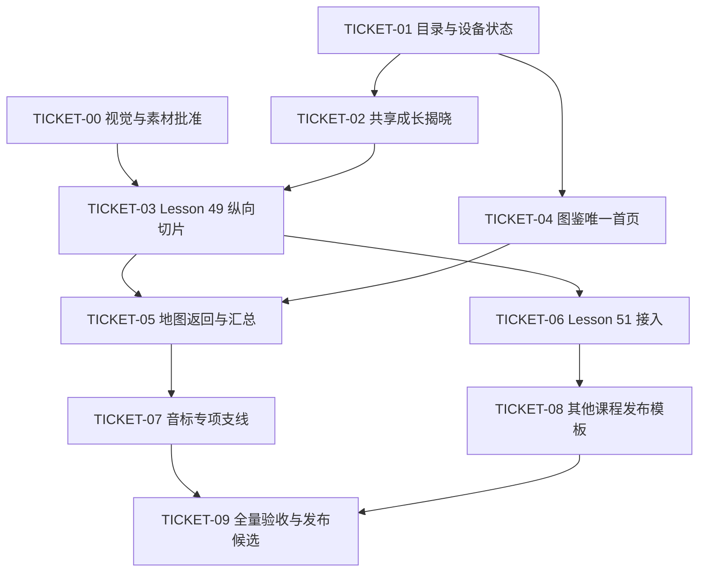

# 十二城区图鉴唯一入口与阶段成长揭晓实施计划

> 状态：TICKET-00 至 TICKET-09 已实现，等待候选全量验收与发布
> 产品规格：`docs/superpowers/specs/2026-08-04-atlas-only-entry-and-growth-reveal-design.md`
> 计划基线：`origin/main` @ `5ef0e94`
> 隔离分支：`codex/atlas-only-growth-reveal-plan`
> 基线验证：63 项单元测试 + 224 项端到端测试通过

## 1. 目标

把当前“首页包含地图、继续学习、课程目录和番外站”的结构收敛为真正的两级冒险图鉴：默认世界总览 → 城区地图 → 地标直达课程。

同时建立一个所有课程共用的阶段成长揭晓运行时：每个真实阶段第一次完成后，孩子在课程内立即看见地标新增装饰，点击任意位置继续；回到地图时再看到一次累计变化汇总。

## 2. 最新代码基线与真实 GAP

| 能力 | `origin/main` 当前状态 | 本计划目标 |
| --- | --- | --- |
| 世界总览 | 首次访问显示 12 张城区卡片；访问过城区后刷新会直接进入城区 | `/` 每次默认显示图鉴世界总览；远期城区融入远景/云雾，不显示卡片 |
| 城区地图 | 已不渲染未发布占位；Lesson 49、51 可进入 | 保留该优点，并收敛名称牌、当前地点和返回定位 |
| 首页其他内容 | 仍有旧头图、继续学习、编号目录、番外站和页脚 | 全部移除可见入口，仅保留图鉴与书签式设备设置 |
| 地标进入 | 已发布地标已经一击进入课程 | 保持，不增加预览卡片 |
| 地标进度 | 独立显示“可以出发 / 成长中 / 地点完成 · N/5” | 改为名称牌内五枚印章/星点 |
| 推荐规则 | 选择第一个未完成地点；全部完成后仍推荐复习 | 最近访问的未完成地点优先；全部完成后不强推课程 |
| Lesson 49 地标 | 发布合同仍使用累计快照 `growth-1.png` 至 `growth-5.png` | 迁移为基础图 + 五张独立透明增量层 |
| Lesson 51 地标 | 已是基础图 + 五张独立透明增量层 | 作为第二个共享运行时接入样本 |
| 课程完成事件 | 49–54 与 soundmark 各自维护 `award*()` 和存储 | 通过一个窄接口统一报告“阶段首次完成”，不重写课程评分算法 |
| 设备档案 | v1 只有城区、纪念物和完成阶段 | v2 增加最近地点、课程揭晓和地图待确认变化 |
| 音标地图 | 课程存在，但地图合同为 `not-applicable` | 完成基础图 + 四层素材后成为专项支线 |
| 动画运行时 | 不存在共享成长揭晓 | 原生 HTML/CSS/JavaScript 共享组件；不引入 Remotion/React |

当前主检出目录中的 Lesson 49 分层图片和相关文档尚未跟踪，属于用户素材；实施票只能在完成视觉与透明层审计后选择性带入，不得用清理、重置或覆盖方式处理。

## 3. 全局约束

- V1 保持静态 HTML、CSS、JavaScript、同源静态资产和浏览器本地进度。
- 不引入 Remotion、React、Lottie、GSAP、Canvas 动画框架或第三方运行时依赖。
- 不改变课程题目、评分算法、历史最高评级、证书门槛和正式课程音频。
- 阶段完成的权威条件仍为该阶段评级从 `0` 推进到大于 `0`；提高已有评级不重复发奖。
- 任何已有课程直达 URL 保持公开、可分享、可索引。
- 未满足完整地图合同的课程继续可以直达，但不在地图中显示任何占位。
- 所有新状态必须可迁移、可幂等、可被“重开冒险”完整清除。
- 每张增量层必须透明、同画布、同锚点，并在手机缩略尺寸可辨认。
- 手机竖屏是视觉和交互真源；平板只改变取景，不改变状态和顺序。
- 每票结束时运行该票聚焦测试；集成票和发布票运行完整 `npm test`。
- 不在本计划中提交、推送、合并或发布；这些动作需要单独授权。

## 4. 目标架构

### 4.1 共享模块

| 文件 | 责任 |
| --- | --- |
| `core/course-catalog.js` | 声明地图发布合同、每阶段增量层、揭晓文案、音效和纪念物 |
| `core/device-profile.js` | 设备档案迁移、首次阶段转换、揭晓已看、地图待确认变化、最近地点和重开清除 |
| `core/growth-reveal.js` | 纯状态模型、DOM 控制器、0.7 秒关闭门、事件穿透保护、音效和降级 |
| `core/growth-reveal.css` | 全屏揭晓、分层动画、第五阶段完成章、响应式和减少动态效果 |
| `core/adventure-atlas.js` | 当前地点选择、地图汇总模型、进度印章和待确认变化模型 |
| `index.html` | 仅渲染世界总览、城区地图、地图汇总反馈与书签设置 |

### 4.2 课程接入接口

每个课程页只在自己现有 `award*()` 完成存储后调用一个共享接口，不复制动画逻辑：

```js
const result = CanranCore.growthReveal.recordStageResult({
  storage: localStorage,
  courses: CanranCore.courseCatalog.COURSES,
  courseId: 'lesson49',
  stageId: 'l1',
  previousRating,
  nextRating,
  progressPersisted
});

if (result.shouldReveal) {
  growthRevealController.open(result.reveal);
}
```

精确命名可以在 TICKET-02 的测试驱动实现中调整，但课程页只报告结果、共享模块决定是否揭晓的边界不能改变。

### 4.3 返回 URL 合同

- 普通打开 `/`：世界总览。
- 已发布地图课程返回：`/?district=<district-id>&focus=<course-id>`。
- 合法 `district` 与 `focus`：进入城区、定位地点并尝试展示地图汇总变化。
- 非法、缺失或未发布的参数：安全回到世界总览，不渲染不存在地点。
- 尚未接入地图的直达课程返回：`/`。
- `/home/` 继续保留 query 与 hash 后跳转到 `/`。

## 5. 依赖关系



TICKET-00 与 TICKET-01 可以并行；其余按图中依赖执行。

## 6. 实施票

### TICKET-00：视觉与素材批准门

**目标：** 在写页面实现前锁定世界总览、成长揭晓和 Lesson 49 分层素材真源。

**依赖：** 无。

**产出：**

- Create: `docs/designs/adventure-map/atlas-only-world-overview-v1.md`
- Create: `docs/designs/adventure-map/atlas-only-world-overview-phone.png`
- Create: `docs/designs/adventure-map/atlas-only-world-overview-tablet.png`
- Create: `docs/designs/adventure-map/growth-reveal-contact-sheet-v1.md`
- Create: `docs/designs/adventure-map/growth-reveal-contact-sheet.png`
- Create or update: `assets/adventure-map/lesson49/README.md`

**工作：**

- [ ] 基于真实 `/` 页面制作 390×844 世界总览高保真稿：图鉴内品牌铭牌、当前城区、远景/云雾中的 11 个城区、书签设置。
- [ ] 派生 768×1024 与 1024×768 平板取景；不重新排列城区语义。
- [ ] 制作 Lesson 49 阶段 0→1、1→2、4→5 的成长揭晓关键帧，以及第五阶段完成章和纪念物状态。
- [ ] 审计主检出目录中未跟踪的 `lesson49/landmark-base.png` 与五张 `growth-0*.png`：透明通道、像素尺寸、锚点、风格、缩略辨识度。
- [ ] 明确保留、重做或放弃每张候选图片，不在审计前复制到隔离分支。
- [ ] 获得用户对手机世界总览、平板取景和成长揭晓关键帧的明确批准。

**验收：** 三组视觉稿可对照同一固定进度状态；没有旧首页板块、空城区卡片或未绘制地点占位。

---

### TICKET-01：课程目录与设备档案 v2

**目标：** 建立可幂等的首次阶段转换、课程揭晓和地图待确认变化数据合同。

**依赖：** 无。

**文件：**

- Modify: `core/course-catalog.js`
- Modify: `core/device-profile.js`
- Modify: `tests/unit/course-catalog.test.js`
- Modify: `tests/unit/device-profile.test.js`
- Modify: `tests/deploy/course-catalog-contract.test.js`

**接口：**

- `course.map.stages[]` 增加 `revealTitle`、`revealCopy` 和可选 `soundAsset`。
- `PROFILE_VERSION` 从 1 升到 2。
- 档案增加 `lastVisitedLocationId`、`courseRevealSeen`、`pendingMapChanges` 与 `mapChangeSeen` 等等价语义。
- 新增纯函数/持久化接口：记录首次完成、关闭课程揭晓、记录最近地点、确认地图变化。

**工作：**

- [ ] 先写 v1→v2 迁移测试，证明既有完成阶段和纪念物不丢失，且不会为历史阶段补发动画。
- [ ] 写 `0→1` 评级触发一次、`1→2` 和重复 `1→1` 不触发的测试。
- [ ] 写多个阶段待确认变化稳定合并、顺序按课程阶段而非事件到达顺序的测试。
- [ ] 写重开冒险清除新状态但保留其他站点存储的测试。
- [ ] 写存储不可写时不宣称永久地图成长的测试。
- [ ] 实现最小接口并保持现有 `initializeDeviceProfile()`、`visitDistrict()` 兼容。

**聚焦验证：**

```bash
node --test tests/unit/course-catalog.test.js tests/unit/device-profile.test.js
node --test tests/deploy/course-catalog-contract.test.js
```

---

### TICKET-02：共享原生成长揭晓运行时

**目标：** 实现一次、可复用、无框架的全屏成长揭晓组件。

**依赖：** TICKET-01。

**文件：**

- Create: `core/growth-reveal.js`
- Create: `core/growth-reveal.css`
- Create: `tests/unit/growth-reveal.test.js`
- Create: `tests/e2e/growth-reveal.spec.js`
- Add: `assets/audio/atlas-stamp-chime.*`（最终格式由移动端探针确定）
- Modify: `scripts/build-static.js`
- Modify: `tests/deploy/static-build.test.js`
- Modify: `tests/deploy/public-v1-boundary.test.js`

**行为合同：**

- [ ] 导入 UMD 模块时不访问 `document`，纯模型可以在 Node 测试。
- [ ] `create(options)` 返回 `{ open, close, destroy, isOpen }` 或等价窄接口。
- [ ] `open()` 渲染成长前图层、本阶段增量层、最终图层、具体文案和最终阶段纪念物。
- [ ] 触发过关的原始 pointer/click/keyboard 事件不能关闭覆盖层。
- [ ] 0.7 秒后，任意位置点击/触摸或 `Enter`、`Space`、`Escape` 可关闭。
- [ ] 没有可见按钮；不自动关闭；关闭后恢复原课程焦点与滚动位置。
- [ ] 动画总时长约 1.8 秒，结束后停在最终状态。
- [ ] `prefers-reduced-motion` 直接显示静态前后结果，仍可关闭。
- [ ] 图片、音效或存储失败均不能形成学习死路。
- [ ] 打开时停止或安全结束课程当前音频，再播放短促同源 UI 音效。
- [ ] 组件在 390×844、平板旋转和安全区下覆盖完整且不让背景滚动。

**聚焦验证：**

```bash
node --test tests/unit/growth-reveal.test.js
npx playwright test tests/e2e/growth-reveal.spec.js
npm run test:deploy
```

---

### TICKET-03：Lesson 49 纵向切片

**目标：** 用 Lesson 49 打通“首次完成阶段 → 课程内揭晓 → 继续闯关”的完整闭环，并把地标迁移为真实分层资产。

**依赖：** TICKET-00、TICKET-01、TICKET-02。

**文件：**

- Modify: `core/course-catalog.js`
- Modify: `lesson49/index.html`
- Add/replace after approval: `assets/adventure-map/lesson49/landmark-base.png`
- Add/replace after approval: `assets/adventure-map/lesson49/growth-01-*.png` 至 `growth-05-*.png`
- Modify: `tests/unit/adventure-atlas.test.js`
- Modify: `tests/e2e/l49-progress.spec.js`
- Modify: `tests/e2e/lesson49-map.spec.js`
- Modify: `tests/e2e/mobile-release.spec.js`

**工作：**

- [ ] 先写 Lesson 49 `l1` 首次从 0 星获得评级时出现揭晓的失败测试。
- [ ] 写重复挑战、提高星级、刷新页面不重复揭晓的失败测试。
- [ ] 将现有 `award(l,n)` 接到共享结果接口；不改变 `awardRating()` 和证书门槛。
- [ ] 只在课程进度成功持久化后写入永久成长；失败时保留课程原反馈并显示中性存储说明。
- [ ] 把 `mapPublication` 从累计快照迁移为基础图 + 五张独立增量层。
- [ ] 为五阶段填写具体变化文案；第五阶段揭示食物篮子和地点完成章。
- [ ] 确认覆盖层关闭后仍处在当前课程下一关，不回地图、不重置题目状态。

**聚焦验证：**

```bash
npx playwright test tests/e2e/l49-progress.spec.js tests/e2e/lesson49-map.spec.js tests/e2e/growth-reveal.spec.js
node --test tests/unit/adventure-atlas.test.js tests/unit/course-catalog.test.js
```

---

### TICKET-04：图鉴唯一首页与世界总览

**目标：** 让 `/` 只显示世界总览和城区地图，并把设备设置收进图鉴书签。

**依赖：** TICKET-00、TICKET-01。

**文件：**

- Modify: `index.html`
- Modify: `home/index.html`（如兼容重定向合同需要）
- Modify: `scripts/home-course-fallback.js`
- Modify: `tests/unit/home-catalog.test.js`（仅保留仍有价值的纯逻辑合同）
- Modify: `tests/e2e/adventure-atlas.spec.js`
- Rewrite: `tests/e2e/home-progress.spec.js`
- Modify: `tests/e2e/routes.spec.js`
- Modify: `tests/e2e/mobile-release.spec.js`

**工作：**

- [ ] 删除旧头图、欢迎语、继续学习、编号目录、专项站和营销页脚的 DOM 与相关首页渲染代码。
- [ ] 不用 `display:none` 保留旧交互；被移除模块不得出现在可聚焦树和无脚本回退中。
- [ ] 将品牌、图鉴名和城区名放入图鉴纸张内部。
- [ ] 世界总览不再渲染 12 张城区卡片；只给首发城区一个真实可点击地标，其余为无交互远景。
- [ ] `/` 每次无参数打开都显示世界总览，不再读取 `currentDistrictId` 直接跳城区。
- [ ] 保留当前无横向溢出和 44px 触控合同。
- [ ] 把设备设置入口改为右上角书签，保持现有二次确认和存储降级。
- [ ] `/home/` 继续保留 query/hash 兼容跳转。
- [ ] 直接课程 URL 与公开静态边界测试继续通过。

**聚焦验证：**

```bash
npx playwright test tests/e2e/adventure-atlas.spec.js tests/e2e/home-progress.spec.js tests/e2e/routes.spec.js tests/e2e/device-profile.spec.js tests/e2e/mobile-release.spec.js
```

---

### TICKET-05：地点进度、返回锚点与地图汇总变化

**目标：** 完成地图侧的“正在闯关”高亮、名称牌进度、课程返回定位和一次性累计变化反馈。

**依赖：** TICKET-03、TICKET-04。

**文件：**

- Modify: `core/adventure-atlas.js`
- Modify: `core/device-profile.js`
- Modify: `index.html`
- Modify: `lesson49/index.html`
- Modify: `tests/unit/adventure-atlas.test.js`
- Modify: `tests/unit/device-profile.test.js`
- Modify: `tests/e2e/adventure-atlas.spec.js`
- Modify: `tests/e2e/lesson49-map.spec.js`
- Modify: `tests/e2e/routes.spec.js`

**工作：**

- [ ] 推荐规则改为：最近访问且未完成 → 最早未开始 → 全部完成时无推荐。
- [ ] 地点名称牌内部渲染五枚印章/星点，并提供等价可访问文本。
- [ ] 移除独立 `.location-status` 与“推荐复习”状态。
- [ ] 课程入口记录 `lastVisitedLocationId`；课程返回链接使用精确 query 合同。
- [ ] 合法 `district/focus` 参数打开城区并定位；无参数仍打开世界总览。
- [ ] 有一个或多个 `pendingMapChanges` 时只播放一次汇总变化和“新变化”贴纸。
- [ ] 汇总被实际看见后幂等确认；刷新不重复，真实进度不受影响。
- [ ] 第五阶段汇总使用“地点完成”和纪念物，不显示“新增 5 处变化”的机械文案。
- [ ] 开始手动滚动后停止自动定位，不持续吸附。

**聚焦验证：**

```bash
node --test tests/unit/adventure-atlas.test.js tests/unit/device-profile.test.js
npx playwright test tests/e2e/adventure-atlas.spec.js tests/e2e/lesson49-map.spec.js tests/e2e/routes.spec.js
```

---

### TICKET-06：Lesson 51 接入共享成长揭晓

**目标：** 证明共享组件可复用到已有完整分层资产的第二门课程。

**依赖：** TICKET-03。

**文件：**

- Modify: `core/course-catalog.js`
- Modify: `lesson51/index.html`
- Modify: `assets/adventure-map/lesson51/README.md`
- Modify: `tests/e2e/l51-progress.spec.js`
- Modify: `tests/e2e/lesson51-map.spec.js`
- Modify: `tests/e2e/audio-lifecycle.spec.js`

**工作：**

- [ ] 为 weather、theatre、seasons、sundial、celebration 五层填写具体儿童文案。
- [ ] 将 `awardLevel(level,rating)` 接到共享首次完成接口。
- [ ] 听音自动下一题行为保持不变；关卡内部每道题正确不触发地标成长，只有整个 `l1` 完成才触发。
- [ ] 揭晓开始前安全结束当前播放，关闭后不恢复过期音频状态。
- [ ] 第五阶段揭晓四季导游罗盘纪念物。
- [ ] 重复挑战和提高星级不重复揭晓。

**聚焦验证：**

```bash
npx playwright test tests/e2e/l51-progress.spec.js tests/e2e/lesson51-map.spec.js tests/e2e/l51-audio.spec.js tests/e2e/audio-lifecycle.spec.js
```

---

### TICKET-07：音标魔法乐园专项支线

**目标：** 把独立首页番外站迁移为城区地图中的四阶段专项地标。

**依赖：** TICKET-00、TICKET-02、TICKET-05。

**文件：**

- Modify: `core/course-catalog.js`
- Modify: `core/adventure-atlas.js`
- Modify: `soundmark/index.html`
- Create: `assets/adventure-map/soundmark/README.md`
- Add after approval: `assets/adventure-map/soundmark/landmark-base.png`
- Add after approval: 四张独立透明成长层
- Add after approval: `assets/adventure-map/soundmark/vowel-star-badge.png`
- Modify: `tests/unit/course-catalog.test.js`
- Modify: `tests/unit/adventure-atlas.test.js`
- Modify: `tests/e2e/adventure-atlas.spec.js`
- Modify: `tests/e2e/soundmark-progress.spec.js`

**工作：**

- [ ] 泛化地图合同以支持 `kind:'special'` 和真实四阶段，不为它虚构第五阶段。
- [ ] 专项支线不参与编号课程排序和全部完成判断。
- [ ] 地图直接进入 `/soundmark/`，旧番外首页板块保持删除。
- [ ] `awardSoundmark(id,rating)` 接入共享首次完成接口。
- [ ] 四阶段分别展示具体变化；最终揭晓元音星徽。
- [ ] 保持 12/12 星证书门槛、音节/元音游戏和首次作答计分不变。

**聚焦验证：**

```bash
node --test tests/unit/course-catalog.test.js tests/unit/adventure-atlas.test.js
npx playwright test tests/e2e/adventure-atlas.spec.js tests/e2e/soundmark-progress.spec.js tests/e2e/growth-reveal.spec.js
```

---

### TICKET-08：其他课程的可重复发布模板

**目标：** 为 Lesson 50、52、53、54 建立逐课接入模板，但不以占位或不完整素材抢先发布。

**依赖：** TICKET-03、TICKET-06。

**每门课单独成子票：**

- `TICKET-08A` Lesson 50
- `TICKET-08B` Lesson 52
- `TICKET-08C` Lesson 53
- `TICKET-08D` Lesson 54

**每个子票必须完成：**

- [ ] 基础地标 + 五张透明增量层 + 独立纪念物。
- [ ] 五个真实阶段与现有 `l1`–`l5` 的显式映射。
- [ ] 五条具体变化文案和最终纪念物文案。
- [ ] 课程自己的 `award*()` 接入共享接口。
- [ ] 地图发布合同、缩略尺寸、手机和平板视觉验收。
- [ ] 课程既有进度、证书、音频和题目回归测试通过。
- [ ] 只有全部通过后把 `declaredStatus` 改为 `published`；此前地图中完全不存在该地点。

**每个子票验证模板：**

```bash
node --test tests/unit/course-catalog.test.js tests/unit/adventure-atlas.test.js
npx playwright test tests/e2e/<lesson>-progress.spec.js tests/e2e/growth-reveal.spec.js tests/e2e/adventure-atlas.spec.js
```

---

### TICKET-09：全量验收与发布候选

**目标：** 证明完整改造在静态构建、公开路由、自动化和真实移动设备上可用；只形成候选，不自动发布。

**依赖：** TICKET-04、TICKET-05、TICKET-06、TICKET-07；TICKET-08 各子票按已完成数量纳入。

**文件：**

- Modify: `tests/e2e/mobile-release.spec.js`
- Modify: `tests/e2e/accessibility.spec.js`
- Modify: `tests/e2e/public-v1-boundary.spec.js`
- Modify: `tests/deploy/static-build.test.js`
- Modify: `docs/mobile-release-smoke-checklist.md`
- Create: `docs/superpowers/qa/2026-08-04-atlas-only-entry-and-growth-reveal.md`

**自动验证：**

```bash
npm run test:unit
npm run test:e2e
npm run test:deploy
npm run build:static
```

**人工设备验证：**

- [ ] 华为 Mate 60 Pro+ 浏览器和微信内置浏览器。
- [ ] iPhone Safari。
- [ ] Android Chromium。
- [ ] iPad/安卓平板竖屏和横屏。
- [ ] 静音、音效失败、减少动态效果和设备旋转。
- [ ] 首次阶段完成、重复挑战、连续完成多关、课程返回和地图汇总。

**发布候选门：**

- 0 个自动测试失败；
- 0 个控制台错误；
- 0 个横向溢出或无法关闭的覆盖层；
- 直达课程 URL 与 `/home/` 兼容入口仍可用；
- 所有已显示地图地点都满足完整素材合同；
- 真实设备证据记录到 QA 文档；
- 获得用户单独的提交、合并和发布授权。

## 7. 不在本轮顺手处理

- V2 账号、授权码、服务端档案和跨设备同步；
- 错题怪兽、教师简报、开放式 AI 或完整故事系统；
- 删除仍可能被直接链接或未来教师工具复用的 `core/home-catalog.js`；
- 为了填满地图而制作 Lesson 55–60 占位；
- 未经视觉批准批量生成世界地图或课程地标；
- 用 Remotion 视频替代实时交互；
- 自动提交、推送、合并或发布。

## 8. 每票完成报告格式

每张票完成时必须报告：

1. 实现了什么可见结果；
2. 改动文件；
3. 运行的精确验证命令与通过数量；
4. 未完成的人工作业或素材门；
5. 当前提交 SHA（如已获提交授权）；
6. 下一张可开始的票。

不得用“代码已写完”代替视觉、移动设备和真实课程闭环证据。
