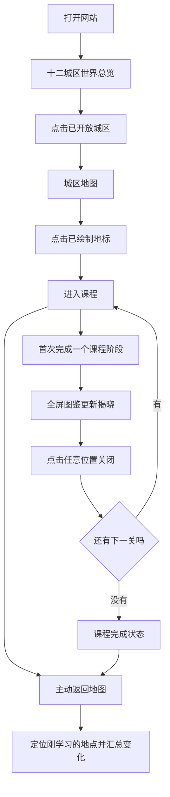

# 十二城区图鉴唯一入口与阶段成长揭晓规格

> 状态：产品决策已于 2026-08-04 确认
> 范围：冒险地图 V1 的首页信息架构、地图进入路径、课程返回路径与阶段成长反馈
> 关系：这是对现行 V1 地图设计与实现的增量覆盖规格；发生冲突时以本文为准
> 实施状态：尚未实施；本文不是上线证明

## 1. 结论

网站不再以“普通首页 + 地图板块 + 课程目录”的方式组织内容。

`/` 的产品本体就是“十二城区冒险图鉴”。孩子先看到十二城区世界总览，再进入城区地图，并从已经完成绘制的地图地标直接进入课程。现有课程页面与直达 URL 继续有效，但首页不再暴露第二套课程入口。

每次首次完成一个真实课程阶段，课程内立即展示一次全屏“图鉴更新”成长揭晓。孩子无需离开课程就能看清自己为地图增加了什么装饰；点击任意位置即可关闭并继续下一关。返回城区地图后，地点再用一次简短汇总反馈把课程奖励与真实地图状态连接起来。

成长揭晓采用原生 HTML、CSS 和 JavaScript 分层动画，不在站点运行时引入 Remotion、React、视频播放器、Lottie 或 GSAP。Remotion 可以用于宣传片或离线演示视频，不属于本交互的生产运行时。

## 2. 被本文替代的旧决策

| 旧决策 | 新决策 |
| --- | --- |
| 日常回访默认直接进入当前城区 | 直接打开 `/` 默认进入十二城区世界总览；从课程返回时才定向回到当前城区 |
| 地图之外保留课程目录书签/抽屉 | 学生界面不再提供课程目录；原有课程直达 URL 继续有效 |
| 非焦点地点先打开底部预览，再点击进入 | 已发布地标或名称牌单击后直接进入课程 |
| 未完成地点显示课号、草图或“正在绘制” | 未满足地图发布合同的地点完全不渲染，不制造空卡片、编号框或临时建筑 |
| 阶段 1–4 完成后自动返回地图回望 | 留在课程内播放全屏成长揭晓，孩子关闭后继续向下闯关 |
| 成长揭示不遮挡整张页面、没有自动音效 | 使用全屏轻庆祝层并播放短促柔和的反馈音效 |
| 课程推荐以独立卡片、按钮或完整展开地点表达 | 只在地图上高亮唯一“正在闯关”地点，不显示独立推荐卡片 |
| 课程进度使用独立 `1/5`、状态胶囊 | 五阶段进度融入地点名称牌，以五枚小印章或星点表达 |
| 音标课通过首页“番外站”进入 | 音标魔法乐园作为城区地图中的永久专项支线进入 |

未被本文明确替代的既有课程内容、评分、证书、音频、公开直达 URL、本地进度和发布安全要求继续有效。

## 3. 信息架构

### 3.1 唯一可见入口

首页只保留两个产品层级：

1. **十二城区世界总览**：`/` 的默认视图。
2. **城区地图**：从世界总览点击已开放城区后进入。

以下首页内容不再渲染：

- 旧“英语闯关乐园”头图、欢迎语和英文副标题；
- 独立继续学习面板；
- 按 Lesson 编号查找的课程目录、范围切换和课程卡片；
- 独立“番外站 · 专项技能”板块；
- 营销式页脚、设备进度说明和常驻设置入口；
- 未开放课程或城区的占位卡片、虚线编号框和“正在绘制”按钮。

品牌名、图鉴名和城区名作为图鉴纸张内部的铭牌存在，不再放在地图外的通用网站页头中。

### 3.2 世界总览

- 手机使用纵向展开的长图鉴，沿道路上下滚动；不要求拖拽画布或双指缩放。
- 平板使用同一信息架构展开为双页图鉴。
- 当前城区有清楚但不突兀的高亮。
- 已制作城区以完整插画成为可点击入口。
- 未制作城区只作为世界版图中的远景、云雾或轮廓存在；它们不可点击，也不显示空卡片、编号或状态按钮。
- 点击首发城区后进入对应城区地图。

### 3.3 城区地图

- 只渲染满足完整地图发布合同的学习地点。
- 地标插画和地点名称牌共享同一个可点击链接；点击后直接进入课程。
- 不弹出预览卡片、底部面板或二次确认按钮。
- 当前唯一“正在闯关”地点使用柔和光圈、道路高亮和简短“继续冒险”小标签表达。
- 其他已发布地点保持精简，但仍可自由进入和重访。
- 五阶段进度直接融入地点名称牌；不额外显示“成长中”“地点完成”或 `1/5` 胶囊。
- 音标魔法乐园作为不占 Lesson 编号的专项支线地标存在，不改变编号课程的顺序。

“正在闯关”地点按以下确定性规则选择：

1. 最近进入且尚未完成的已发布地点；
2. 如果不存在，选择课号最靠前的未开始已发布地点；
3. 当前城区全部完成后不强推某一课程，只展示城区完成状态。

### 3.4 设置

“设备冒险设置 / 重开进度”功能继续保留，但收进图鉴右上角的低调书签菜单。书签菜单不与当前学习地点争夺视觉焦点。

### 3.5 兼容入口

- 已发布课程和音标课的原有 URL 继续可直接访问。
- 旧书签、老师已经分享的链接和搜索入口不得失效。
- `/home/` 保持兼容，但呈现与 `/` 相同的图鉴入口或安全跳转到 `/`，不得继续展示旧目录首页。
- “地图是唯一入口”指学生界面中唯一可见的导航入口，不表示封锁合法直达 URL。

## 4. 核心路径

从课程主动返回或完成课程后，目标是当前城区地图，而不是世界总览。地图自动定位到刚刚学习的地点，但孩子开始主动滚动后不得持续吸附或把页面强行拉回。

## 5. 阶段成长揭晓

### 5.1 触发条件

成长揭晓只在课程阶段发生从“未完成”到“已完成”的单调状态推进时触发。

- 某阶段第一次真实完成：触发一次。
- 重复练习或提高同一阶段评分：不触发。
- 刷新页面、重复保存、网络或事件重试：不得重复发奖。
- 只浏览、播放音频或进入阶段：不触发。
- 进度写入失败时：不能先展示永久成长成功；应保留原有课程反馈并允许重试。

### 5.2 视觉顺序

完整动画目标时长约为 1.8 秒：

1. 课程背景柔和变暗，全屏成长揭晓层出现。
2. 先短暂呈现本阶段完成前的地点状态。
3. 本阶段新增透明装饰以“贴纸落下、盖章或被绘制出来”的方式加入。
4. 新增装饰短暂发光，其他已有图层保持稳定。
5. 最终停留在成长后的完整地点，并展示一条与本次装饰对应的短文案。

文案必须说明具体变化，例如“肉店挂上了红白遮阳棚！”，不能只写“地图发生了变化”。具体名词属于课程地图素材合同的一部分。

### 5.3 关闭规则

- 不显示“继续下一关”“回地图看看”或关闭按钮。
- 整个揭晓层是关闭热区，显示“轻触任意位置继续”。
- 触发过关的原始点击、触摸或键盘事件不得穿透并立即关闭揭晓层。
- 动画开始约 0.7 秒后，孩子下一次点击或触摸任意位置即可关闭。
- 键盘用户可以在同一时点使用 `Enter`、`Space` 或 `Escape` 关闭。
- 不自动关闭；孩子不操作时停留在最终成长画面。
- 关闭后保留当前课程上下文，继续下一未完成阶段，不强制返回地图。

### 5.4 声音

- 每次揭晓播放一段很短、柔和的“盖章 + 闪光”反馈音效。
- 音效只能由完成阶段的用户手势链触发，不得在普通页面加载时自动播放。
- 音效不能盖过尚未结束的课程音频；现有课程音频必须先停止或进入可预测状态。
- 声音不是理解变化的唯一渠道；静音、播放失败或无声设备仍能通过动画、文字和状态完成流程。
- 音效加载失败不得阻塞关闭或继续闯关。

### 5.5 第五阶段

第五阶段包含普通阶段成长的全部反馈，并额外：

- 加盖“地点完成”纪念章；
- 揭晓并显示本课故事纪念物；
- 使用比前四阶段略强但仍克制的完成光效；
- 保持点击任意位置关闭，不增加奖励领取按钮或领取步骤。

### 5.6 减少动态效果与失败降级

- `prefers-reduced-motion: reduce` 下不播放位移、缩放、粒子和持续闪光。
- 减少动态效果时直接呈现成长前、成长后和具体变化文字，0.7 秒关闭保护仍可缩短为只防止事件穿透所需的最小时间。
- 任一图片加载失败时显示可理解的静态“图鉴已更新”状态和具体变化文字，不显示破图图标。
- JavaScript 异常不能阻止课程继续、进度保存或返回地图。

## 6. 返回地图后的反馈

课程内的成长揭晓和真实地图状态是两个独立的“已看见”节点。

- 每次首次完成阶段后，把该地点记为有待在地图中确认的新变化。
- 第一次回到城区地图时，地点播放一次简短闪光，并出现一次性“新变化”贴纸。
- 孩子实际看到地点后，贴纸自动消失，不永久占据地图。
- 如果期间连续完成多个阶段，地图直接呈现最新完整状态，只播放一次汇总动画。
- 汇总文案使用“这里新增了 3 处变化”或第五关的“地点完成”，不顺序重播所有课程内动画。
- 完成或返回后，地图以刚学习地点作为一次性的任务锚点；后续正常打开 `/` 仍从世界总览开始。

## 7. 地标素材发布合同

### 7.1 编号 Lesson

每个编号 Lesson 必须提供：

- 一张稳定的基础地标；
- 五张与真实五阶段一一对应的透明新增装饰层；
- 一张独立故事纪念物；
- 每个新增装饰的儿童可理解名称和揭晓文案；
- 必要的手机与平板视觉预览；
- 地图和成长揭晓回归测试。

六张地标图片必须共享：

- 完全相同的像素画布、地面锚点和建筑位置；
- 一致的透视、光向、线条、比例与色彩；
- 透明背景；
- 不包含课程文字、按钮、进度或烘焙背景色。

每张成长层只包含本阶段新增加的装饰，不得重复包含基础建筑或之前阶段的装饰。实现通过稳定叠层得到任意阶段的最终地点状态。

### 7.2 专项支线

专项支线使用相同合同，但成长层数量必须等于它的真实课程阶段数。音标魔法乐园当前为基础地标加四张成长层；不得为了套用编号 Lesson 的五层结构虚构第五阶段。

### 7.3 发布门槛

课程页面已经可用但地图素材不完整时：

- 课程直达 URL 继续有效；
- 学生地图中完全不渲染该地点；
- 不显示临时建筑、课号框、虚线卡片或“正在绘制”；
- 素材合同、阶段映射与回归验证全部完成后才加入地图。

ImageGen 可以辅助制作缺失的透明成长层，但每张资产必须人工检查透明通道、画布尺寸、锚点、风格一致性、儿童内容安全和缩略尺寸辨识度。生成成功不等于地图发布成功。

## 8. 动画实现决策

### 8.1 运行时技术

实现使用一个共享的原生网页组件：

- HTML 负责语义、图片分层、提示文字和全屏关闭热区；
- CSS `@keyframes` 负责淡入、贴纸落下、盖章、发光和减少动态效果；
- JavaScript 负责状态机、时间顺序、首次完成判定、事件穿透保护、音效和持久化；
- 地标图层使用绝对定位的透明 `` 或 `<picture>`，不使用整段预渲染视频；
- 随机粒子只能作为非必要装饰，不得影响测试、关闭时机或最终状态。

共享组件应由所有编号 Lesson 和专项支线配置使用，课程只声明：课程 ID、阶段 ID、成长前图层、当前新增图层、最终图层集合、具体文案、音效和是否为最终阶段。

不得把五套动画逻辑复制进每个课程页面。

### 8.2 为什么不用 Remotion

当前站点是包依赖极少的静态 HTML、CSS 和 JavaScript。Remotion 的应用内播放器主要面向 React 时间轴内容；把它引入每门课程会增加运行时、构建、下载、响应式适配和交互同步成本。

本动画需要读取真实阶段状态、按用户点击关闭、根据地点装饰动态组合、处理重复完成与返回地图待确认状态。原生分层动画比预渲染视频更适合这些要求。

Remotion 仍可用于：

- 宣传视频和课程预告；
- 教师演示视频；
- 离线渲染全部成长阶段的评审样片。

它不用于孩子实际操作的成长揭晓运行时。

## 9. 状态与幂等要求

实现至少区分以下状态：

- `completedStages`：课程阶段是否真实完成，是地图成长的权威来源；
- `courseRevealSeen`：该阶段的课程内揭晓是否已关闭；
- `pendingMapChanges`：课程内已揭晓、但尚未在真实地图中确认的阶段集合；
- `lastVisitedLocation`：用于优先恢复未完成的正在闯关地点；
- `mapChangeSeen`：地图汇总变化是否已经展示。

要求：

- 阶段完成和新增待确认变化必须以一次可恢复操作写入；
- 重复完成、刷新、后退和重新进入不得重复增加装饰或纪念物；
- 在成长揭晓尚未关闭时刷新，允许重新展示同一次揭晓，但不得重复写入阶段完成；
- 地图汇总确认不得清除真实完成进度；
- 重开冒险必须同时清除以上设备状态。

具体存储字段名可以在实施计划中调整，但语义和幂等边界不能改变。

## 10. 验收标准

### 10.1 首页与地图

- 直接打开 `/` 时，首个产品视图是十二城区世界总览。
- 页面不存在旧头图、继续学习面板、编号目录、专项技能板块和营销页脚的可见内容或可聚焦控件。
- 未制作城区不显示空卡片、编号按钮或可点击热区。
- 进入首发城区后，只渲染满足发布合同的地点。
- 已发布地标单击一次直接进入课程，不出现预览卡片。
- 当前地点只有一个，并按“最近未完成 → 最早未开始 → 全部完成”规则确定。
- 进度显示在名称牌内，不存在额外进度胶囊。
- 音标魔法乐园只能通过地图专项支线或合法直达 URL 进入。

### 10.2 成长揭晓

- 每个真实阶段从未完成变为完成时只触发一次揭晓。
- 揭晓层没有可见按钮，整个层在解锁后可点击关闭。
- 触发完成的原始事件不能关闭揭晓层。
- 0.7 秒前的额外点击不关闭，0.7 秒后的下一次点击关闭并保持课程上下文。
- 动画呈现正确的成长前状态、本阶段新增层和最终状态。
- 文案准确命名新增装饰。
- 重复挑战同阶段不显示揭晓。
- 第五阶段显示完成章和纪念物。
- 音效失败、图片失败和减少动态效果均不会造成学习死路。

### 10.3 返回地图

- 从任何已接入课程返回后进入正确城区，并定位刚学习地点。
- 一个或多个待确认变化只触发一次地图汇总反馈。
- 汇总反馈消失后刷新地图不重复出现。
- 地图显示的图层数量始终与已完成真实阶段一致。

### 10.4 响应式与设备

至少验证：

- 390 × 844 手机竖屏；
- 768 × 1024 平板竖屏；
- 1024 × 768 平板横屏；
- 华为 Mate 60 Pro+ 常用浏览器或微信内置浏览器；
- iPhone Safari；
- Android Chromium；
- 键盘操作与 `prefers-reduced-motion`。

全屏揭晓层必须覆盖安全区、阻止背景误滚动、不产生横向溢出，并在旋转设备后保持可关闭。

## 11. 测试要求

实施必须至少增加：

- 单元测试：推荐地点选择、首次完成判定、重复完成幂等、待确认变化合并、第五阶段完成状态；
- 资产合同测试：画布尺寸一致、透明图层存在、阶段数匹配、发布地点无缺失资产；
- E2E：旧首页模块不可见且不可聚焦、世界总览默认打开、地图一击进入、课程返回锚点；
- E2E：首次完成显示揭晓、事件不穿透、任意位置关闭、重复完成不显示；
- E2E：第五阶段完成章与纪念物、多个待确认变化汇总；
- E2E：减少动态效果、音效加载失败、图片失败和存储异常降级；
- 移动截图基线：手机、平板竖屏和平板横屏的世界总览、城区地图和成长揭晓。

真实微信、华为浏览器、iPhone Safari 和 Android Chromium 继续保留人工冒烟验证；桌面 Chromium 自动化通过不能替代真实设备结论。

## 12. 实施顺序建议

1. 扩展课程目录和设备进度状态，建立成长揭晓与地图待确认变化的纯逻辑测试。
2. 用 Lesson 49 实现共享原生成长揭晓组件和完整五阶段验收。
3. 把首页收敛为世界总览与城区地图，移除旧可见入口。
4. 统一课程返回地址、城区和地点锚点。
5. 接入 Lesson 51 和音标专项支线，验证五阶段与四阶段复用能力。
6. 只有在其他课程素材合同完整后才逐一加入地图。
7. 完成移动自动化、真实设备冒烟和视觉验收后再发布。

## 13. 非目标

本文不授权或要求：

- 建设 V2 账号、授权码、API、数据库或跨设备进度；
- 使用 Remotion 生成站内实时互动动画；
- 为填满地图而显示不完整地点；
- 阻止合法课程直达 URL；
- 重做课程教学内容、评分、证书或既有音频；
- 创建课程市场、排行榜、货币、背包或复杂剧情系统；
- 在没有完整素材与测试时一次性开放所有课程地标。

## 14. 完成定义

本改造不是“把首页其他板块设为 `display: none`”即完成。

只有当孩子能够从十二城区图鉴进入真实城区地图、从已绘制地标一击进入课程、每次首次完成阶段都明确看见具体地图成长、继续闯关，并在返回地图时看到同一真实状态的汇总变化，才算完成本规格。

所有结论必须以实际代码、自动化测试、移动截图和真实设备冒烟结果为证；本文批准不等于实现完成或发布完成。
